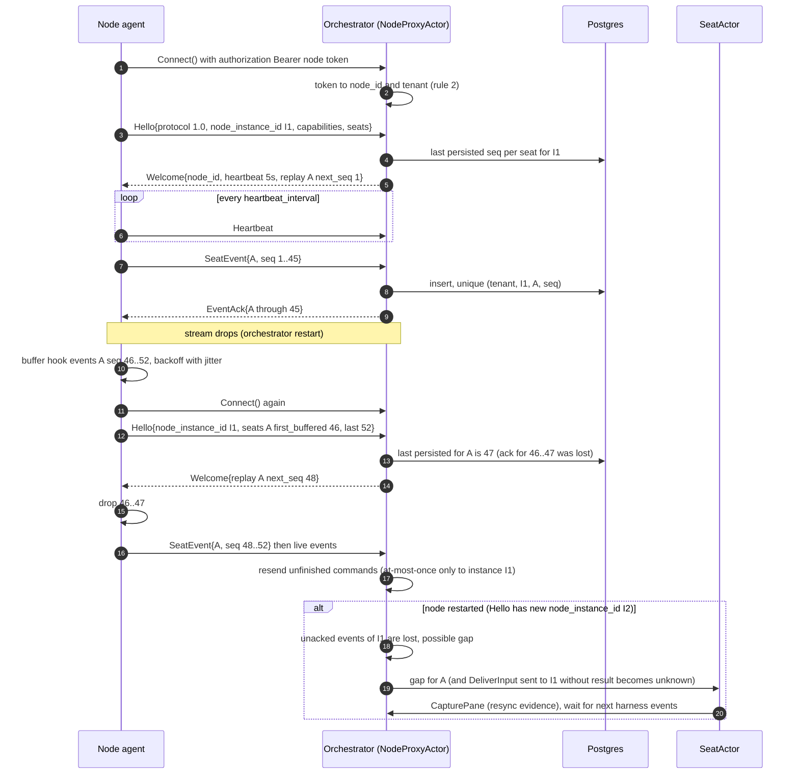
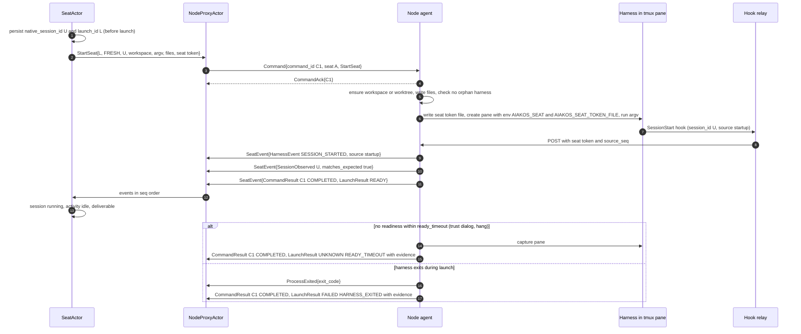
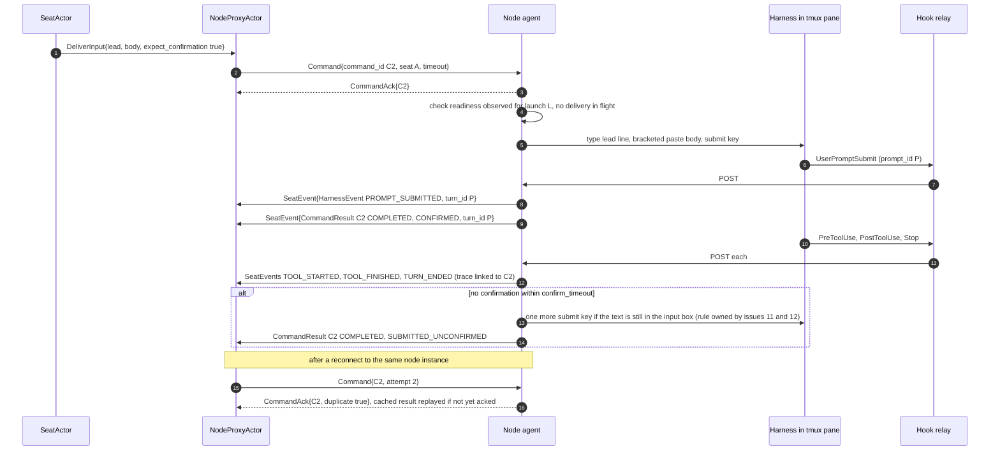
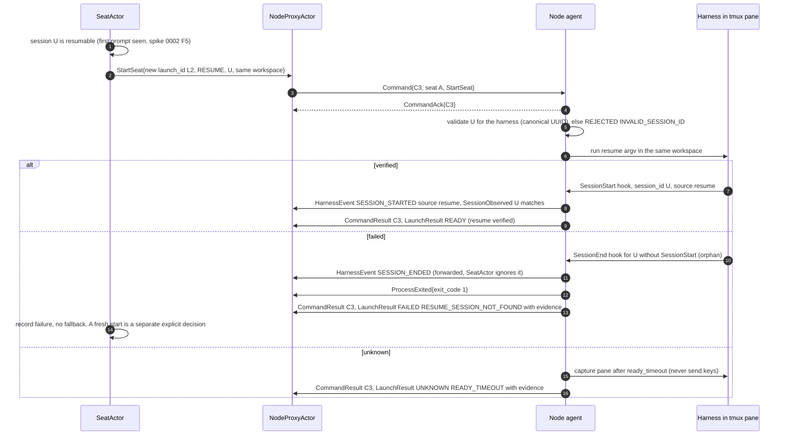

# 0002 — Orchestrator ↔ node gRPC contract v1

## Context

[ADR 0004](../adr/0004-orchestrator-node-split.md) splits Aiakos into an **orchestrator** (meaning:
rigs, seats, identity, history) and a **node agent** per machine (execution: sessions, sandboxes,
files, local event ingest; no business logic). Nodes dial out to the orchestrator over one gRPC
bidirectional stream, authenticated with a node token. The ADR calls this contract "the most
important interface in M1" and requires it to be versioned. Issue
[#10](https://github.com/aiakos-hq/aiakos/issues/10) asks for v1: node hello and capabilities,
commands (create session, send text/keys, capture, stop), and events (session/pane lifecycle, hook
events, heartbeats).

The M0 spikes are the evidence this design rests on:

| Spike | What it forces into the contract |
|---|---|
| [0001](../spikes/0001-claude-wsl-tmux-hooks.md) | Delivery is *typed lead line + bracketed paste + separate submit*, and only after a readiness signal (`SessionStart`). Delivery is confirmed by `UserPromptSubmit`, except for slash commands. Hook events arrive **out of order** (each hook is its own process), so a per-seat sequence number must be stamped at the source and the SeatActor orders by it. `statusLine` is an untagged, frequent telemetry sample. |
| [0002](../spikes/0002-claude-session-resume.md) | The **orchestrator owns the session ID** and persists it before launch. Resume outcome is `verified` / `failed` / `unknown`, never a silent fresh start (rule 3). A failed resume emits an **orphan `SessionEnd`** (no `SessionStart`), which must not change state. No `SessionStart` within ~15 s means blocked/unknown, with a pane capture as evidence; never send keys to get past an unknown screen. |
| [0003](../spikes/0003-aspire-wsl-node.md) | The bidi stream works over **h2c on loopback** (mirrored networking). W3C trace context crosses the wire **only once** on a long-lived stream, so every message needs its own `traceparent`. The node reconnects with backoff after an orchestrator restart and must not exit when the stream drops. |
| [0004](../spikes/0004-opencode-api.md) | OpenCode's legacy SSE stream has **no replay**: after a reconnect the client re-reads state. The contract therefore cannot assume harness replay; replay is the node's job, and harness-side gaps must be reported honestly. OpenCode's needs-input comes from `permission.asked`, not a status. |
| [0005](../spikes/0005-docker-seat.md) | `StopFailure` is the only signal for auth/API failures (after ~3 min of silence). Container stop SIGKILLs the harness without `SessionEnd`, so process/container exit must be reported separately from hook events. The source IP of hook posts cannot identify a seat: identity comes from a **per-seat token**. |

Other inputs: [plan §3](../plan.md#3-architecture) (responsibilities, core interfaces),
[plan §7](../plan.md#7-monitoring-incl-sandboxed-seats) (signal sources; "hook events win
(sequence numbers); heartbeat timeout ⇒ `unknown`"), [ADR 0005](../adr/0005-tmux-first-session-host.md)
(terminals are transport; capture is evidence only), [ADR 0006](../adr/0006-claude-code-first-harness.md)
(Claude Code in M1, OpenCode in M2 behind the same abstraction), and CLAUDE.md rules 2–5.

Related specs, written in parallel or later:

- **Spec 0001** (issue #9) owns the solution layout, including where the proto lives
  ("location per spec 0001"; this spec assumes a shared contracts project).
- **Spec 0003** (issue #14) owns the rig file format. This contract carries **resolved** launch
  parameters, never rig YAML.
- Specs for **#11** (tmux session host), **#12** (Claude Code adapter) and **#13** (SeatActor) use
  this contract. The assumptions they must satisfy are listed under
  [Assumptions for dependent specs](#assumptions-for-dependent-specs).

## Goals

- One versioned proto package, `aiakos.node.v1`, that the orchestrator and the node agent both
  compile from the shared contracts project.
- A node can connect, identify itself **by token only**, advertise capabilities, and report the
  seats it is already running.
- The orchestrator can start (fresh or resume) a seat, deliver input, send keys, capture a pane
  and stop a seat, each with an idempotency key, an acknowledgement and a result.
- The node reports what it observes: harness events (normalized kind plus raw payload), the
  native session ID, process exit, command results and observation gaps. Every seat event has a
  per-seat monotonic sequence number, is delivered **at least once**, and is deduplicated by the
  orchestrator, so it is recorded **exactly once**.
- Disconnects lose nothing the node still holds: the node buffers while disconnected and replays
  from where the orchestrator's database left off. Losses the node cannot avoid (node restart,
  buffer overflow, harness stream gaps) are reported, not hidden.
- Every message carries trace context, so one flow (CLI `send` → orchestrator → node → harness →
  hook → orchestrator) shows as one trace in Aspire.
- The same messages serve Claude Code (terminal-driven, M1) and OpenCode (API-driven, M2) without
  a v2.

## Non-goals / out of scope

- **Solution layout, project names, build wiring** — spec 0001.
- **Rig/agent file format and resolution** — spec 0003. The contract receives resolved values.
- **Seat state machine** (the three axes, how events merge into state, health findings) — #13.
  This contract carries observations; it does not define state transitions.
- **tmux mechanics** (socket, pane naming, paste commands, liveness polling) — #11.
- **Claude Code specifics** (settings projection, hook relay script, argv, which hooks, how the
  node recognises readiness and confirmation) — #12.
- **Hook relay → node transport** (the node's local HTTP ingest endpoint). It is node-internal;
  #11/#12 define it. This spec only states what it must provide (seat token, source sequence).
- Later milestones, deliberately left out of v1.0 (added as additive `v1.x` changes, see
  [Compatibility rules](#compatibility-rules)):
  - answering permission prompts over the API (`AnswerInput`; M2 for OpenCode, M4 for chat
    approvals);
  - sandbox lifecycle events (Docker `die`/`exec_die`/OOM) and secret-file delivery for sandboxed
    seats (M6);
  - reading files from a seat home (transcripts, `ISeatProbe`) and chunked transfer of large
    files (M5/M7);
  - a durable, on-disk event spool on the node (decision D2);
  - TLS, mTLS, token rotation and remote nodes (M6; see [Security](#security));
  - node self-update, node metrics over the stream (OTLP already covers metrics), compression,
    and multiple orchestrators (Akka.Cluster, M8).

## Requirements

**Package, versioning, transport**

- **R1** The contract is one proto3 file, `aiakos/node/v1/node_link.proto`, package
  `aiakos.node.v1`, in the shared contracts project (location per spec 0001). The orchestrator
  and the node agent generate code from the same file; neither keeps a private copy.
- **R2** There is exactly one RPC, `NodeLinkService.Connect`, a bidirectional stream opened by the node.
  The orchestrator never dials a node.
- **R3** The major version is the package name (`v1`). Within a major version every change is
  additive and follows the [compatibility rules](#compatibility-rules). A breaking change creates
  `aiakos.node.v2`, served side by side with `v1` for at least one release
  ([ADR 0020](../adr/0020-node-contract-versioning.md)).
- **R4** `Hello` and `Welcome` carry `ProtocolVersion {major, minor}`. The orchestrator rejects a
  different major version with `FAILED_PRECONDITION`. The negotiated minor is the lower of the
  two; neither side uses a feature above it.
- **R5** Optional features are gated by **capability strings** that the node advertises in
  `Hello` (e.g. `harness.claude-code`, `command.send-keys`, `launch.fork`, `session-host.tmux`
  (the node has a usable tmux session host, spec 0004)). The orchestrator sends
  only commands and options the node advertised. A node that receives something it did not
  advertise answers with a `REJECTED` result, reason `UNSUPPORTED`.

**Connection, identity, liveness**

- **R6** The node authenticates with a per-node token in the `authorization: Bearer <token>`
  metadata of the `Connect` call. The orchestrator resolves **node ID and tenant from the token**
  (rule 2). No message carries a node ID or tenant ID that the orchestrator trusts.
- **R7** The node's first message is `Hello`; the orchestrator's first message is `Welcome`.
  Neither side sends anything else before that. No `Hello` within 10 s → the orchestrator closes
  the stream with `FAILED_PRECONDITION`.
- **R8** `Hello.node_name` is informational. If it differs from the name bound to the token, the
  orchestrator closes the stream with `PERMISSION_DENIED` (fail closed, no guessing).
- **R9** At most one live stream per node. A new, authenticated `Connect` for a node that already
  has one **replaces** it: the old stream receives `Goodbye{SUPERSEDED}` and is closed with
  `ABORTED` (D7).
- **R10** The node sends `Heartbeat` every `Welcome.heartbeat_interval` (default 5 s). No
  message of any kind from the node for `Welcome.liveness_timeout` (default 15 s) → the
  orchestrator marks the node, and the liveness of all its seats, `unknown` (plan §7; the state
  consequences belong to #13). Both sides also enable HTTP/2 keepalive pings (30 s, 10 s
  timeout) to detect dead connections.
- **R11** The node reconnects after any stream failure with exponential backoff and full jitter
  (0.5 s initial, 30 s cap). After `UNAUTHENTICATED`, `PERMISSION_DENIED` or `FAILED_PRECONDITION`
  it backs off to a 5 min cap and logs an error each time; it never exits because the stream
  dropped (spike 0003).
- **R12** The orchestrator accepts events only for seats it has assigned to the authenticated
  node. Events for other seats are dropped, not acked, and raised as a security finding.

**Commands**

- **R13** Every command has a `command_id` (UUID, generated and persisted by the orchestrator
  before sending) and a `seat_id`. `command_id` is the idempotency key.
- **R14** On receipt the node sends `CommandAck` immediately. The outcome follows as a
  `CommandResult` **seat event**, so results are sequenced, buffered and replayed like any other
  event.
- **R15** A command resent with a known `command_id` is never executed twice. The node answers
  `CommandAck{duplicate: true}` and, if the command has finished, replays its result. The node
  keeps command IDs for at least 10 minutes after their result was acked.
- **R16** Per seat, `StartSeat`, `DeliverInput` and `SendKeys` run one at a time in the order
  received. `CapturePane` and `StopSeat` bypass that queue (a capture must be possible while a
  launch waits for readiness). `StopSeat` ends a pending `StartSeat` with outcome `UNKNOWN`,
  reason `STOPPED`, and fails queued deliveries with `SEAT_STOPPING`.
- **R17** Each command carries a relative `timeout` (a `Duration`, not an absolute time, so clock
  skew between hosts does not matter). A command that does not finish in time completes with
  status `TIMED_OUT`; for `StartSeat` the separate `ready_timeout` governs readiness (R21).
- **R18** Resend rules after a reconnect: `StartSeat` (keyed by `launch_id`), `CapturePane` and
  `StopSeat` are idempotent and may be resent at any time. `DeliverInput` and `SendKeys` are
  **at most once**: they are resent only when `Hello.node_instance_id` equals the instance they
  were first sent to. Otherwise the orchestrator records the delivery outcome as `unknown` and
  does not resend (rule 3).
- **R19** `StartSeat` carries resolved launch parameters: harness, launch mode, the
  orchestrator-owned native session ID, workspace, argv, non-secret env, projected files and
  secrets. The node expands only the placeholders `${AIAKOS_SEAT_HOME}` and `${AIAKOS_WORKSPACE}`
  in argv, env values and file contents marked `expand`; it does not interpret anything else.
  `argv[0]` is the harness's logical name (e.g. `claude`), which the node replaces with the
  executable path configured for that harness on the node (spec 0005). When `Workspace.worktree` is set, the node ensures the worktree exists (idempotent) before it
  launches (D6). Resume and fork are launch modes of `StartSeat`, not separate commands (D4).
- **R20** A `StartSeat` for a seat that already has a live harness under a different `launch_id`
  is rejected with `SEAT_ALREADY_RUNNING`. The node never kills a running seat to satisfy a
  start.
- **R21** `StartSeat` completes with a `LaunchResult` whose outcome is:
  `READY` (fresh: the harness signalled readiness; resume/fork: the resume is **verified**),
  `FAILED` (the harness exited or reported that the session does not exist), or `UNKNOWN`
  (no readiness within `ready_timeout`; a pane capture is attached as evidence). `RESUME` never
  falls back to a fresh session on the node. A fresh start after a failed resume is a new,
  explicit `StartSeat{FRESH}` decided and recorded by the orchestrator. The node decides the
  outcome (it sees the harness signal first and holds the timer); the SeatActor records it and
  still receives the underlying harness events. A disagreement between the two becomes a health
  finding, never a silent override (D5).
- **R22** `DeliverInput` carries a one-line `lead` and a `body`. The node rejects it with
  `SEAT_NOT_READY` if it has not observed readiness for the current launch, and with `SEAT_BUSY`
  if a delivery for the seat is in flight. The result is `CONFIRMED` (the harness acknowledged
  the prompt; `turn_id` set), `SUBMITTED_UNCONFIRMED` (sent, no acknowledgement within
  `confirm_timeout`) or `NOT_DELIVERED`.
- **R23** `SendKeys` accepts only named keys from a fixed allowlist (`Enter`, `Escape`, `Tab`,
  `Up`, `Down`, `Left`, `Right`, `C-c`, `C-d`) and is available only on nodes with capability
  `command.send-keys`. It is for humans driving a seat through the CLI, never for automated
  dialog handling (spike 0002 F3).
- **R24** `CapturePane` returns the visible pane plus up to `history_lines` of scrollback, with a
  `truncated` flag. The orchestrator stores a capture as evidence and never derives seat state
  from its text (ADR 0005).
- **R25** `StopSeat` asks the harness to exit gracefully, waits up to `grace` for exit, then
  kills it. The result says which happened (`STOPPED`, `KILLED`, `NOT_RUNNING`). Stopping keeps
  the seat home and transcript, so the seat stays resumable.

**Events, sequencing, replay**

- **R26** Every `SeatEvent` carries `seat_id`, `launch_id` (empty only if the event cannot be
  attributed to a launch), `seq`, `observed_at` and one body: `CommandResult`, `HarnessEvent`,
  `SessionObserved`, `ProcessExited` or `ObservationGap`.
- **R27** `seq` is assigned by the node when the event enters its buffer. It starts at 1 per
  `(node_instance_id, seat_id)`, increases by exactly 1 per event, and a number is never reused,
  even if the event is later dropped. `node_instance_id` is a UUID generated at every node
  process start and is the epoch of the sequence. In M1 the buffer is in memory only; there is
  no on-disk spool (D2).
- **R28** An optional `source_seq`, stamped by the hook relay per seat, orders harness events by
  when the harness emitted them (spike 0001: arrival order is not emission order). The SeatActor
  orders harness events by `source_seq` when present and by `seq` otherwise. `observed_at` is
  never used for ordering. The hook relay stamps it with a per-seat counter file under `flock`
  in the seat home (#12); if that proves too slow, `source_seq` stays 0 and ingest order (`seq`)
  applies (D3).
- **R29** Delivery is at least once. The orchestrator persists each event with the unique key
  `(tenant_id, node_instance_id, seat_id, seq)` and treats a duplicate insert as success.
- **R30** The orchestrator acks with `EventAck{seat_id, through_seq}` (cumulative) only **after**
  the events are committed to Postgres, at least every 1 s or 100 events per seat. The node
  deletes acked events from its buffer.
- **R31** On (re)connect, `Hello.seats` lists every seat the node knows with its buffered range.
  `Welcome.replay` gives, per seat, the `next_seq` the orchestrator expects for the current
  `node_instance_id`. The node discards buffered events below `next_seq` and sends the rest in
  `seq` order before any new event for that seat. A seat in `Hello.seats` that the orchestrator
  does not know (database reset, manual launch) becomes a health finding with its inventory; the
  orchestrator never stops it automatically in M1 (D9).
- **R32** Gaps are detected, not hidden: if the first event the orchestrator receives for a seat
  is above its `next_seq`, or `node_instance_id` changed while it still expected events from the
  previous instance, the orchestrator records a gap for the seat and asks #13 to resync (capture
  plus the next harness events). The orchestrator never fabricates missing events.
- **R33** The node emits `ObservationGap` whenever it knows it missed harness signals: its own
  restart (`NODE_RESTARTED`), a harness event stream reconnect without replay (`HARNESS_STREAM_RECONNECTED`,
  OpenCode), an ingest outage (`INGEST_UNAVAILABLE`), or buffer overflow (`BUFFER_OVERFLOW`).
  After a harness stream reconnect the node re-reads harness state and emits the result as
  `HarnessEvent`s with `origin = RESYNC`.
- **R34** Harness events are carried harness-neutrally: `harness` (e.g. `claude-code`),
  `native_name` (e.g. `SessionStart`, `permission.asked`), a normalized `kind`, the native
  session ID from the payload, a small map of well-known `attributes`, optional `usage`, and the
  **raw payload bytes** with content type. `kind = OTHER` is always allowed; the raw payload is
  the evidence and is never omitted (only truncated, R38).
- **R35** The node forwards every harness event it attributes to a seat, including orphan
  `SessionEnd` events (spike 0002). Deciding that an event is noise is the SeatActor's job.
- **R36** `SessionObserved` is emitted the first time a launch observes a native session ID
  (from the harness payload or API), with `matches_expected` comparing it to
  `StartSeat.native_session_id`. A mismatch is reported, never corrected.
- **R37** `ProcessExited` is emitted when the node observes the harness process end (pane dead,
  process wait; later container exec exit), with exit code and signal as `optional` fields: an
  absent value means "not known", not zero.

**Limits, backpressure, errors, tracing**

- **R38** Size limits: gRPC max message 4 MiB in both directions. `DeliverInput.body` ≤ 1 MiB
  (larger content goes by file path). Total `StartSeat.files` ≤ 2 MiB. `PaneCapture.text` ≤ 1 MiB.
  `HarnessEvent.raw` ≤ 256 KiB: longer payloads are cut, `raw_truncated = true` and `raw_size`
  holds the original size. Normalized fields are extracted **before** truncation. Attribute values
  ≤ 1 KiB. An oversized command is rejected with `PAYLOAD_TOO_LARGE`, never truncated.
- **R39** The node buffers at most 2 000 events per seat and 10 000 events or 64 MiB per node
  (configurable). When over the limit it first coalesces `TELEMETRY` events per seat (only the
  newest is kept), then drops the oldest events and records an `ObservationGap{BUFFER_OVERFLOW}`
  with the number dropped. While connected, `TELEMETRY` is rate-limited to one event per second
  per seat.
- **R40** Backpressure uses HTTP/2 flow control: the orchestrator stops reading when its
  per-node inbound queue is full, and the node buffers. The orchestrator keeps at most
  `Limits.max_inflight_commands` (advertised by the node, default 64) unfinished commands per
  node.
- **R41** Stream-level failures use gRPC status codes (table in [Error model](#error-model)).
  Command failures use the `Error` message: coarse `code`, stable machine `reason`
  (`UPPER_SNAKE_CASE`), human `message` and `retryable`. Messages and traces never contain
  secrets or payload bodies.
- **R42** Every `ConnectRequest` and `ConnectResponse` carries a `TraceContext`
  (`traceparent`, `tracestate`). The receiver starts its per-message activity as a child of it.
  A replayed event carries the trace context it had when it was first buffered. The node links
  harness events of a turn to the trace of the `DeliverInput` that started it when it can
  correlate them (`turn_id`).

**Security (M1)**

- **R43** In M1 the stream is h2c on loopback only (WSL mirrored networking, spike 0003). The
  orchestrator refuses to start an h2c `NodeLinkService` endpoint bound to a non-loopback address.
- **R44** The node token reaches the node through its environment (`AIAKOS_NODE_TOKEN`, forwarded
  by the AppHost through `WSLENV`). The orchestrator stores only a hash; the token binds a node ID
  and a tenant.
- **R45** The orchestrator mints a per-seat token for every launch and sends it in
  `StartSeat.secrets`. The node writes it to a file with mode 0600 under the seat home and gives
  the seat only the file's path, in `AIAKOS_SEAT_TOKEN_FILE`; the value never passes through tmux
  argv or environment ([ADR 0025](../adr/0025-secrets-never-through-tmux.md)). The node uses the
  token to attribute hook posts to the seat and never logs it. Secret values never appear in
  logs, traces, errors or `argv`.
- **R46** The node rejects projected file paths that are absolute or contain `..`
  (`PATH_NOT_ALLOWED`); files are written only below the seat home or the workspace.

## Design

### Shape

```
 Node agent (WSL)                                         Orchestrator (Windows)
 ┌────────────────────────────┐   NodeLinkService.Connect (h2c, loopback, Bearer node token)
 │ hook ingest (local HTTP) ──┐│ ───────────────────────────────────────────────►  NodeLinkService
 │ harness drivers (per seat) ├┼─► event buffer ── ConnectRequest{Hello|Heartbeat|     │
 │ ISessionHost (tmux)        ││   (seq per seat)   CommandAck|SeatEvent|Goodbye}  ▼
 │ command executor ◄─────────┘│ ◄─────────────────────────────────────────────  NodeProxyActor ─► SeatActor
 └────────────────────────────┘     ConnectResponse{Welcome|Command|EventAck|Goodbye}   │
                                                                                       Postgres
```

- The **NodeLinkService** (ASP.NET Core gRPC) authenticates the call, then hands the stream to
  the node's `NodeProxyActor` (ADR 0002), which owns sequencing, acks, resends and heartbeat
  tracking, and routes seat events to `SeatActor`s.
- On the node, a **command executor** runs commands (per-seat queue, R16) against
  `ISessionHost` and the node-side harness driver; the **event buffer** assigns `seq`, holds
  events until acked, and replays them.
- Interfaces touched (implemented in #11/#12, not here):

| Contract element | Node-side interface call |
|---|---|
| `StartSeat` | workspace ensure, file projection, `ISessionHost.CreateAsync` (later `ISandbox.EnsureAsync` + `Wrap`) |
| `DeliverInput` | `ISeatChannel.SendAsync` → terminal style: `ISessionHost.SendTextAsync` (lead) + paste + `SendKeysAsync(Enter)`; API style: HTTP prompt |
| `SendKeys` | `ISessionHost.SendKeysAsync` |
| `CapturePane` | `ISessionHost.CaptureAsync` |
| `StopSeat` | harness driver graceful stop, then `ISessionHost` kill |
| `ProcessExited` | `ISessionHost.IsAliveAsync` / `EventsAsync` |
| `HarnessEvent`, `SessionObserved` | node-side part of `IHarnessAdapter.ParseEvent` (normalization only; D1, [ADR 0018](../adr/0018-harness-adapter-split.md)) |

### Proposed proto (v1.0)

```proto
// aiakos/node/v1/node_link.proto — location per spec 0001.
syntax = "proto3";

package aiakos.node.v1;

option csharp_namespace = "Aiakos.Contracts.Node.V1";

import "google/protobuf/duration.proto";
import "google/protobuf/timestamp.proto";

// The node agent dials out and keeps one Connect stream open per node (ADR 0004).
// Authentication: "authorization: Bearer <node token>" call metadata. Node ID and tenant
// are derived from the token by the orchestrator, never from message fields (rule 2).
service NodeLinkService {
  rpc Connect(stream ConnectRequest) returns (stream ConnectResponse);
}

// ───────────────────────────── Envelopes ─────────────────────────────

// Every message the node sends (buf naming: ConnectRequest).
message ConnectRequest {
  TraceContext trace = 1;
  oneof body {
    Hello hello = 10;              // first message, exactly once per stream
    Heartbeat heartbeat = 11;
    CommandAck command_ack = 12;
    SeatEvent seat_event = 13;
    Goodbye goodbye = 14;          // node shutting down gracefully (e.g. SIGHUP)
  }
}

// Every message the orchestrator sends (buf naming: ConnectResponse).
message ConnectResponse {
  TraceContext trace = 1;
  oneof body {
    Welcome welcome = 10;          // first message, exactly once per stream
    Command command = 11;
    EventAck event_ack = 12;
    Goodbye goodbye = 13;
  }
}

// W3C Trace Context, per message: context on the Connect call is not enough (spike 0003).
message TraceContext {
  string traceparent = 1;
  string tracestate = 2;
}

// ───────────────────────────── Handshake ─────────────────────────────

message ProtocolVersion {
  uint32 major = 1;                // 1 for this package
  uint32 minor = 2;                // additive revisions; 0 for this spec
}

message Hello {
  ProtocolVersion protocol = 1;
  string node_name = 2;            // informational; must equal the name bound to the token
  string node_instance_id = 3;     // UUID, new at every node process start; epoch of seq numbers
  string agent_version = 4;        // node build version (SemVer)
  NodePlatform platform = 5;
  repeated string capabilities = 6;
  repeated SeatInventory seats = 7;// every seat the node currently knows (live or buffered)
  Limits limits = 8;
}

message NodePlatform {
  string os = 1;                   // "linux"
  string arch = 2;                 // "x64", "arm64"
  string kernel = 3;               // e.g. "6.18.33.2-microsoft-standard-WSL2"
  string hostname = 4;
}

message Limits {
  uint32 max_message_bytes = 1;    // default 4 MiB
  uint32 max_inflight_commands = 2;// per node; default 64
  uint32 event_buffer_capacity = 3;// per node, events
}

message SeatInventory {
  string seat_id = 1;
  string launch_id = 2;            // current or last launch; empty if unknown
  SessionLifecycle lifecycle = 3;
  string native_session_id = 4;    // empty = not observed
  uint64 first_buffered_seq = 5;   // 0 = nothing buffered
  uint64 last_seq = 6;             // highest seq assigned in this node instance; 0 = none
}

// Node-observable lifecycle of a seat's harness process. Activity (working/idle/needs-input)
// is not here: the SeatActor derives it from HarnessEvents (#13).
enum SessionLifecycle {
  SESSION_LIFECYCLE_UNSPECIFIED = 0;
  SESSION_LIFECYCLE_LAUNCHING = 1; // process started, readiness not yet observed
  SESSION_LIFECYCLE_RUNNING = 2;   // readiness observed, process alive
  SESSION_LIFECYCLE_EXITED = 3;
  SESSION_LIFECYCLE_UNKNOWN = 4;   // e.g. pane found after node restart, state not established
}

message Welcome {
  ProtocolVersion protocol = 1;    // negotiated: major 1, minor = min(node, orchestrator)
  string node_id = 2;              // derived from the token; authoritative
  string connection_id = 3;        // for logs and traces
  google.protobuf.Duration heartbeat_interval = 4;  // default 5 s
  google.protobuf.Duration liveness_timeout = 5;    // default 15 s
  repeated ReplayFrom replay = 6;
  Limits limits = 7;               // orchestrator side; senders respect the lower value
  google.protobuf.Timestamp server_time = 8;        // diagnostics only
}

message ReplayFrom {
  string seat_id = 1;
  uint64 next_seq = 2;             // first seq the orchestrator has not persisted for this node instance
}

message Heartbeat {
  google.protobuf.Timestamp sent_at = 1;
  uint32 buffered_events = 2;      // unacked events across all seats
  uint32 inflight_commands = 3;
}

message Goodbye {
  GoodbyeReason reason = 1;
  string message = 2;
  google.protobuf.Duration retry_after = 3;         // hint for the node's next Connect
}

enum GoodbyeReason {
  GOODBYE_REASON_UNSPECIFIED = 0;
  GOODBYE_REASON_SHUTDOWN = 1;     // sender is stopping
  GOODBYE_REASON_SUPERSEDED = 2;   // a newer stream for this node replaced this one
  GOODBYE_REASON_REVOKED = 3;      // node token revoked
}

// ───────────────────────────── Commands ─────────────────────────────

message Command {
  string command_id = 1;           // UUID; idempotency key, persisted by the orchestrator first
  string seat_id = 2;              // all v1 commands are seat-scoped
  google.protobuf.Duration timeout = 3;
  uint32 attempt = 4;              // 1 = first send; >1 = resend after reconnect
  oneof body {
    StartSeat start_seat = 10;
    DeliverInput deliver_input = 11;
    SendKeys send_keys = 12;       // capability "command.send-keys"
    CapturePane capture_pane = 13;
    StopSeat stop_seat = 14;
  }
}

message CommandAck {
  string command_id = 1;
  bool duplicate = 2;              // already known: not executed again
}

message StartSeat {
  string launch_id = 1;            // UUID, new per launch attempt; idempotency key of the launch
  string seat_address = 2;         // "member@rig"; for pane naming and AIAKOS_SEAT
  string harness = 3;              // "claude-code" (M1), "opencode" (M2)
  LaunchMode mode = 4;
  string native_session_id = 5;    // orchestrator-owned; FRESH/RESUME: the session; FORK: the new one
  string fork_from_session_id = 6; // FORK only
  Workspace workspace = 7;
  repeated string argv = 8;        // resolved command line; placeholders per R19
  map<string, string> env = 9;     // non-secret environment
  repeated SeatFile files = 10;    // projected files (settings, guidance, skills)
  repeated SeatSecret secrets = 11;// per-seat token (M1); never logged
  google.protobuf.Duration ready_timeout = 12;      // e.g. 15 s (spike 0002 F9)
  TerminalSize terminal = 13;      // terminal-driven harnesses; e.g. 160x45
}

enum LaunchMode {
  LAUNCH_MODE_UNSPECIFIED = 0;
  LAUNCH_MODE_FRESH = 1;
  LAUNCH_MODE_RESUME = 2;
  LAUNCH_MODE_FORK = 3;            // capability "launch.fork"; not required in M1
}

message Workspace {
  string path = 1;                 // absolute path on the node
  WorktreeSpec worktree = 2;       // set for checkout policy seat-worktree: ensure it exists
}

message WorktreeSpec {
  string repo_path = 1;            // absolute path of the main checkout on the node
  string branch = 2;
  string base_ref = 3;             // used only when the branch does not exist yet
}

message SeatFile {
  FileRoot root = 1;
  string path = 2;                 // relative; no "..", not absolute (R46)
  bytes content = 3;
  uint32 mode = 4;                 // POSIX permission bits, e.g. 0644; 0 = default
  bool expand = 5;                 // expand ${AIAKOS_SEAT_HOME} / ${AIAKOS_WORKSPACE}
}

enum FileRoot {
  FILE_ROOT_UNSPECIFIED = 0;
  FILE_ROOT_SEAT_HOME = 1;
  FILE_ROOT_WORKSPACE = 2;
}

message SeatSecret {
  string name = 1;                 // e.g. "seat_token"
  bytes value = 2;
  oneof target {
    string env_var = 3;            // not used for the seat token (R45)
    string file_path = 4;          // relative to seat home; M1 seat token (R45) and M6 sandboxes
  }
}

message TerminalSize {
  uint32 columns = 1;
  uint32 rows = 2;
}

message DeliverInput {
  string lead = 1;                 // one line, typed (not pasted) by terminal harnesses; may be empty
  string body = 2;                 // ≤ 1 MiB; pasted (terminal) or sent as prompt text (API)
  bool expect_confirmation = 3;    // false for slash commands (no UserPromptSubmit, spike 0001)
  google.protobuf.Duration confirm_timeout = 4;     // e.g. 5 s
}

message SendKeys {
  repeated string keys = 1;        // allowlist per R23
}

message CapturePane {
  uint32 history_lines = 1;        // scrollback lines in addition to the visible screen
}

message StopSeat {
  google.protobuf.Duration grace = 1;               // graceful exit window before kill
}

// ───────────────────────────── Events ─────────────────────────────

message EventAck {
  string seat_id = 1;
  uint64 through_seq = 2;          // cumulative, for the current node instance; sent after DB commit
}

message SeatEvent {
  string seat_id = 1;              // node's attribution (via per-seat token); checked per R12
  string launch_id = 2;
  uint64 seq = 3;                  // per (node_instance_id, seat_id); starts at 1; +1; never reused
  google.protobuf.Timestamp observed_at = 4;        // node clock; never used for ordering
  uint64 source_seq = 5;           // hook relay stamp; 0 = absent (R28)
  oneof body {
    CommandResult command_result = 10;
    HarnessEvent harness = 11;
    SessionObserved session_observed = 12;
    ProcessExited process_exited = 13;
    ObservationGap gap = 14;
  }
}

message CommandResult {
  string command_id = 1;
  CommandStatus status = 2;
  Error error = 3;                 // set unless status = COMPLETED
  oneof result {
    LaunchResult launch = 10;
    DeliveryResult delivery = 11;
    PaneCapture capture = 12;
    StopResult stop = 13;
  }
}

enum CommandStatus {
  COMMAND_STATUS_UNSPECIFIED = 0;
  COMMAND_STATUS_COMPLETED = 1;    // ran to the end; see the typed result for the outcome
  COMMAND_STATUS_REJECTED = 2;     // not started (validation, precondition, unsupported)
  COMMAND_STATUS_FAILED = 3;       // started, failed on the node (e.g. session host error)
  COMMAND_STATUS_TIMED_OUT = 4;
}

message LaunchResult {
  LaunchOutcome outcome = 1;
  string reason = 2;               // e.g. RESUME_SESSION_NOT_FOUND, READY_TIMEOUT, STOPPED
  string observed_session_id = 3;  // empty = none observed
  optional int32 exit_code = 4;    // set if the harness exited during the launch
  PaneCapture evidence = 5;        // set for FAILED and UNKNOWN when a pane exists
}

enum LaunchOutcome {
  LAUNCH_OUTCOME_UNSPECIFIED = 0;
  LAUNCH_OUTCOME_READY = 1;        // FRESH: ready for input. RESUME/FORK: resume verified
  LAUNCH_OUTCOME_FAILED = 2;       // RESUME/FORK: resume failed; never replaced by a fresh start
  LAUNCH_OUTCOME_UNKNOWN = 3;      // no readiness signal in time (dialog, picker, hang)
}

message DeliveryResult {
  DeliveryOutcome outcome = 1;
  string turn_id = 2;              // harness correlation id (Claude prompt_id, OpenCode messageID)
}

enum DeliveryOutcome {
  DELIVERY_OUTCOME_UNSPECIFIED = 0;
  DELIVERY_OUTCOME_CONFIRMED = 1;
  DELIVERY_OUTCOME_SUBMITTED_UNCONFIRMED = 2;
  DELIVERY_OUTCOME_NOT_DELIVERED = 3;
}

message PaneCapture {
  string text = 1;                 // plain text, no escape sequences; ≤ 1 MiB
  bool truncated = 2;
  google.protobuf.Timestamp captured_at = 3;
  TerminalSize size = 4;
  bool pane_dead = 5;
}

message StopResult {
  StopOutcome outcome = 1;
}

enum StopOutcome {
  STOP_OUTCOME_UNSPECIFIED = 0;
  STOP_OUTCOME_STOPPED = 1;        // exited within grace
  STOP_OUTCOME_KILLED = 2;         // grace expired, killed
  STOP_OUTCOME_NOT_RUNNING = 3;
}

message HarnessEvent {
  string harness = 1;              // "claude-code", "opencode"
  string native_name = 2;          // "SessionStart", "statusLine", "permission.asked", …
  HarnessEventKind kind = 3;       // normalized; OTHER is always valid
  string native_session_id = 4;    // from the payload; empty = absent
  map<string, string> attributes = 5;               // well-known keys, see table; values ≤ 1 KiB
  Usage usage = 6;                 // set when the payload carries usage (TELEMETRY, turn end)
  bytes raw = 7;                   // original payload, ≤ 256 KiB
  string raw_content_type = 8;     // "application/json"
  bool raw_truncated = 9;
  uint32 raw_size = 10;            // original size in bytes
  EventOrigin origin = 11;
}

enum HarnessEventKind {
  HARNESS_EVENT_KIND_UNSPECIFIED = 0;
  HARNESS_EVENT_KIND_OTHER = 1;
  HARNESS_EVENT_KIND_SESSION_STARTED = 2;   // attribute source: startup|resume|fork|clear
  HARNESS_EVENT_KIND_PROMPT_SUBMITTED = 3;
  HARNESS_EVENT_KIND_ACTIVE = 4;            // level signal "working" (OpenCode status busy)
  HARNESS_EVENT_KIND_TOOL_STARTED = 5;
  HARNESS_EVENT_KIND_TOOL_FINISHED = 6;
  HARNESS_EVENT_KIND_INPUT_REQUESTED = 7;   // permission / question
  HARNESS_EVENT_KIND_INPUT_RESOLVED = 8;
  HARNESS_EVENT_KIND_COMPACTION_STARTED = 9;
  HARNESS_EVENT_KIND_COMPACTED = 10;
  HARNESS_EVENT_KIND_TURN_ENDED = 11;
  HARNESS_EVENT_KIND_TURN_FAILED = 12;      // Claude StopFailure, OpenCode session.error
  HARNESS_EVENT_KIND_RETRYING = 13;
  HARNESS_EVENT_KIND_SESSION_ENDED = 14;
  HARNESS_EVENT_KIND_TELEMETRY = 15;        // statusLine tick, usage sample
}

enum EventOrigin {
  EVENT_ORIGIN_UNSPECIFIED = 0;
  EVENT_ORIGIN_LIVE = 1;           // pushed by the harness (hook, SSE)
  EVENT_ORIGIN_RESYNC = 2;         // synthesized by re-reading harness state after a gap
}

// proto3 `optional`: an absent field means "unknown", never zero (rule 3).
message Usage {
  optional uint32 context_used_percent = 1;
  optional uint64 context_window_tokens = 2;
  optional uint64 context_used_tokens = 3;
  optional double cost_usd = 4;
  string model_id = 5;             // empty = unknown
}

message SessionObserved {
  string native_session_id = 1;
  SessionIdSource source = 2;
  bool matches_expected = 3;       // equals StartSeat.native_session_id
}

enum SessionIdSource {
  SESSION_ID_SOURCE_UNSPECIFIED = 0;
  SESSION_ID_SOURCE_HARNESS_EVENT = 1;      // e.g. SessionStart.session_id
  SESSION_ID_SOURCE_HARNESS_API = 2;        // e.g. OpenCode create/get session response
}

message ProcessExited {
  optional int32 exit_code = 1;
  optional int32 signal = 2;
  ExitSource source = 3;
}

enum ExitSource {
  EXIT_SOURCE_UNSPECIFIED = 0;
  EXIT_SOURCE_PANE_DEAD = 1;       // session host reports the pane's process ended
  EXIT_SOURCE_PROCESS_WAIT = 2;    // node's own child process
  // 3–9 reserved for sandbox sources (container exec_die / die) in M6.
}

message ObservationGap {
  GapReason reason = 1;
  google.protobuf.Timestamp from = 2;       // unset = unknown
  google.protobuf.Timestamp to = 3;
  uint64 dropped_events = 4;                // BUFFER_OVERFLOW only
}

enum GapReason {
  GAP_REASON_UNSPECIFIED = 0;
  GAP_REASON_NODE_RESTARTED = 1;
  GAP_REASON_HARNESS_STREAM_RECONNECTED = 2;
  GAP_REASON_INGEST_UNAVAILABLE = 3;
  GAP_REASON_BUFFER_OVERFLOW = 4;
}

// ───────────────────────────── Errors ─────────────────────────────

message Error {
  ErrorCode code = 1;
  string reason = 2;               // stable UPPER_SNAKE_CASE, e.g. SEAT_NOT_READY
  string message = 3;              // human-readable; no secrets, no payloads
  bool retryable = 4;
  map<string, string> metadata = 5;
}

// Values mirror google.rpc.Code so they map 1:1 onto gRPC status codes.
enum ErrorCode {
  ERROR_CODE_UNSPECIFIED = 0;
  ERROR_CODE_INVALID_ARGUMENT = 3;
  ERROR_CODE_DEADLINE_EXCEEDED = 4;
  ERROR_CODE_NOT_FOUND = 5;
  ERROR_CODE_ALREADY_EXISTS = 6;
  ERROR_CODE_PERMISSION_DENIED = 7;
  ERROR_CODE_RESOURCE_EXHAUSTED = 8;
  ERROR_CODE_FAILED_PRECONDITION = 9;
  ERROR_CODE_ABORTED = 10;
  ERROR_CODE_UNIMPLEMENTED = 12;
  ERROR_CODE_INTERNAL = 13;
  ERROR_CODE_UNAVAILABLE = 14;
}
```

### Harness-neutral mapping

`HarnessEvent.kind` is a normalization of evidence from the spikes. The SeatActor (#13) maps kinds
to state; the raw payload stays available for anything the kind does not capture.

| `kind` | Claude Code (M1, hooks / statusLine) | OpenCode (M2, legacy SSE) |
|---|---|---|
| `SESSION_STARTED` | `SessionStart` source `startup`/`resume`/`fork`/`clear` | health 200 + `server.connected` + `GET /session/{id}` 200 |
| `COMPACTED` | `SessionStart` source `compact` | `session.compacted` |
| `PROMPT_SUBMITTED` | `UserPromptSubmit` (`turn_id` = `prompt_id`) | `message.updated` role=user (`turn_id` = `messageID`) |
| `ACTIVE` | — | `session.status` busy (a level, re-emitted per step) |
| `TOOL_STARTED` / `TOOL_FINISHED` | `PreToolUse` / `PostToolUse` | tool part `running` / `completed`\|`error` |
| `INPUT_REQUESTED` | `Notification` `permission_prompt` (and `PermissionRequest`, if #12 adopts it) | `permission.asked`, `question.asked` |
| `INPUT_RESOLVED` | — (inferred from `PostToolUse`/`Stop` by #13) | `permission.replied` |
| `COMPACTION_STARTED` | `PreCompact` | — |
| `TURN_ENDED` | `Stop` | `session.idle` / `session.status` idle |
| `TURN_FAILED` | `StopFailure` (spike 0005) | `session.error`, assistant `info.error` |
| `RETRYING` | — | `session.status` retry |
| `SESSION_ENDED` | `SessionEnd` (incl. orphan ones, R35) | — (server exit is `ProcessExited`) |
| `TELEMETRY` | statusLine tick (`usage` from `context_window`, `cost`, `model`) | `step-finish` tokens/cost |

Well-known `attributes` keys: `source`, `reason`, `tool_name`, `tool_use_id`, `turn_id`,
`request_id`, `notification_type`, `permission_mode`. Unknown keys are allowed and ignored by
receivers that do not know them.

For OpenCode the same commands apply: `StartSeat` launches `opencode serve` (argv) and the node
driver creates or re-opens the session; `DeliverInput` becomes `prompt_async` with lead and body
joined; `CapturePane` captures the attached TUI pane. Because the SSE stream has no replay, the
driver emits `ObservationGap{HARNESS_STREAM_RECONNECTED}` and `RESYNC` events after every SSE
reconnect (R33). No message changes are needed for M2 except the additive `AnswerInput` command.

### Sequencing and delivery guarantees

The delivery model (one stream, node-numbered events, ack after commit, at-most-once input) is
recorded in [ADR 0019](../adr/0019-node-link-delivery-model.md).

| Direction | Guarantee | Mechanism |
|---|---|---|
| Seat events, node → orchestrator | at least once on the wire, exactly once in the database, in `seq` order per seat | node buffer + `seq`; orchestrator unique key + `EventAck` after commit; replay from `Welcome.replay` |
| Loss the node cannot prevent | reported | new `node_instance_id` (restart), `ObservationGap`, orchestrator gap detection (R32) |
| Commands, orchestrator → node | idempotent commands: at least once; `DeliverInput`/`SendKeys`: at most once | `command_id` dedupe on the node; resend only to the same node instance (R18) |
| Heartbeats, acks | best effort | not sequenced, not replayed |

Ordering across seats is not guaranteed and not needed. `seq` is the transport order;
`source_seq` is the harness emission order (R28).

### Error model

Stream level (gRPC status on `Connect`; a `Goodbye` precedes it where possible):

| Status | When | Node behaviour |
|---|---|---|
| `UNAUTHENTICATED` | missing, malformed or unknown node token | back off to 5 min cap, log error |
| `PERMISSION_DENIED` | token revoked, or `Hello.node_name` ≠ bound name | back off to 5 min cap, log error |
| `FAILED_PRECONDITION` | unsupported protocol major; no `Hello` within 10 s; message before `Welcome` | back off to 5 min cap, log error |
| `ABORTED` | superseded by a newer stream of the same node (R9) | reconnect with normal backoff (normally this stream is already the stale one) |
| `RESOURCE_EXHAUSTED` | message larger than the negotiated limit | log error; drop the offending event with an `ObservationGap`, reconnect |
| `UNAVAILABLE` | orchestrator shutting down or restarting | reconnect with normal backoff, honour `retry_after` |

Command level (`CommandResult.error.reason`, initial catalogue; additions are additive):

| Reason | Code | Retryable | Meaning |
|---|---|---|---|
| `SEAT_NOT_FOUND` | `NOT_FOUND` | no | no launch known for this seat |
| `SEAT_ALREADY_RUNNING` | `ALREADY_EXISTS` | no | R20 |
| `SEAT_NOT_READY` | `FAILED_PRECONDITION` | yes | readiness not observed for the current launch |
| `SEAT_BUSY` | `FAILED_PRECONDITION` | yes | a delivery for this seat is in flight |
| `SEAT_STOPPING` | `ABORTED` | no | cancelled by `StopSeat` |
| `INVALID_SESSION_ID` | `INVALID_ARGUMENT` | no | not a valid native ID for the harness (e.g. Claude needs a canonical UUID, spike 0002 F3) |
| `ORPHAN_HARNESS_DETECTED` | `FAILED_PRECONDITION` | no | a harness process for this session already runs outside a known launch (spike 0005 F4) |
| `UNSUPPORTED` | `UNIMPLEMENTED` | no | capability, harness, launch mode or key not supported |
| `PATH_NOT_ALLOWED` | `INVALID_ARGUMENT` | no | R46 |
| `PAYLOAD_TOO_LARGE` | `RESOURCE_EXHAUSTED` | no | R38 |
| `SESSION_HOST_ERROR` | `INTERNAL` | yes | tmux (or later sandbox) call failed |
| `INPUT_NOT_ALLOWED` | `INVALID_ARGUMENT` | no | lead or body contains a forbidden character (spec 0004 R16) |
| `INVALID_LAUNCH` | `INVALID_ARGUMENT` | no | launch argv, working directory, environment or size invalid (spec 0004 R11) |
| `SESSION_HOST_UNAVAILABLE` | `FAILED_PRECONDITION` | no | no usable session host, e.g. tmux missing or too old (spec 0004 R5) |

Launch outcome reasons (`LaunchResult.reason`): `READY_TIMEOUT`, `RESUME_SESSION_NOT_FOUND`,
`HARNESS_EXITED`, `SESSION_ID_MISMATCH`, `STOPPED`.

### Security

**M1 (local node).** The orchestrator's `NodeLinkService` endpoint is h2c on `127.0.0.1` with a fixed,
unproxied port (spike 0003). The node token comes from `AIAKOS_NODE_TOKEN` (through `WSLENV`);
the orchestrator stores its hash with the node ID and tenant it binds. Per-seat tokens are minted
per launch by the orchestrator, travel only inside `StartSeat.secrets` over loopback, reach the
seat as a 0600 file named by `AIAKOS_SEAT_TOKEN_FILE` (never through tmux argv or environment,
R45), and let the node attribute hook posts to seats. Everything in messages that names a seat is a *claim scoped by the node's
identity* (R12).

**What changes for remote and sandboxed nodes (M6).** These are additive or configuration
changes, not a v2:

- TLS is mandatory for any non-loopback endpoint (Tailscale or a real certificate); h2c stays
  loopback-only (R43). mTLS or token rotation are candidates for an ADR then.
- Secret files (`SeatSecret.file_path`, already used in M1, R45) move to a per-container
  tmpfs, written without appearing in argv or `docker events` (spike 0005 F3).
- Hook posts from containers arrive from a proxy address (`host.docker.internal`), so the per-seat
  token in a header is the only identity (spike 0005 F5); it lives in a secrets file, not in
  `docker inspect`-visible env.
- New `ExitSource` values and a sandbox event body for container lifecycle (`die`, `exec_die`,
  OOM) join the `SeatEvent` oneof; raw payload paths are container paths, and the node adds
  host-mapped paths through `ISandbox.Paths`.
- Tenant-owned nodes (M8) only change how tokens are issued; tenant never enters the messages.

### Compatibility rules

The versioning scheme (package major, negotiated minor, capabilities) is recorded in
[ADR 0020](../adr/0020-node-contract-versioning.md); `buf` as the lint and breaking-change tool
in [ADR 0021](../adr/0021-buf-for-proto-tooling.md).

1. Never change the number, type or meaning of an existing field; never reuse a number. Removed
   fields and enum values become `reserved` (number and name).
2. New fields, messages, enum values and `oneof` cases are allowed in a minor revision.
   Increment `ProtocolVersion.minor` and, when the feature is optional, add a capability string.
3. Every enum has `*_UNSPECIFIED = 0`. Receivers treat an unknown enum value as "unknown" (the
   honest answer), never as a default that means something.
4. Unknown fields are preserved and ignored (protobuf default). An unknown `oneof` case in a
   command → `REJECTED`, `UNSUPPORTED`. An unknown `oneof` case in a seat event → persisted as
   an opaque event, acked, and logged (no data loss, no crash).
5. Senders never rely on the peer understanding something newer than the negotiated minor.
6. The orchestrator of release N accepts nodes of the same major at any minor ≤ its own; a node
   newer than the orchestrator degrades to the negotiated minor. This lets the released `aiakos`
   tool (bootstrap rule, ADR 0008) talk to nodes built from the same or an older release.
7. Lint and breaking-change checks run in CI against `main` (see Test plan); a PR that breaks
   `v1` fails.

### Sequence diagrams

**Node connect, reconnect and resync**



**Start seat through ready (fresh)**



**Deliver input**



**Resume with outcome**



### Assumptions for dependent specs

- **#11 (tmux session host)** must: persist a small launch registry in the node home
  (`seat_id`, `launch_id`, pane, native session ID, seat token hash) so `Hello.seats` and hook
  attribution survive node restarts; report pane death with exit status when available
  (`remain-on-exit`); provide capture as plain text; allow `CapturePane`/`StopSeat` while a launch
  waits (R16).
- **#12 (Claude Code adapter)** must: build argv with `--session-id`/`--resume` from
  `native_session_id` (orchestrator-owned), using the R19 placeholders; register all hooks it
  maps in the table above, including `StopFailure`; stamp `source_seq` in the hook relay per seat
  (e.g. a counter file under `flock` in the seat home) and send the seat token as a header; define
  the node-side readiness rule (`SessionStart` for this launch) and confirmation rule
  (`UserPromptSubmit` matching the delivered body); decide whether `PermissionRequest` maps to
  `INPUT_REQUESTED`.
- **#13 (SeatActor)** must: persist `native_session_id`, `launch_id` and `command_id` before
  sending; order harness events by `source_seq`/`seq`; ignore events whose `launch_id` is not the
  current launch for state (keep them as history); treat orphan `SESSION_ENDED` as noise; map node
  liveness timeout and gaps to `unknown`; own the event table with `tenant_id` and the unique key
  of R29; never issue a fresh `StartSeat` automatically after `LaunchResult FAILED`.
- **Spec 0001** places the proto in the shared contracts project and wires code generation for
  both the orchestrator and the node (native AOT, spike 0003 / plan §0.5).

## Acceptance criteria

- [ ] AC1 — `aiakos/node/v1/node_link.proto` exists in the contracts project (location per spec
  0001) and matches this spec; `buf lint` reports no errors.
- [ ] AC2 — CI runs `buf breaking --against '.git#branch=main'`; a PR that renumbers a field in
  the proto fails that job.
- [ ] AC3 — The orchestrator and the node agent both build from the generated code with no new
  warnings (`dotnet build -warnaserror`).
- [ ] AC4 — `dotnet test --filter Category=Contract` passes, covering every item in the
  contract-test list below.
- [ ] AC5 — Connecting without a token, with an unknown token, or with a `node_name` that does not
  match the token ends the stream with `UNAUTHENTICATED` (first two cases) and `PERMISSION_DENIED` (third)
  (conformance test).
- [ ] AC6 — Reconnect test: 1 000 seat events emitted while the orchestrator is restarted twice
  and acks are dropped at random end up as exactly 1 000 rows, in `seq` order per seat, with no
  gap recorded.
- [ ] AC7 — A `DeliverInput` resent after reconnect to the same node instance is executed once
  (fake session host counts one paste); after a node restart (new `node_instance_id`) it is not
  resent and its outcome is recorded as `unknown`.
- [ ] AC8 — Killing the node with pending unacked events and restarting it produces a recorded gap
  for the affected seats and no fabricated events.
- [ ] AC9 — Stopping the node's heartbeats for longer than `liveness_timeout` marks the node
  `unknown` in the orchestrator within 1 s of the timeout.
- [ ] AC10 — In the Aspire dashboard, one CLI `send` shows a single trace spanning orchestrator
  (`Command` send), node (`DeliverInput` execution) and the orchestrator's handling of the
  resulting `PROMPT_SUBMITTED` event.
- [ ] AC11 — The M1 manual demo (with #11/#12/#13): `up` a Claude seat, `send` a multi-line
  message, observe `READY` → `CONFIRMED` → `TURN_ENDED`; `down`, `up` again → `LaunchResult READY`
  for mode `RESUME`; a resume with a random UUID yields `FAILED` with evidence and no fresh
  session.

## Test plan

**Contract tests** (unit, no network; `Category=Contract`):

- The proto compiles; `buf lint` clean; `buf breaking` against `main`.
- Round trip of every message with all fields set; `optional` fields distinguish unset from zero.
- Forward compatibility: a message with an unknown field and an unknown enum value parses; the
  unknown enum is surfaced as "unknown"; an unknown command oneof yields `REJECTED UNSUPPORTED`;
  an unknown event oneof is persisted opaquely and acked.
- Validation helpers: path rules (R46), size limits (R38), key allowlist (R23), placeholder
  expansion limited to the two names (R19).

**Protocol conformance tests** (in-process gRPC test server with a fake node and a fake
orchestrator; each side is tested against a scripted peer):

- Handshake order (R7), auth failures (AC5), protocol major mismatch, minor negotiation, capability
  gating (R5), newest-stream-wins (R9).
- Heartbeat interval and liveness timeout (R10, AC9); reconnect backoff bounds and the long
  backoff after auth errors (R11).
- Dedupe and replay: duplicate `seq`, lost acks, replay from `next_seq`, events arriving before
  replay finishes, and the reconnect storm of AC6.
- Gap detection: first received `seq` above `next_seq`, node instance change, buffer overflow with
  telemetry coalescing (R39), `ObservationGap` passthrough.
- Command idempotency: duplicate `command_id` before and after completion (R15), per-seat
  serialization and the capture/stop bypass (R16), at-most-once resend rules (R18, AC7),
  `SEAT_ALREADY_RUNNING`, `SEAT_NOT_READY`, `SEAT_BUSY`, timeouts (R17).
- Security checks: events for a seat not assigned to the node are dropped and not acked (R12);
  secrets never appear in logs (log-capture assertion with a sentinel secret).
- Tracing: parent/child relationship of per-message activities (R42), including replayed events
  keeping their original context.

**Integration tests** (Linux CI, real tmux, fake harness): a fake harness script that emits
hook-shaped posts (including out-of-order ones, an orphan `SessionEnd`, and a statusLine flood)
exercises the node end to end against a real orchestrator and Postgres (Testcontainers). The real
Claude Code runs only in the manual demo (AC11), because it needs a login.

**Manual demo:** AC10 and AC11 on the maintainer's machine (WSL mirrored networking, Aspire).

## Risks and open questions

No questions remain open. The review on PR #27 accepted every recommendation; the outcomes are
folded into the requirements and design above.

### Decisions (resolved in review)

- **D1 — Where does harness normalization run?** *Decision:* split `IHarnessAdapter`. The
  **orchestrator side** builds launches (argv, files) and interprets events into state; a
  **node-side driver** does the mechanics (readiness, delivery, confirmation, resume
  verification) and normalizes `kind`, `native_session_id`, `attributes` and `usage`. The raw
  payload always travels. *Rationale:* the node sees payloads first and must know the harness
  mechanics anyway, while meaning stays with the orchestrator, which can re-derive anything from
  the raw payload. Recorded in [ADR 0018](../adr/0018-harness-adapter-split.md).
- **D2 — Durable event spool on the node in M1?** *Decision:* no. The buffer is in memory, with
  `node_instance_id` as the epoch and honest gap reporting (R27, R32). *Rationale:* hook posts sent
  while the node is down are lost anyway, so the gap path is needed regardless; a spool only
  narrows it. Revisit in M7.
- **D3 — Who stamps `source_seq`?** *Decision:* the hook relay, with a per-seat counter file under
  `flock` in the seat home (#12); fallback is ingest order with `source_seq = 0` (R28).
  *Rationale:* only the source sees emission order; the contract works either way.
- **D4 — Resume as its own command or as a launch mode?** *Decision:* a mode of `StartSeat`
  (`RESUME`, `FORK`) with its own `launch_id` (R19, R21). *Rationale:* launch idempotency, evidence
  and outcome handling are shared, and the outcomes map directly (`READY` = verified, `FAILED`,
  `UNKNOWN`).
- **D5 — Who decides readiness and resume verification?** *Decision:* the node reports them in
  `LaunchResult`; the SeatActor records them and turns any disagreement with the raw events into
  a health finding (R21). *Rationale:* the node sees the hook first and holds the timer; plan §7
  forbids silent overrides.
- **D6 — Does `StartSeat` create the worktree?** *Decision:* yes in M1, as an idempotent ensure of
  `Workspace.worktree` (R19). A `PrepareWorkspace` command can follow in a minor revision if clone
  times make `StartSeat` timeouts awkward. *Rationale:* `seat-worktree` is an M1 checkout policy
  and needs no extra round trip.
- **D7 — Second connection from the same node?** *Decision:* the newest stream wins; the old one
  gets `Goodbye{SUPERSEDED}` and `ABORTED` (R9). *Rationale:* it recovers from half-open
  connections without waiting for keepalive, and the node's single-instance lock (spike 0003)
  prevents two live node processes.
- **D8 — Toolchain for lint and breaking checks?** *Decision:* the `buf` CLI for `buf lint` and
  `buf breaking` in CI; `Grpc.Tools` for C# code generation (AC1, AC2). *Rationale:* `buf breaking`
  enforces the compatibility rules mechanically. Recorded in
  [ADR 0021](../adr/0021-buf-for-proto-tooling.md).
- **D9 — Seats on the node that the orchestrator does not know?** *Decision:* report them as a
  health finding with the inventory; never stop them automatically in M1 (R31). *Rationale:* no
  guessing (rule 3); a human decides.

The delivery model and the versioning scheme, which this spec defines rather than asks about, are
recorded in [ADR 0019](../adr/0019-node-link-delivery-model.md) and
[ADR 0020](../adr/0020-node-contract-versioning.md).

### Risks

- **RK1 — statusLine volume.** statusLine fires often; R39 rate-limits and coalesces it. If it still
  dominates, move usage samples to a separate unsequenced message in a minor revision.
- **RK2 — Secrets over h2c.** Acceptable only on loopback (R43). Any remote node needs TLS first (M6).

## Changes after acceptance

- **2026-09-30 — wave 2 amendments** (specs 0004 and 0005, accepted in review):
  - **R45, seat token as a file.** The token still arrives in `StartSeat.secrets`, but the node
    writes it to a 0600 file under the seat home and gives the seat only
    `AIAKOS_SEAT_TOKEN_FILE`; the value never passes through tmux argv or environment. The
    `SeatSecret` comments, [Security](#security) and the start sequence diagram follow. Source:
    spec 0004 Q1 and spec 0005's decisions;
    [ADR 0025](../adr/0025-secrets-never-through-tmux.md).
  - **Reason catalogue and capabilities.** Added the command reasons `INPUT_NOT_ALLOWED`,
    `INVALID_LAUNCH` and `SESSION_HOST_UNAVAILABLE` to the [Error model](#error-model) table,
    and the capability string `session-host.tmux` to R5. Reasons are strings in
    `Error.reason`, so the proto is unchanged; the additions are additive (no renumbering).
    Source: spec 0004 (Mapping to spec 0002).
  - **R19, `argv[0]`.** Clarified that `argv[0]` is the harness's logical name (e.g. `claude`),
    resolved by the node to its configured executable path. Source: spec 0005 Q6.
