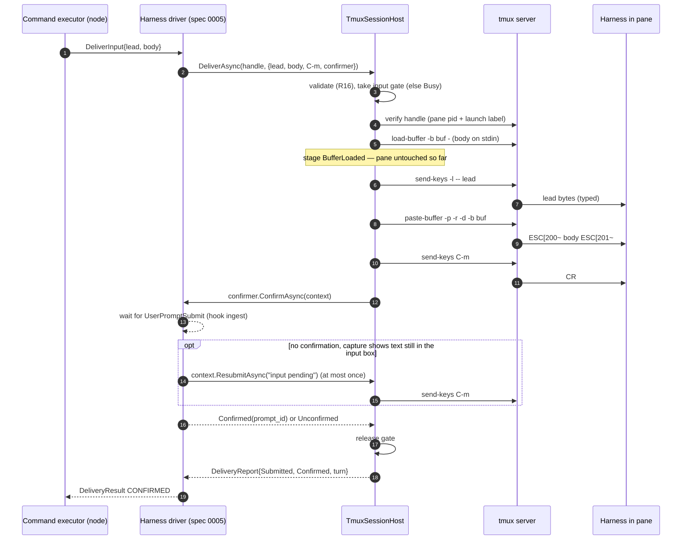

# 0004 — Node agent: tmux session host

## Context

Issue [#11](https://github.com/aiakos-hq/aiakos/issues/11) asks for the node agent's terminal
layer: create a pane, deliver text (bracketed paste plus a separate submit), send keys, capture,
check liveness, give humans an attach command, pass the seat identity through the pane
environment, and set per-seat tmux options. This spec defines `ISessionHost` and its tmux
implementation in `Aiakos.Node`.

Decisions this spec implements (not reopened here):

- [ADR 0005](../adr/0005-tmux-first-session-host.md): tmux is the first session host; delivery is
  bracketed paste plus a separate submit key; the terminal is transport, never the record, and a
  capture is evidence, never a state signal.
- [ADR 0004](../adr/0004-orchestrator-node-split.md): the node owns the machine (sessions,
  processes) and has no business logic. The orchestrator never touches tmux.
- CLAUDE.md rules 3 (honest state: `unknown` is a valid answer, no silent fallbacks), 4 (terminals
  are transport, the database is the record) and 5 (host-specific concerns behind interfaces).
- [Plan §3](../plan.md#3-architecture) (the `ISessionHost` sketch; a seat = harness × session host
  × sandbox), [§7](../plan.md#7-monitoring-incl-sandboxed-seats) (session host = "pane
  alive/exited, capture as evidence").

Evidence from the M0 spikes:

| Spike | What it forces into this spec |
|---|---|
| [0001](../spikes/0001-claude-wsl-tmux-hooks.md) | Delivery = typed lead line (`send-keys -l`) + `load-buffer -` / `paste-buffer -p -r -d` + a separate `C-m`. Byte-exact for 28 KB / 400 lines, **except TAB → spaces** (done by the harness TUI). No race between paste and submit even with zero delay. Input sent before the TUI is ready loses the submit key, so readiness gates delivery. Never send a bare Enter to an idle prompt. `new-session -e` reaches the pane (and its hooks). `remain-on-exit` / `#{pane_dead}` are the backup exit signal when no `SessionEnd` arrives. One private socket per node. |
| [0002](../spikes/0002-claude-session-resume.md) | `kill-server` sends SIGHUP; the harness exits and fires `SessionEnd`. A harness can sit on an unknown screen (trust dialog, picker): **never send keys to get past a screen the node does not recognise**; capture it as evidence instead. |
| [0003](../spikes/0003-aspire-wsl-node.md) | The node is a long-lived WSL process that is stopped with SIGHUP. Children that daemonize (the tmux server) survive the node by design, so sessions outlive node restarts and must be re-adopted. |
| [0004](../spikes/0004-opencode-api.md) | A `pgrep -f` pattern matched the tmux server's own argv and killed the whole server: identify processes by `#{pane_pid}` and recorded pids, never by pattern over all processes. |
| [0005](../spikes/0005-docker-seat.md) | For `docker exec` panes, killing the pane leaves the harness running in the container (orphans that hold the session ID). The stop protocol must stop the harness itself, not just close the pane. `kill-session` of the last session also stops the tmux server. |

### Depends on wave 1 decisions

These decisions come from draft specs that are still in review. If one changes, the listed parts of
this spec change with it.

- **Spec 0001 (solution skeleton)**
  - D1: the tmux socket is named after the instance, `tmux -L aiakos-<instance>` (dev:
    `aiakos-dev`, released: `aiakos-release`) → R6, [Server and socket](#server-socket-and-configuration).
  - D2: the node has a per-instance `AIAKOS_HOME` and a single-instance lock (`node.lock`, R38) →
    the registry location (R31) and "one node process writes the registry".
  - D3: the node treats SIGHUP as a graceful stop (R36) → R35 (node shutdown never stops seats).
  - D4: `ISessionHost` exists as an empty placeholder in `Aiakos.Core` (R43), and later specs may
    move it → R1 moves it into `Aiakos.Node`.
  - D5: `Aiakos.Node` is AOT-compatible and must not reference orchestrator code (R40) → P/Invoke
    through `LibraryImport`, source-generated JSON.
  - D6: telemetry uses `ActivitySource`/`Meter` `Aiakos.Node` (R42) → R40.
  - D7: opt-in tests follow the `AIAKOS_E2E_WSL=1` pattern with xUnit v3 dynamic skip → the
    `AIAKOS_TEST_TMUX=1` switch in the test plan.
  - D8: the node's own environment contains `AIAKOS_NODE_TOKEN` and `OTEL_*` → R9 (the tmux server
    must not inherit them).
- **Spec 0002 (gRPC contract)**
  - D9: the command set `StartSeat` / `DeliverInput` / `SendKeys` / `CapturePane` / `StopSeat`, with
    per-seat serialization of the first three and a bypass for capture and stop (R16) → R17, R24, R26.
  - D10: `DeliverInput` = one-line `lead` + `body` (≤ 1 MiB), outcomes `CONFIRMED` /
    `SUBMITTED_UNCONFIRMED` / `NOT_DELIVERED`, `SEAT_BUSY`, and **at-most-once** resend (R18, R22,
    R38) → R14–R20.
  - D11: the `SendKeys` allowlist (`Enter`, `Escape`, `Tab`, arrows, `C-c`, `C-d`), for humans only
    (R23) → R21.
  - D12: `CapturePane` = visible pane + up to `history_lines`, plain text, ≤ 1 MiB, `truncated`,
    `pane_dead` (R24, R38) → R22–R24.
  - D13: `StopSeat` = graceful, wait `grace`, then kill; outcomes `STOPPED` / `KILLED` /
    `NOT_RUNNING` (R25) → R25.
  - D14: `ProcessExited` with `optional` exit code and signal, source `PANE_DEAD` (R37);
    `SessionLifecycle.UNKNOWN` for a pane found after a node restart; `ObservationGap{NODE_RESTARTED}`
    (R33) → R29–R33.
  - D15: "Assumptions for dependent specs", #11 part: a launch registry in the node home, pane death
    with exit status (`remain-on-exit`), plain-text capture, capture/stop while a launch waits → R31,
    R12, R22, R24, R26.
  - D16: seats unknown to the orchestrator are a health finding and are never stopped automatically
    (Q9) → R33.
  - D17: error reasons `SESSION_HOST_ERROR`, `ORPHAN_HARNESS_DETECTED`, `SEAT_ALREADY_RUNNING`,
    `PAYLOAD_TOO_LARGE`, `UNSUPPORTED` → [Mapping to spec 0002](#mapping-to-spec-0002).
  - D18: the per-seat token reaches the harness through the pane environment in M1 (R45). **This
    spec proposes changing that** (Q1).
  - D19: `StartSeat.seat_address` is `member@rig` and `StartSeat.terminal` carries the size.
- **Spec 0003 (rig file format)**
  - D20: identifier patterns: rig `^[a-z][a-z0-9-]{1,39}$`, seat `^[a-z][a-z0-9-]{0,23}$` → the
    session name `<rig>_<seat>` (R7).
  - D21: seat directory `<seat_root>/<rig>/<seat>` and the workdir are computed upstream and arrive
    as absolute paths; creating worktrees is a workspace step before the session host is called
    (spec 0002 Q6), not part of it.

### Neighbouring specs (written in parallel)

- **Spec 0005 (#12, Claude Code adapter)** owns everything Claude-specific: argv (`--session-id`,
  `--resume`, `--settings`), readiness via the `SessionStart` hook, the lead-line text, the trust
  prompt, resume verification, what counts as a confirmation (`UserPromptSubmit`), and the hook
  relay/ingest. This spec provides the mechanics it needs; the contract is in
  [Contract with the harness driver](#contract-with-the-harness-driver).
- **Spec 0006 (#13, SeatActor)** owns state derivation. The session host reports observations
  (alive, exited with code, vanished); it never decides `working`/`idle`/`needs-input`.

## Goals

- One harness-neutral `ISessionHost` interface in the node, with a tmux implementation and an
  in-memory fake, covering start, deliver, send-keys, capture, status, stop, list, adopt, attach
  command and pane events.
- Delivery that is byte-exact for everything the spikes proved, rejects what it cannot deliver
  safely, never sends a key on its own, and reports exactly how far it got.
- A pane lifecycle with honest exit reporting: exit code and signal when tmux knows them,
  "unknown" otherwise, and dead panes kept as evidence until the seat is started or stopped again.
- Stop that terminates the harness and all its descendants (SIGTERM → grace → SIGKILL) and leaves
  no orphan processes.
- Seats survive a node restart: the next node process finds, classifies and adopts its sessions,
  and reports what it could not attribute.
- No user text ever reaches a shell or the tmux command parser; no secret ever reaches a tmux
  argv or the tmux server's environment.
- Every operation is traced and measured.

## Non-goals / out of scope

- **Anything Claude-specific** (spec 0005): argv, hooks, readiness rule, lead text, trust prompt,
  resume verification, the confirmation rule, the hook ingest endpoint.
- **Seat state** (spec 0006). Captures are evidence only (ADR 0005).
- **Workspace preparation**: creating directories, worktrees and projected files happens before
  `StartAsync` (spec 0002 `StartSeat` steps, spec 0003 paths).
- **Docker seats (M6)**: `docker exec` panes, container lifecycle events, secrets in tmpfs. The
  interface keeps room for them (R25, [Docker panes later](#docker-exec-panes-m6)); nothing is
  implemented.
- **Other session hosts** (herdr, tuios, native Windows), several panes per seat (the OpenCode
  human-view pane is M2), tmux control mode, resize after start, ANSI-preserving capture for a
  dashboard (M5), cgroup-based process tracking.
- **The CLI** (`aiakos attach`, `capture`, `send`): #15 uses `GetAttachCommand` and the commands of
  spec 0002.
- Keeping WSL itself running while no node process exists (#15, released tool).

## Requirements

### Interface and placement

- **R1** `ISessionHost` and its types live in `Aiakos.Node`, namespace `Aiakos.Node.Sessions`. The
  empty placeholder in `Aiakos.Core` (spec 0001 R43) is removed, because only the node uses it
  (ADR 0004). The members are those in [Interface](#interface); plan §3's one-line sketch is
  updated in the implementation PR.
- **R2** The interface is harness-neutral: no member or type names a harness, a hook or a harness
  screen. Harness-specific behaviour enters only through values and callbacks supplied by the
  harness driver (argv, environment, `IDeliveryConfirmer`, `IOrphanProbe`, `GracefulStop`).
- **R3** The session host **never sends input on its own initiative**: no key, no text, no Enter on
  startup, on a timeout, on an unknown screen or during adoption. Every byte written to a pane is
  the result of an explicit `DeliverAsync`, `SendKeysAsync` or a confirmer's `ResubmitAsync`
  (spike 0002 F3, spike 0001 pitfall 6).
- **R4** Operations that fail before touching a pane throw `SessionHostException` with a
  `SessionHostErrorCode` (see [Errors](#errors)). `DeliverAsync` and `StopAsync` return a report
  instead of throwing once they have changed the pane, so partial progress is never lost.

### tmux, server and naming

- **R5** tmux **3.4 or later** is required. At node start the host runs `tmux -V`, parses
  `tmux <major>.<minor>[suffix]`, and records the version. A lower or unparseable version, or no
  tmux binary, makes the host `Unavailable`: it does not advertise capability
  `session-host.tmux`, every operation throws `Unavailable` with the found version and the
  requirement in the message, and the node keeps running (rule 3; M2 API-driven seats do not need
  tmux). The tmux binary path is configurable (`Aiakos:Node:SessionHost:TmuxPath`, default: the
  first `tmux` on `PATH`, resolved once at start and logged).
- **R6** Every tmux invocation uses the instance socket `-L aiakos-<instance>` (D1), the node's
  generated configuration `-f $AIAKOS_HOME/tmux/tmux.conf` and `-u` (UTF-8). The user's
  `~/.tmux.conf` is therefore never loaded into the node's server.
- **R7** One tmux session per seat, named `<rig>_<seat>` from the seat address `<seat>@<rig>`
  (D20; `_` cannot occur in either identifier, and tmux forbids `.` and `:` in session names).
  An address that does not match the 0003 patterns is rejected with `InvalidArgument`. Targets are
  always the pane ID (`%N`) returned at creation; a session name is only used as an exact target
  (`-t '=<name>'`).
- **R8** Each managed session carries labels as tmux user options: `@aiakos-schema` (`1`),
  `@aiakos-instance`, `@aiakos-seat-id`, `@aiakos-seat` (address), `@aiakos-launch` (launch ID) and
  `@aiakos-harness`. Labels hold no secrets. Before every mutating operation the host verifies that
  the target pane still has the handle's launch label and pane PID; a mismatch is `NotFound`
  (a stale handle never touches another seat's pane).
- **R9** The host starts tmux client processes with an **explicit, allowlisted environment**
  (`HOME`, `USER`, `LOGNAME`, `SHELL`, `PATH`, `TMUX_TMPDIR`, `XDG_RUNTIME_DIR`, and `LANG=C.UTF-8`
  when `LANG`/`LC_ALL` are unset or not UTF-8), never the node's full environment. Since the first
  client starts the server and the server's global environment becomes every pane's base
  environment, this keeps `AIAKOS_NODE_TOKEN`, `OTEL_*` and `DOTNET_*` out of every pane (D8). At
  node start, if a server already runs, the host removes any global variable outside the allowlist
  (`set-environment -g -u`) and logs each name it removed.
- **R10** The generated `tmux.conf` sets at least: `remain-on-exit on`, `history-limit 10000`,
  `window-size manual`, `update-environment ""`, `allow-rename off`, `automatic-rename off`. The
  node rewrites it at every start; when a server is already running, the node applies the same
  options with `set-option -g` so an old server converges.

### Start

- **R11** `StartAsync(SessionSpec)` validates before doing anything visible:
  - `Argv` is non-empty, `Argv[0]` is an absolute path to an existing executable file, no element
    contains NUL, and no element ends with `;` (tmux's argument parser treats a trailing `;` as a
    command separator);
  - `WorkingDirectory` is an absolute path to an existing directory (tmux silently falls back to
    another directory when `-c` does not exist; rule 3);
  - `Environment` names match `^[A-Z_][A-Z0-9_]*$`, values contain no NUL or newline, names are not
    reserved (`TMUX`, `TMUX_PANE`, `AIAKOS_NODE_*`), and no name contains `TOKEN`, `SECRET`,
    `PASSWORD` or `API_KEY` (secrets never go through tmux: R38, Q1);
  - the packed size of argv plus environment is at most 12 KiB (tmux sends a command to its
    server in one message of about 16 KiB; larger configuration belongs in projected files);
  - `Size` is within 80–500 columns and 24–200 rows.
- **R12** The pane runs the harness **directly**, without a shell: the host passes argv as separate
  arguments after `--`, and when argv has one element it runs it as `/usr/bin/env <argv0>` so tmux
  always receives more than one argument (tmux runs a single-argument command through `sh -c`).
  `remain-on-exit` is on for the pane before the harness can exit (it is a server default, R10, and
  set again per pane).
- **R13** A start for a seat whose session exists: if the pane is alive, throw `AlreadyRunning`
  with the running launch ID (spec 0002 R20: never kill a running seat to satisfy a start); if the
  pane is dead, emit its `PaneExited` event if not yet emitted, remove the session, and continue.
  If the driver supplied an `IOrphanProbe` and a matching process runs outside every live managed
  pane, throw `OrphanDetected` with the PIDs (spike 0005 F4). `StartAsync` returns after the pane
  exists and is labelled; it does not wait for readiness.

### Delivery

- **R14** `DeliverAsync` runs, in order: load the body into a uniquely named tmux buffer from
  **stdin** (`load-buffer -b <buf> -`); type the lead with `send-keys -l`; paste with
  `paste-buffer -p -r -d -b <buf>`; wait `SubmitDelay` (default 0); send the submit key as its own
  `send-keys` call (default `C-m`); then call the driver's confirmer. The body is never passed as
  an argument, so no shell and no tmux parser sees it. A buffer left behind by a failed delivery is
  deleted.
- **R15** The body is pasted as **one** bracketed paste, never split into several pastes (the
  harness would see several pastes, and could act on a partial one). The host streams it to tmux's
  stdin in 64 KiB writes; that is the only chunking. The body limit is 1 MiB of UTF-8 (D10); larger
  is `PayloadTooLarge`.
- **R16** Input validation, with rejection (`InputNotAllowed`) rather than silent repair, except for
  line endings:
  - Lead: at most 1 KiB of UTF-8, one line, no C0 control characters, DEL or C1 controls. A lead
    ending in `;` is passed with tmux's `\;` escape; a lead ending in `\;` is rejected. The pane
    receives exactly the lead's bytes (tested).
  - Body: valid UTF-8; the only control characters allowed are LF and TAB. CRLF and lone CR are
    normalized to LF, and the report says so. In particular ESC is rejected: an `ESC [201~` in the
    body would end the bracketed paste early and turn the rest into keystrokes.
  - TAB is passed through unchanged; spike 0001 saw the Claude TUI turn it into spaces. Content
    whose bytes matter goes by file path (spec 0005).
- **R17** At most **one input operation** (delivery or send-keys) runs per session at a time. A
  second one fails immediately with `Busy`; the host does not queue (queueing is the command
  executor's job, spec 0002 R16). The gate is held from buffer load until the confirmer returns,
  so a second message can never be pasted while the first is unconfirmed. Capture, status and stop
  never take the gate.
- **R18** The confirmer decides what "delivered" means (spec 0005). The host passes it a
  `DeliveryContext` with the delivery ID, the submit time, capture access and `ResubmitAsync`.
  `ResubmitAsync` sends the submit key once more; the host allows it **at most once per
  delivery**, only after the submit step, and records the confirmer's reason. With no confirmer,
  the outcome is `NotRequested`.
- **R19** `DeliveryReport` states the last completed stage (`None`, `BufferLoaded`, `LeadTyped`,
  `BodyPasted`, `Submitted`), the confirmation outcome and turn ID, the resubmit count, the body
  size and whether line endings were normalized, and the error if one occurred. A tmux failure
  after `BufferLoaded` means the pane's input box may hold partial input: the error is not
  retryable, and the host sends nothing to clean up (R3).
- **R20** `StopAsync` cancels an in-flight delivery. The delivery observes cancellation between
  steps, never inside one, and reports the stage it reached.

### Keys

- **R21** `SendKeysAsync` accepts only the closed `NamedKey` set (`Enter`, `Escape`, `Tab`, `Up`,
  `Down`, `Left`, `Right`, `CtrlC`, `CtrlD`), mapped to fixed tmux key names; it never accepts free
  text or tmux key syntax. At most 32 keys per call, sent in one `send-keys` invocation. It takes
  the input gate (R17).

### Capture

- **R22** `CaptureAsync` returns the visible screen plus up to `HistoryLines` (0–10 000) of
  scrollback as **plain text**: tmux's `capture-pane -p` without `-e`, so no escape sequences.
  Trailing whitespace is trimmed per line and trailing empty lines are dropped; invalid UTF-8 is
  replaced with U+FFFD; control characters other than LF and TAB are removed. Wrapped lines are
  kept as displayed (no `-J`), so the text matches what a human sees.
- **R23** The text is capped at `MaxBytes` (default and maximum 1 MiB, D12). When over the cap,
  the **oldest** lines are dropped first, the visible screen is always kept whole, and `Truncated`
  is set.
- **R24** A snapshot also reports the pane size, the cursor position, whether the pane is dead and
  the capture time. Capturing a dead pane is allowed (evidence of why a launch failed). Capture
  never takes the input gate and never changes the pane.

### Stop and process tree

- **R25** `StopAsync(handle, StopRequest)`:
  1. If the pane is dead or gone: outcome `NotRunning`, with the recorded exit status.
  2. Snapshot the pane's process tree: the pane PID and all descendants (walking `/proc` parent
     links), plus every process whose session ID equals the pane PID; each identified by PID and
     start time (`/proc/<pid>/stat` field 22) so a reused PID is never signalled.
  3. Graceful step: by default send `SIGTERM` to the pane process (the harness). The request may
     choose another signal, or a driver-supplied `GracefulStop` callback instead (reserved for
     M6 `docker exec` panes, where signalling the pane only kills the exec client).
  4. Wait up to `Grace` (default 10 s, from `StopSeat.grace`) for the pane to die.
  5. If the harness is still alive: `SIGKILL` every tracked process → outcome `Killed`. If it
     exited in time: send `SIGTERM` to the tracked processes still alive, wait `ChildGrace`
     (default 2 s), then `SIGKILL` → outcome `Stopped`. Rescan descendants before each signal
     round so processes forked during the grace period are included.
  6. Verify within 1 s that no tracked process is left. Survivors (for example in uninterruptible
     sleep) are reported by PID in `StopReport.Leftovers` and in a `SessionHostError`; they are
     never ignored.
  7. Record the exit status, then `kill-session` and remove the registry entry.
- **R26** Stop bypasses the input gate and serializes only with start of the same seat. Stopping
  a seat whose start is in progress waits for the pane to exist, then stops it.
- **R27** Stop never runs `kill-session` or `kill-server` on a live harness: those send SIGHUP and
  lose the exit status. `kill-server` is never used at all.

### Liveness and events

- **R28** `GetStatusAsync` returns `Alive`, `Exited` (with optional exit code and signal),
  `Missing` (the session or pane is gone, for example the server was killed) or `Unknown` (tmux
  did not answer within its timeout, with the reason). `Missing` and `Unknown` are distinct: a
  timeout is never reported as dead or alive.
- **R29** A watcher polls `list-panes -a` every 1 s (configurable) and publishes
  `PaneExited{exit_code?, signal?}` exactly once per launch when a managed pane turns dead, and
  `SessionVanished` when a managed session disappears without being stopped. Exit code and signal
  come from `#{pane_dead_status}` / `#{pane_dead_signal}`; an empty value means "unknown" and is
  reported as absent, never as 0 (D14).
- **R30** A tmux invocation that times out or fails does not produce an event; the watcher marks
  the host degraded (metric and log) and retries on the next tick.

### Registry, restart and adoption

- **R31** The host keeps a launch registry in `$AIAKOS_HOME/sessions/` (directory `0700`), one JSON
  file per seat (`<rig>_<seat>.json`, mode `0600`), written atomically (temp file, `fsync`,
  rename). The entry is written **before** `new-session` with state `starting`, and updated to
  `running` with the tmux IDs, pane PID and pane start time once the pane exists. It also holds
  the caller's opaque `Attributes` (for example the native session ID and the seat token hash
  that spec 0002 D15 needs for hook attribution; never a token). The entry is deleted when the
  session is removed.
- **R32** `ListAsync` joins the tmux listing with the registry and classifies each session on the
  socket:
  - `Managed`: labels match the instance and a registry entry (by launch ID, or a `starting`
    entry by session name);
  - `ManagedUnregistered`: our labels, but no registry entry (for example the registry was
    deleted);
  - `Foreign`: no Aiakos labels (for example a human ran `new-session` on the node's socket);
  and each registry entry without a session as `Vanished`.
- **R33** On node start the host reconciles once, before the node sends `Hello`:
  - `Managed` and alive → adopted: the handle is restored and watched; the seat is reported with
    lifecycle `UNKNOWN` (D14) because readiness cannot be re-established from the pane;
  - `Managed` and dead → adopted and `PaneExited` is emitted with the recorded status;
  - `Vanished` → `SessionVanished` is emitted (exit code absent) and the entry is kept until the
    orchestrator stops or restarts the seat;
  - `ManagedUnregistered` → adopted read-only (status, capture, stop only; `DeliverAsync` throws
    `NotFound`), reported under its labelled seat ID so the orchestrator raises the health finding
    (D16);
  - `Foreign` → never touched; logged with its name and counted in a metric.
  Nothing is stopped, killed or sent keys during reconciliation.
- **R34** `AdoptAsync` restores a handle only after verifying the pane PID's start time against the
  registry (or, for `ManagedUnregistered`, reading it fresh). Adoption is idempotent.
- **R35** Node shutdown (SIGHUP, SIGTERM, Ctrl+C) **never stops seats**. The host flushes the
  registry and exits; sessions keep running in the tmux server (spike 0003 §4).

### Invocation from .NET

- **R36** tmux is run with `System.Diagnostics.Process`: `UseShellExecute = false`, arguments only
  through `ArgumentList` (one element per argument, never a joined string), the environment of R9,
  stdout and stderr captured up to 1 MiB each, stdin only for `load-buffer`. There is no shell
  anywhere between the node and tmux, and no user-supplied string is ever an option or a format.
- **R37** Every invocation has a timeout (default 5 s; `load-buffer` 5 s + 2 s per MiB). On
  timeout the client process is killed and the result is `TmuxTimeout`. At most 8 tmux client
  processes run at once per node (configurable). Failures are classified from exit code and stderr
  ("no server running", "can't find session/pane", "duplicate session"); unclassified stderr is
  kept (truncated to 1 KiB) in the error.
- **R38** Secret values never pass through the session host: not in argv, not in `-e`, not in
  labels, not in the registry, not in logs or traces. `SessionSpec` has no field for them.

### Observability and testing

- **R39** Logs and traces never contain the lead, the body, captured text or environment values.
  They may contain sizes, hashes (SHA-256 prefix), environment variable names, tmux IDs, the seat
  address and launch ID.
- **R40** Spans and metrics as listed in [Observability](#observability), under `Aiakos.Node`.
- **R41** `FakeSessionHost` (in-memory, in a test-support project) implements `ISessionHost` with
  the same validation, gate, stage and status semantics, and a shared contract test suite runs
  against both the fake and real tmux so the two cannot drift.

## Design

### Components

```
Aiakos.Node
 └─ Sessions/
     ├─ ISessionHost, SessionSpec, SessionHandle, … (interface and types)
     ├─ TmuxSessionHost        implements ISessionHost; per-seat state, gates, registry, reconcile
     ├─ TmuxClient             builds argv for each operation, runs it, classifies results
     ├─ ProcessRunner          Process wrapper: ArgumentList, env allowlist, stdin, timeouts (IProcessRunner)
     ├─ TmuxVersion            parse and compare `tmux -V`
     ├─ TmuxConfigWriter       generates $AIAKOS_HOME/tmux/tmux.conf
     ├─ PaneWatcher            BackgroundService: polls list-panes, publishes events
     ├─ SessionRegistry        $AIAKOS_HOME/sessions/*.json, atomic writes, source-generated JSON
     ├─ ProcessTree            /proc scan: descendants, session members, start times, argv
     ├─ Signals                LibraryImport kill(2) with start-time check before each signal
     └─ InputValidator         lead/body/env/argv rules (R11, R16)
tests/Aiakos.Node.Testing      FakeSessionHost, FakeProcessRunner, SessionHostContractTests (abstract)
tests/Aiakos.Node.Tests        unit tests; tmux integration tests (opt-in, Category=Tmux)
```

`tests/Aiakos.Node.Testing` is a class library (not a test project) so spec 0002's conformance
tests and specs 0005/0006 can reuse the fake.

### Interface

Illustrative C#; names and semantics are normative, exact signatures may be adjusted in the
implementation PR (and noted under "Changes after acceptance").

```csharp
namespace Aiakos.Node.Sessions;

public interface ISessionHost
{
    SessionHostInfo Info { get; }   // kind "tmux", version, Available/Unavailable + reason, capabilities

    Task<SessionHandle> StartAsync(SessionSpec spec, CancellationToken ct);
    Task<DeliveryReport> DeliverAsync(SessionHandle session, DeliveryRequest request, CancellationToken ct);
    Task SendKeysAsync(SessionHandle session, IReadOnlyList<NamedKey> keys, CancellationToken ct);
    Task<PaneSnapshot> CaptureAsync(SessionHandle session, CaptureRequest request, CancellationToken ct);
    Task<PaneStatus> GetStatusAsync(SessionHandle session, CancellationToken ct);
    Task<StopReport> StopAsync(SessionHandle session, StopRequest request, CancellationToken ct);
    Task<IReadOnlyList<SessionListing>> ListAsync(CancellationToken ct);
    Task<SessionHandle> AdoptAsync(SessionListing listing, CancellationToken ct);
    IReadOnlyList<string> GetAttachCommand(SessionHandle session, bool readOnly = true);
    IAsyncEnumerable<SessionHostEvent> WatchAsync(CancellationToken ct);   // PaneExited, SessionVanished
}

public sealed record SessionSpec(
    string SeatId,                                   // orchestrator seat ID (label, registry)
    string SeatAddress,                              // "impl@aiakos-dev" → session "aiakos-dev_impl"
    string LaunchId,
    string Harness,                                  // label only; the host does not interpret it
    IReadOnlyList<string> Argv,                      // absolute argv[0]; no shell
    string WorkingDirectory,                         // absolute, must exist
    IReadOnlyDictionary<string, string> Environment, // non-secret only (R11, R38)
    TerminalSize Size,                               // default 160x45
    IOrphanProbe? OrphanProbe,                       // harness-specific predicate (R13)
    IReadOnlyDictionary<string, string> Attributes); // opaque, stored in the registry only; ≤ 4 KiB

public sealed record SessionHandle(
    string SeatId, string LaunchId, string SessionName,
    string SessionId, string PaneId, int PanePid, ulong PaneStartTime,
    bool ReadOnly);                                  // true for adopted ManagedUnregistered sessions

public sealed record DeliveryRequest(
    string Lead, string Body,
    SubmitKey Submit = SubmitKey.CtrlM,              // or None (the driver submits itself)
    TimeSpan SubmitDelay = default,
    IDeliveryConfirmer? Confirmer = null);

public interface IDeliveryConfirmer
{
    Task<Confirmation> ConfirmAsync(DeliveryContext context, CancellationToken ct);
}

public abstract class DeliveryContext
{
    public abstract string DeliveryId { get; }
    public abstract DateTimeOffset SubmittedAt { get; }
    public abstract Task<PaneSnapshot> CaptureAsync(CaptureRequest request, CancellationToken ct);
    public abstract Task ResubmitAsync(string reason, CancellationToken ct);   // at most once (R18)
}

public sealed record Confirmation(ConfirmationOutcome Outcome, string? TurnId);  // Confirmed | Unconfirmed | NotRequested

public enum DeliveryStage { None, BufferLoaded, LeadTyped, BodyPasted, Submitted }

public sealed record DeliveryReport(
    string DeliveryId, DeliveryStage Stage, Confirmation Confirmation, int Resubmits,
    int BodyBytes, bool LineEndingsNormalized, SessionHostError? Error);

public enum NamedKey { Enter, Escape, Tab, Up, Down, Left, Right, CtrlC, CtrlD }

public sealed record CaptureRequest(int HistoryLines = 0, int MaxBytes = 1 << 20);
public sealed record PaneSnapshot(
    string Text, bool Truncated, int Lines, DateTimeOffset CapturedAt,
    TerminalSize Size, (int X, int Y)? Cursor, bool PaneDead);

public sealed record PaneStatus(PaneState State, int? ExitCode, int? Signal, string? Reason);
public enum PaneState { Alive, Exited, Missing, Unknown }

public sealed record StopRequest(
    TimeSpan Grace, GracefulStop? Graceful = null /* default: Signal(SIGTERM) to the pane process */,
    TimeSpan? ChildGrace = null /* default 2 s */);
public abstract record GracefulStop
{
    public sealed record Signal(int Number) : GracefulStop;
    public sealed record Custom(Func<SessionHandle, CancellationToken, Task> StopAsync) : GracefulStop; // M6
}
public sealed record StopReport(
    StopOutcome Outcome, int? ExitCode, int? Signal, int ChildrenSignalled,
    IReadOnlyList<int> Leftovers, SessionHostError? Error);   // Stopped | Killed | NotRunning

public interface IOrphanProbe { bool Matches(ProcessInfo process); }       // argv-based (see below)
public sealed record ProcessInfo(int Pid, int ParentPid, int SessionId, ulong StartTime, IReadOnlyList<string> Argv);

public sealed record SessionListing(
    string SessionName, string SessionId, string PaneId, int PanePid, bool PaneDead,
    int? ExitCode, int? Signal, SessionLabels? Labels, ListingClass Class, RegistryEntry? Registry);
public enum ListingClass { Managed, ManagedUnregistered, Foreign, Vanished }

public abstract record SessionHostEvent(SessionHandle Session, DateTimeOffset ObservedAt)
{
    public sealed record PaneExited(SessionHandle Session, DateTimeOffset ObservedAt, int? ExitCode, int? Signal)
        : SessionHostEvent(Session, ObservedAt);
    public sealed record SessionVanished(SessionHandle Session, DateTimeOffset ObservedAt)
        : SessionHostEvent(Session, ObservedAt);
}
```

`IOrphanProbe` receives only what `/proc/<pid>/cmdline` and `/proc/<pid>/stat` give, because a
harness's `/proc/<pid>/environ` may be unreadable (spike 0005 F3: the Claude process is not
dumpable). Spec 0005's probe matches argv containing the seat's native session ID. The host scans
only processes of its own UID and excludes every process in a live managed pane's tree.

### Errors

| `SessionHostErrorCode` | Thrown / reported when | Retryable |
|---|---|---|
| `Unavailable` | tmux missing or older than 3.4 (R5) | no |
| `InvalidArgument` | argv, cwd, env, size, address or key invalid (R7, R11, R21) | no |
| `InputNotAllowed` | lead or body contains a forbidden character (R16) | no |
| `PayloadTooLarge` | body > 1 MiB, argv+env > 12 KiB, attributes > 4 KiB | no |
| `AlreadyRunning` | live pane exists for the seat (R13) | no |
| `OrphanDetected` | orphan probe matched (R13) | no |
| `NotFound` | handle's pane gone, or labels/PID do not match (R8); delivery to a read-only handle | no |
| `Busy` | another input operation runs on the session (R17) | yes |
| `TmuxTimeout` | a tmux call exceeded its timeout (R37) | yes, unless input may be partial (R19) |
| `TmuxFailed` | tmux exited non-zero for an unclassified reason (stderr attached) | yes, unless input may be partial (R19) |
| `LeftoverProcesses` | processes survived SIGKILL (R25 step 6) | no |

### Mapping to spec 0002

| Spec 0002 | Session host |
|---|---|
| `StartSeat` (after workspace and files are prepared) | `StartAsync`; `AlreadyRunning` → `SEAT_ALREADY_RUNNING`; `OrphanDetected` → `ORPHAN_HARNESS_DETECTED`; `PayloadTooLarge` → `PAYLOAD_TOO_LARGE`; `InvalidArgument` → `INVALID_ARGUMENT` (reason `INVALID_LAUNCH`, proposed); `Unavailable` → `SESSION_HOST_UNAVAILABLE` (proposed); tmux errors → `SESSION_HOST_ERROR` |
| `DeliverInput` | `DeliverAsync`. `Submitted` + `Confirmed` → `CONFIRMED` (turn ID); `Submitted` + `Unconfirmed`/`NotRequested` → `SUBMITTED_UNCONFIRMED`; stage `None`/`BufferLoaded` → `NOT_DELIVERED`, retryable; stage `LeadTyped`/`BodyPasted` with an error → status `FAILED`, `SESSION_HOST_ERROR`, `metadata.stage`, not retryable; `Busy` → `SEAT_BUSY`; `InputNotAllowed` → `INPUT_NOT_ALLOWED` (proposed) |
| `SendKeys` | `SendKeysAsync`; the wire key names map 1:1 onto `NamedKey` |
| `CapturePane` | `CaptureAsync(history_lines, 1 MiB)`; `PaneSnapshot` → `PaneCapture{text, truncated, captured_at, size, pane_dead}` |
| `StopSeat` | `StopAsync(grace)`; `Stopped`/`Killed`/`NotRunning` → `STOP_OUTCOME_*`; `LeftoverProcesses` → `SESSION_HOST_ERROR` with the PIDs in `metadata` |
| `ProcessExited{PANE_DEAD}` | `PaneExited` and `SessionVanished` (exit code absent) |
| `Hello.seats` | registry + reconciliation (R33): adopted live → `UNKNOWN`, dead/vanished → `EXITED` |
| `ObservationGap{NODE_RESTARTED}` | emitted by the node for every adopted seat (the host reports adoption; the node emits the gap) |

**Proposed additions to spec 0002** (additive, catalogue of reasons): `INPUT_NOT_ALLOWED`
(`INVALID_ARGUMENT`), `INVALID_LAUNCH` (`INVALID_ARGUMENT`), `SESSION_HOST_UNAVAILABLE`
(`FAILED_PRECONDITION`, not retryable), and the capability string `session-host.tmux`. If 0002
prefers to keep its catalogue closed, the fallbacks are `INVALID_ARGUMENT`/`UNSUPPORTED` with the
detail in `message`.

### Server, socket and configuration

- Socket: `-L aiakos-<instance>` (D1), so the path is `$TMUX_TMPDIR/tmux-<uid>/aiakos-<instance>`
  (default `/tmp/tmux-<uid>/…`, directory mode 0700, created by tmux). The dev stack and the
  released tool never see each other's sessions.
- The server is started implicitly by the first `new-session` with `-f` (R6); nothing else starts
  it. With `exit-empty` at its default (on), the server exits when the last session is removed;
  the next start creates a new one. That is fine because all state that matters is in the
  registry and the labels.
- `$AIAKOS_HOME/tmux/tmux.conf` (generated; every line commented in the file with its reason):

```tmux
# Generated by aiakos-node. Do not edit; rewritten at every node start.
set-option -g remain-on-exit on          # keep dead panes: exit status + evidence (spike 0001)
set-option -g history-limit 10000        # scrollback for CapturePane history_lines
set-option -g window-size manual         # an attaching human does not resize the seat's TUI
set-option -g update-environment ""      # attaching clients never inject variables
set-option -g allow-rename off
set-option -g automatic-rename off
```

- Human attach (issue #11): `GetAttachCommand` returns
  `tmux -L aiakos-<instance> attach-session -r -t '=<rig>_<seat>'` (read-only by default; the
  CLI can offer a writable attach with a warning that typing collides with deliveries).

### tmux invocations

Every line starts with `tmux -u -f $AIAKOS_HOME/tmux/tmux.conf -L aiakos-<instance>`. `<…>` are
single `ArgumentList` elements; nothing is joined or quoted.

| Operation | Arguments |
|---|---|
| Version | `-V` (without `-L`/`-f`) |
| Start | `new-session -d -P -F '#{session_id}\t#{pane_id}\t#{pane_pid}' -s <name> -x <cols> -y <rows> -c <cwd> [-e <K=V>]… -- <argv…>` |
| Label | `set-option -t <$id> @aiakos-schema 1 ; set-option -t <$id> @aiakos-instance <i> ; …labels… ; set-option -p -t <%id> remain-on-exit on` (the `;` are standalone arguments; all values are ours and validated) |
| Load body | `load-buffer -b aiakos-<launch8>-<n> -` (body on stdin) |
| Lead | `send-keys -t <%id> -l -- <lead>` |
| Paste | `paste-buffer -p -r -d -b aiakos-<launch8>-<n> -t <%id>` |
| Submit / resubmit | `send-keys -t <%id> C-m` |
| Keys | `send-keys -t <%id> <Enter|Escape|Tab|Up|Down|Left|Right|C-c|C-d>…` |
| Capture | `capture-pane -p -t <%id> [-S -<history>]` and `display-message -p -t <%id> '#{pane_width}\t#{pane_height}\t#{cursor_x}\t#{cursor_y}\t#{pane_dead}'` |
| Watch / list | `list-panes -a -F '#{session_name}\t#{session_id}\t#{pane_id}\t#{pane_pid}\t#{pane_dead}\t#{pane_dead_status}\t#{pane_dead_signal}\t#{@aiakos-schema}\t#{@aiakos-instance}\t#{@aiakos-seat-id}\t#{@aiakos-launch}\t#{@aiakos-harness}'` |
| Verify handle | `display-message -p -t <%id> '#{pane_pid}\t#{@aiakos-launch}\t#{pane_dead}'` |
| Remove | `kill-session -t '=<name>'` (dead panes only, R27) |
| Clean buffer | `delete-buffer -b <buf>` (after a failed delivery; "no buffer" is ignored) |
| Server hygiene | `show-environment -g`, `set-environment -g -u <NAME>`, `set-option -g …` (R9, R10) |

`list-panes` with no server running returns "no server running": the watcher treats that as
"no sessions" and turns every live managed handle into `SessionVanished`.

### Delivery sequence



The body is loaded before the lead is typed, so the most likely failure (a large stdin transfer)
happens while the pane is still untouched and the delivery can be retried safely.

### Contract with the harness driver

The node-side harness driver (spec 0002 Q1; for Claude Code, spec 0005) and the session host
divide the work like this:

| Concern | Harness driver provides / decides | Session host guarantees |
|---|---|---|
| Launch | absolute argv (fresh/resume/fork), cwd, non-secret env (`AIAKOS_SEAT`, hook URL, …), size, attributes for the registry, orphan probe | exact argv without a shell (R12), labels and registry (R8, R31), refusal of a live or orphaned seat (R13) |
| Readiness | the rule (Claude: `SessionStart` for this launch) and its timeout; may call `CaptureAsync` for a prompt check or evidence | never sends keys while waiting (R3); capture and stop work during the wait (R24, R26) |
| Delivery | whether a message may be sent now (readiness), the lead text, the submit key (or none), `SubmitDelay`, the confirmer (Claude: `UserPromptSubmit` matching the body) | byte-exact lead and body in order, one bracketed paste, one delivery at a time, stage reporting, at most one resubmit (R14–R20) |
| Screens | recognising harness screens (trust dialog, picker) | never interprets screen text |
| Keys | only on explicit human request (spec 0002 R23) | closed key set (R21) |
| Exit | mapping `PaneExited` / `SessionVanished` together with its hook events | exit status once per launch, unknown stays unknown (R29) |
| Stop | graceful method if SIGTERM is wrong for the harness (M6: stop inside the container) | process-tree termination and verification (R25) |
| Content | send files by path when bytes (TAB) matter | no transformation except CRLF → LF (R16) |

### Registry entry

```json
{
  "schema": 1,
  "instance": "dev",
  "state": "running",
  "seat_id": "0b7c…",
  "seat_address": "impl@aiakos-dev",
  "launch_id": "5f1e…",
  "harness": "claude-code",
  "socket": "aiakos-dev",
  "session_name": "aiakos-dev_impl",
  "session_id": "$3",
  "pane_id": "%7",
  "pane_pid": 48211,
  "pane_start_time": 1823412,
  "created_at": "2026-10-02T09:14:03.112Z",
  "exit": null,
  "attributes": { "native_session_id": "088452fe-…", "seat_token_sha256": "…" }
}
```

`exit` holds `{ "code": 0|null, "signal": 15|null, "observed_at": "…", "reported": true }` once the
pane is dead, so `PaneExited` is emitted exactly once even across node restarts.

### Process tree and signals

- `/proc` is read directly (`stat` for PID, parent PID, session ID and start time; `cmdline` for
  argv). Only processes of the node's UID are considered.
- `kill(2)` is called through `LibraryImport` (AOT-safe, D5). Immediately before each signal the
  host re-reads the start time; a mismatch means the PID was reused and the process is skipped.
- Process groups are not used for targeting: children of a harness can create their own groups
  or sessions (spike 0005's in-container case is the extreme). The snapshot of descendants taken
  **before** the first signal is what finds children that `setsid` away; after the parent dies
  they are re-parented and would otherwise be lost.
- `pidfd_open`/`pidfd_send_signal` would close the remaining reuse race; they are a later
  hardening (M7), not needed for M1.

### Concurrency

- One `SeatSessionState` per seat in memory: the handle, an input gate (`SemaphoreSlim(1)`,
  `WaitAsync(0)` for R17), a lifecycle lock for start/stop (R26), and the cancellation source of
  the in-flight delivery (R20).
- Different seats run fully in parallel, limited only by the node-wide cap of 8 concurrent tmux
  client processes (R37).
- The watcher's poll and operations may overlap; `PaneExited` is emitted by whichever sees the
  death first, deduplicated through the registry's `exit.reported` flag.

### Docker `exec` panes (M6)

Not implemented; the interface is shaped so M6 needs no change to it:

- `ISandbox.Wrap(argv)` produces `docker exec -it <container> <argv…>`, which `StartAsync` runs
  like any argv.
- Pane death then means "exec client exited", not "harness exited" (spike 0005 F4). The M6
  driver supplies `GracefulStop.Custom` (SIGTERM inside the container, wait for `SessionEnd` or
  `exec_die`) and an `IOrphanProbe` that looks inside the container (`docker top`).
- Container lifecycle events come from `ISandbox`, not from the session host.

### Observability

Spans (`ActivitySource` `Aiakos.Node`), all with `aiakos.seat.address`, `aiakos.launch_id`,
`tmux.session`, `tmux.pane_id` where known:

| Span | Extra attributes |
|---|---|
| `session_host.start` | `aiakos.harness`, `argv.count`, `env.names` (names only), outcome |
| `session_host.deliver` | `delivery.id`, `lead.bytes`, `body.bytes`, `body.sha256_prefix`, `delivery.stage`, `delivery.confirmation`, `delivery.resubmits` |
| `session_host.send_keys` | `keys` (the named keys) |
| `session_host.capture` | `capture.history_lines`, `capture.bytes`, `capture.truncated` |
| `session_host.stop` | `stop.outcome`, `stop.grace_ms`, `stop.children_signalled`, `stop.leftovers` |
| `session_host.reconcile` | counts per `ListingClass` |
| `tmux <command>` (child of the above) | `tmux.command`, `tmux.exit_code`, `tmux.error_class`, duration |

Metrics (`Meter` `Aiakos.Node`):

| Instrument | Type | Tags |
|---|---|---|
| `aiakos.node.tmux.invocations` | counter | `command`, `result` (`ok`, `timeout`, `failed`, `no_server`, `not_found`) |
| `aiakos.node.tmux.invocation.duration` | histogram (ms) | `command` |
| `aiakos.node.session_host.deliveries` | counter | `stage`, `confirmation` |
| `aiakos.node.session_host.delivery.bytes` | histogram | — |
| `aiakos.node.session_host.sessions` | observable gauge | `class` (`managed`, `managed_unregistered`, `foreign`), `state` (`alive`, `dead`) |
| `aiakos.node.session_host.pane_exits` | counter | `has_exit_code` |
| `aiakos.node.session_host.stops` | counter | `outcome` |
| `aiakos.node.session_host.available` | observable gauge (0/1) | `tmux.version` |

### Security notes

- Every process of the node's user can reach the tmux socket. In M1 seats run as that user, so a
  seat's shell tool could drive another seat's pane with `tmux -L …`. This is accepted for the
  local profile (same trust boundary as the user's own shell) and removed by sandboxing in M6.
  Spec 0005 should add `Bash(tmux:*)` to the projected deny rules as a speed bump.
- tmux arguments are visible to same-host users in `/proc/<pid>/cmdline` while a client runs;
  hence no secrets in argv or `-e` (R38) and only non-sensitive labels.
- The registry and `tmux.conf` are `0600` in a `0700` directory under `$AIAKOS_HOME`.

## Acceptance criteria

- [ ] AC1 — `dotnet test tests/Aiakos.Node.Tests --filter "Category!=Tmux"` passes on Linux CI;
  it includes the argv golden tests (every row of [tmux invocations](#tmux-invocations)), the
  validator tests and the contract suite against `FakeSessionHost`.
- [ ] AC2 — In WSL Ubuntu (tmux 3.6) and on `ubuntu-24.04` (tmux 3.4),
  `AIAKOS_TEST_TMUX=1 dotnet test tests/Aiakos.Node.Tests --filter Category=Tmux` passes; without
  the variable those tests report "skipped".
- [ ] AC3 — Byte-exact delivery: the integration test's fake harness records exactly
  `lead ‖ ESC[200~ ‖ body ‖ ESC[201~ ‖ CR` for a one-line body, the spike 0001 special-character
  body (quotes, backticks, `$HOME`, `\n` text, `\\`, Greek, `✓`, a TAB, a blank line), 400 lines,
  and 1 MiB; and a lead ending in `;` arrives with the `;`.
- [ ] AC4 — A body containing ESC, and a lead containing a newline, are rejected with
  `InputNotAllowed`, and the fake harness receives no byte.
- [ ] AC5 — Two concurrent `DeliverAsync` calls on one session: exactly one runs, the other fails
  with `Busy` before any tmux call; a confirmer calling `ResubmitAsync` twice gets one extra `CR`
  and an exception on the second call.
- [ ] AC6 — With the test process's environment containing `AIAKOS_NODE_TOKEN=sentinel`, a
  started pane's environment (`/proc/<pane_pid>/environ`) and
  `tmux -L <socket> show-environment -g` contain no `AIAKOS_NODE_TOKEN`; a variable passed in
  `SessionSpec.Environment` is present.
- [ ] AC7 — With `HOME` pointing at a directory whose `.tmux.conf` sets `remain-on-exit off` and
  `base-index 1`, a pane whose harness runs `exit 7` stays dead and `PaneExited{exit_code: 7}` is
  published once; a harness killed with SIGKILL yields `signal: 9` (or an absent signal if the
  tmux version does not report it, never 0).
- [ ] AC8 — Stop: a harness that exits on SIGTERM → `Stopped`; one that ignores SIGTERM →
  `Killed` after the grace period; in both cases a grandchild started with `setsid sleep 1000` is
  gone afterwards (no process with its PID and start time exists), and the session is removed.
- [ ] AC9 — Restart: start a session with host instance A, dispose A without stopping (simulated
  node exit), start host B on the same `AIAKOS_HOME`: the session is `Managed`, adopted, alive,
  and accepts a delivery. A session whose harness exited while no host ran is adopted as dead
  and `PaneExited` is published once (and not again after a third host start). A session created
  by hand with `tmux -L <socket> new-session` is `Foreign` and still exists, untouched, after
  reconciliation.
- [ ] AC10 — `tmux -L <socket> kill-server` run externally → every managed handle gets
  `SessionVanished` within 2 s; `GetStatusAsync` returns `Missing`.
- [ ] AC11 — A fake `tmux` printing `tmux 3.2a` (first on `PATH`) makes `Info` report
  `Unavailable` with "3.2a < 3.4", `session-host.tmux` is not advertised, and `StartAsync` throws
  `Unavailable`; the node process keeps running.
- [ ] AC12 — Capture: after the harness prints 500 lines with ANSI colours, `CaptureAsync(500)`
  returns them without any ESC byte; with `MaxBytes` = 4 KiB the result keeps the whole visible
  screen, drops the oldest lines and sets `Truncated`.
- [ ] AC13 — `StartAsync` with a single-element argv (a script that writes `$0` to a file) runs
  without `sh -c` (the file shows the script path, and no `sh` process appears in the pane tree);
  a missing working directory throws `InvalidArgument` and creates no session.
- [ ] AC14 — A log-capture test with a sentinel lead, body and environment value finds none of
  them in logs, spans or the registry file.
- [ ] AC15 — Manual (WSL, with spec 0005): `aiakos up` a Claude seat, stop the node from the
  Aspire dashboard and start it again; `tmux -L aiakos-dev ls` shows the seat's session throughout,
  the node log shows "adopted aiakos-dev_impl (alive)", and `Hello.seats` reports it with
  lifecycle `UNKNOWN`.

## Test plan

**Unit tests** (`tests/Aiakos.Node.Tests`, run everywhere, no tmux needed):

- `TmuxClient` argv golden tests with `FakeProcessRunner`: each operation's exact `ArgumentList`,
  environment allowlist (R9), stdin only for `load-buffer`, timeouts and kill on timeout, stderr
  classification table.
- `InputValidator`: lead and body rules (every forbidden character class, 1 KiB / 1 MiB limits,
  CRLF normalization, trailing `;` and `\;`), env name rules and the secret-name guard, argv rules
  (absolute path, trailing `;`, NUL), 12 KiB packed size, session name derivation.
- `TmuxVersion`: `3.4`, `3.6`, `3.3a`, `next-3.7`, `master`, garbage.
- `SessionRegistry`: atomic write (crash between write and rename leaves the old file), `starting`
  → `running`, `exit.reported` dedupe.
- `ProcessTree` against a fake `/proc` directory: descendants, session members, start-time reuse
  check, UID filter.
- Reconciliation classification over scripted `list-panes` output and registry contents (all four
  classes plus stale PIDs).
- `DeliverAsync` stage machine with an injected tmux failure at each step: the reported stage,
  retryability, buffer cleanup, no further tmux call after a failure.
- `SessionHostContractTests` (abstract, in `tests/Aiakos.Node.Testing`) run against
  `FakeSessionHost`: validation, gate, stages, resubmit limit, status values, stop outcomes, event
  once-only.

**Integration tests** (`Category=Tmux`, opt-in with `AIAKOS_TEST_TMUX=1`, xUnit v3 dynamic skip
otherwise; Linux or WSL with tmux ≥ 3.4):

- Each test uses its own socket (`aiakos-test-<guid>`), its own `AIAKOS_HOME` in a temp directory
  and `kill-server` in teardown, so tests run in parallel and never touch a real instance.
- The fake harness is a POSIX shell script: it switches the tty to raw mode (`stty raw -echo`),
  enables bracketed paste (`printf '\033[?2004h'`) and appends everything it reads to a file; it
  can also print scripted output, trap or ignore SIGTERM, spawn a `setsid` grandchild and exit
  with a given code. Real Claude Code is only in the manual demo (it needs a login).
- The same `SessionHostContractTests` run against `TmuxSessionHost`.
- AC2–AC13 as individual tests.

**Manual demo** (WSL, together with spec 0005): AC15, plus: attach read-only with the command from
`GetAttachCommand` and watch a delivery arrive; `aiakos down` leaves no `claude` process
(`pgrep -u $USER -a claude` empty).

## Risks and open questions

Each question has a recommendation; the reviewer confirms or changes it before `accepted`.

- **Q1 — How does the per-seat token reach the harness?** Spec 0002 R45 puts it in the pane
  environment (D18), but `-e` makes it part of the tmux client's argv (readable in `/proc`), and
  `set-environment` would store it in the server. *Recommendation:* in M1 too, deliver it as a
  file (`SeatSecret.file_path`, mode 0600 under the seat home), and let the hook relay read it from
  the file named by a non-secret variable (`AIAKOS_SEAT_TOKEN_FILE`). That is also the M6
  mechanism (spike 0005), so there is one path. Requires a small change to 0002 R45 and to spec
  0005's relay. If 0002 keeps the environment variable, the fallback is tmux's
  `update-environment` (the token travels in the client's environment, never its argv), which
  needs a short verification first.
- **Q2 — How are pane deaths detected?** Options: poll `list-panes -a`; a `pane-died` tmux hook
  (runs a shell command); tmux control mode (`-C`, a long-lived client that streams events).
  *Recommendation:* poll every 1 s in M1 (one cheap process per second per node, no shell, no
  long-lived client to supervise). Revisit control mode in M5/M7 if latency or process churn
  matters.
- **Q3 — Is 1 MiB in one bracketed paste safe?** Spike 0001 verified 28 KB. *Recommendation:* keep
  the 1 MiB contract (D10) and let AC3 prove it with the fake harness. If tmux or the pty fails
  below that, lower the host limit to the verified size and advertise it in `Hello.limits`
  (additive field in 0002). Whether Claude Code handles a very large paste well is spec 0005's
  question; its guidance should prefer file paths for large content anyway.
- **Q4 — What happens to dead panes?** *Recommendation:* keep each dead pane (screen and exit
  status) until the seat is started or stopped again, so the evidence is there when a human looks.
  Only one pane per seat exists, so nothing accumulates.
- **Q5 — Registry format.** *Recommendation:* one JSON file per seat with atomic rename. It is
  tiny, diffable, needs no dependency and fits AOT with source-generated JSON. SQLite would be
  overkill for tens of entries.
- **Q6 — `window-size manual`?** A human who attaches with `latest` would resize the seat's TUI
  and change what captures look like. *Recommendation:* `manual` with the size from
  `StartSeat.terminal`; resizing is a later, explicit operation.
- **Q7 — `-L` (socket under `TMUX_TMPDIR`/`/tmp`) or `-S` (a path under `$AIAKOS_HOME`)?** `-L` is
  what spec 0001 decided (D1) and what humans type. A `/tmp` cleaner can delete an old socket
  file, which makes the server unreachable (tmux recreates it on `SIGUSR1`). *Recommendation:*
  keep `-L`; if the watcher finds "no server running" while the registry lists running sessions
  and a tmux server process for this socket name still exists, send it `SIGUSR1` once and log it.
- **Q8 — Where does the interface live?** *Recommendation:* `Aiakos.Node` (R1). The orchestrator
  never calls it (ADR 0004), and the M6 sandbox and M2 harness drivers are node-side too.
- **Q9 — Minimum tmux version.** Ubuntu 22.04 ships 3.2a, 24.04 ships 3.4 (the CI runner), and the
  dev distro has 3.6. *Recommendation:* 3.4, the oldest version the tests run on. Supporting 3.2
  would need tests on it and checks for format variables that may be missing
  (`pane_dead_signal`).
- **Q10 — Integration tests in CI.** *Recommendation:* opt-in locally, as asked for (D7), but the
  Linux CI job installs tmux and sets `AIAKOS_TEST_TMUX=1` from the implementation PR on. They are
  fast (seconds), and the tmux layer is exactly where regressions would otherwise hide until the
  manual demo.
- **Q11 — Orphan detection outside tmux.** *Recommendation:* a generic `/proc` argv scan with a
  harness-supplied predicate (R13, `IOrphanProbe`), run at start only. Periodic scanning is a
  health-watchdog feature (M7).
- **Risk — tmux argument parsing.** The exact handling of a trailing `;` in an argument, `--`
  before the command, and single- versus multi-argument commands (`sh -c` versus direct exec) is
  based on the tmux 3.x documentation and source, not on a spike. AC3 and AC13 pin it for the
  versions we support.
- **Risk — `pane_dead_signal` availability** differs between tmux versions. An empty value is
  reported as absent (R29), so the worst case is less information, never wrong information.
- **Risk — WSL idles out.** If no `wsl.exe` session is attached, WSL may shut the distro down some
  time after the node stops, and the tmux server with it. Adoption then finds `Vanished` sessions
  and says so; the orchestrator resumes them (spec 0006). Keeping WSL alive is #15's concern.
- **Risk — the pane `PATH`.** A node started with `wsl.exe --exec` inherits WSL's default `PATH`
  plus appended Windows paths, and that `PATH` becomes the panes' base (R9). Harness argv is
  absolute (R11), but the harness's shell tool uses `PATH`. Spec 0005 should set `PATH` explicitly
  in the seat environment if the inherited one is not suitable.
- **Risk — same-user access to the socket** (see [Security notes](#security-notes)).

**Decisions that deserve an ADR** (not written here):

1. The node owns a private tmux server per instance, started with a generated configuration and a
   scrubbed environment; sessions outlive the node and are re-adopted through labels plus a
   registry (R6–R10, R31–R35).
2. The session host never sends input on its own initiative; delivery is a single composite
   operation whose confirmation belongs to the harness driver (R3, R14–R20).
3. Stop is signal-based process-tree termination with verification, never `kill-session` on a live
   harness (R25, R27).
4. Secrets never pass through tmux; per-seat tokens are files in M1 as in M6 (R38, Q1). This
   amends spec 0002 R45 if accepted.
5. Minimum tmux version policy: the oldest version CI tests on (R5, Q9).

## Changes after acceptance

*(none yet)*
