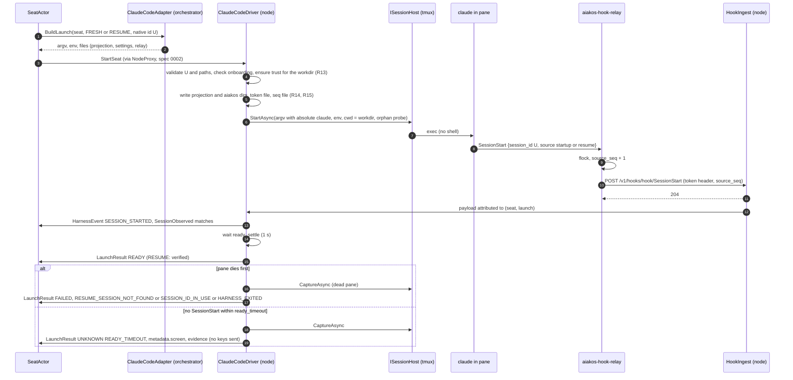

# 0005 — Claude Code adapter

## Context

Issue [#12](https://github.com/aiakos-hq/aiakos/issues/12) asks for the M1 harness adapter for
Claude Code: project guidance and skills, give Claude hook and statusLine configuration that points
at the node agent, launch with an explicit session ID, resume honestly, and parse hook events.
[ADR 0006](../adr/0006-claude-code-first-harness.md) makes Claude Code the first harness,
terminal-driven through tmux ([ADR 0005](../adr/0005-tmux-first-session-host.md)), with hooks for
state and session ID and the statusLine for context usage. The node owns the machine and the
orchestrator owns meaning ([ADR 0004](../adr/0004-orchestrator-node-split.md)). CLAUDE.md rules that
shape this spec: **2** (identity from the environment and a per-seat token, never from request
bodies), **3** (honest state, no silent fresh start) and **5** (harness concerns behind interfaces).
Plan [§3](../plan.md#3-architecture) sketches `IHarnessAdapter`, and
[§7](../plan.md#7-monitoring-incl-sandboxed-seats) orders the signal sources: hooks first, then the
statusLine.

Evidence from the M0 spikes:

| Spike | What it forces into this spec |
|---|---|
| [0001](../spikes/0001-claude-wsl-tmux-hooks.md) | All hooks and the statusLine reach a listener. Payload shapes and the state mapping. Readiness gate on `SessionStart`. Every delivery needs a **typed lead line**, because pastes of five or more lines arrive wrapped in `<pasted_content>` and the model treats them as data. Delivery is confirmed by `UserPromptSubmit`, which slash commands do not emit. The trust dialog defaults to "No, exit". Hook arrival order is not emission order, so the relay stamps a sequence number. Hooks must exit 0 fast. `Notification permission_prompt` arrives about 6 s after `PreToolUse`. |
| [0002](../spikes/0002-claude-session-resume.md) | The orchestrator owns the session ID: `--session-id <uuid>` for a fresh launch and `--resume <uuid>` (never a title, never `--continue`) for a resume. Anything that is not a UUID opens a blocking picker. A session becomes resumable only after its first prompt. A failed resume exits 1 and emits an orphan `SessionEnd`. Outcome is verified / failed / unknown, never a fresh fallback. Resume in the same workspace. The trust prompt blocks before `SessionStart`. |
| [0004](../spikes/0004-opencode-api.md) | The second harness is API-driven. The node-side driver interface must fit an HTTP/SSE harness as well as a terminal one, so nothing Claude-specific may leak into it. |
| [0005](../spikes/0005-docker-seat.md) | `StopFailure` is the only signal for auth and API errors, after about 3 minutes of silence. Seed `~/.claude.json` (`hasCompletedOnboarding`, `theme`, trust) for a fresh home. Use `apiKeyHelper` with a key file, never `ANTHROPIC_API_KEY` (it opens a blocking dialog whose default is "No"). SIGTERM gives `SessionEnd reason=other`. The hook source address cannot identify a seat; the per-seat token does. |

### Verification experiment (spec 0003 D3)

Spec 0003 projects guidance and skills into a per-seat projection root outside the checkout and
proposes loading it with `--add-dir <projection root>` plus
`CLAUDE_CODE_ADDITIONAL_DIRECTORIES_CLAUDE_MD=1`. No spike had tested that. This spec's design is
based on the experiment below. It was run on 2026-09-29.

**Environment.** Windows 11, WSL2 `Ubuntu` (mirrored networking), tmux 3.6 on the private socket
`-L aiakos-spec5`, Claude Code 2.1.284 (`~/.local/bin/claude`, Pro subscription), `--model haiku`
for every probe. Scratch files were in `~/aiakos-spikes/0005b/`. The user's `~/.claude/settings.json`
and `~/.claude.json` were not edited. Interactive runs that needed a trusted directory used
`~/aiakos-spikes/0002/ws/spec5/…`, which inherits trust from the spike 0002 entry. Trust rules were
tested with an isolated `HOME` and no login. The TUI only ever ran inside tmux, and every probe had
a `timeout`.

**Layout** (the spec 0003 R30 shape):

```text
<seat>/repos/app/CLAUDE.md                  "The repo code word is MAPLE-1203."
<seat>/repos/app/.claude/settings.json      project settings: defaultMode plan, a UserPromptSubmit hook, a statusLine
<seat>/projection/CLAUDE.md                 "The projection code word is ZIRCON-4412."
<seat>/projection/.claude/skills/aiakos-probe-5b/SKILL.md   "The aiakos probe token is QUARTZ-7781."
<seat>/projection/.claude/settings.json     a UserPromptSubmit hook (to see whether it loads)
<seat>/aiakos/cli.json                      the --settings file: defaultMode acceptEdits, hooks, statusLine
```

**Commands.** Print-mode probes, where the `system/init` message of `stream-json` lists the loaded
skills:

```bash
cd <seat>/repos/app
[CLAUDE_CODE_ADDITIONAL_DIRECTORIES_CLAUDE_MD=1] timeout 120 claude -p "<question>" --model haiku \
  --output-format stream-json --verbose --settings <seat>/aiakos/cli.json [--add-dir <seat>/projection] </dev/null
```

Interactive probes (no key is sent before `SessionStart` has been seen):

```bash
tmux -L aiakos-spec5 new-session -d -s i1 -x 160 -y 45 -c <seat>/repos/app \
  -e AIAKOS_PROBE=i1 -e CLAUDE_CODE_ADDITIONAL_DIRECTORIES_CLAUDE_MD=1 \
  "claude --session-id $U -n impl --model haiku --settings <seat>/aiakos/cli.json --add-dir <seat>/projection"
# wait for the SessionStart hook, then: send-keys -l "<question>"; send-keys C-m; capture-pane -p
```

In the interactive runs under the spike 0002 root, `repos/app` was a plain directory rather than a
git repository. A git repository there would have needed its own trust entry (T1), and writing one
into the user's config was out of bounds for this experiment. Print mode skips the trust check, so
the print probes used a real git repository.

Questions: *"Answer with exactly two words: the projection code word, then the repo code word;
NONE for any you were not given"* and *"Use the aiakos-probe-5b skill if you have it and reply with
only the token; else NOSKILL"*.

**Results.**

| # | Mode | Setup | Result |
|---|---|---|---|
| E1 | print | `--add-dir` + env var = 1 | `ZIRCON-4412 MAPLE-1203`: **the projected and the repo `CLAUDE.md` both load** |
| E2 | print | `--add-dir`, env var unset | `NONE MAPLE-1203`: the projected `CLAUDE.md` needs the env var |
| E3 | print | env var, no `--add-dir` | `NONE MAPLE-1203` |
| E4 | print | `--add-dir` + env var | init `skills` lists `aiakos-probe-5b`; the answer is `QUARTZ-7781`: **skills load from `<dir>/.claude/skills`** |
| E5 | print | `--add-dir`, env var unset | skill listed and used: skills need only `--add-dir` |
| E6 | print | no `--add-dir` | `NOSKILL`, not listed |
| E7 | print + TUI | hooks in `--settings` and in the repo's `.claude/settings.json` | **both fire** (hooks merge across sources) |
| E8 | print + TUI | hook in `<projection>/.claude/settings.json` | **never fires**: settings are not read from `--add-dir` directories |
| E9 | print + TUI | `defaultMode`: repo `plan`, `--settings` `acceptEdits` | `acceptEdits` (init `permissionMode`, `UserPromptSubmit.permission_mode`, TUI footer): **`--settings` wins** |
| E10 | TUI | statusLine in the repo and in `--settings` | the footer shows the `--settings` one; the repo's command never ran |
| E11 | print | repo `settings.json` **or** `settings.local.json` with `"disableAllHooks": true` | **no hook fired at all**, including every `--settings` hook |
| E12 | print | as E11, plus `"disableAllHooks": false` in `--settings` | all hooks fire again (ours and the repo's) |
| E13 | print | `--setting-sources user` | the repo's settings are ignored, but so are the repo `CLAUDE.md` and the projected skill: unusable |
| E14 | TUI | untrusted workspace | trust dialog, no `SessionStart` (as spike 0002 F8) |
| E15 | TUI | projection outside the trusted root, trusted cwd | both code words: `--add-dir` directories need no trust |
| E16 | TUI | statusLine payload | `workspace.added_dirs` lists the projection root; `session_name` is the `-n` value |
| E17 | print | `permissions.defaultMode: "default"` | accepted (init `permissionMode: default`; the TUI calls it "manual mode") |

Trust rules for git checkouts (isolated `HOME`, seeded `~/.claude.json`, no login; the TUI still
reaches its prompt):

| # | Trusted path in `projects` | Working directory | Trust dialog? |
|---|---|---|---|
| T1 | seat root | a git repository (its own root) under the seat root | **yes** |
| T2 | the repository root | the repository root | no |
| T3 | the repository root | a subdirectory of it | no |
| T4 | seat root | a `git worktree` under the seat root | **yes** |
| T5 | the main clone the worktree belongs to | the worktree | no |
| T6 | the worktree path | the worktree | no |
| T7 | seat root | a non-git directory under the seat root | no |

**Trust is inherited from an ancestor only up to a git repository root.** A trusted seat root
(spike 0002 F8, spec 0003 R30) therefore does **not** cover a seat's checkout. Each working
directory needs its own entry, or its main clone's entry.

Other findings from the same runs:

- **`/clear` changes the session ID** (spec 0006 Q14). It emits `SessionEnd{session_id: old,
  reason: "clear"}` and then `SessionStart{session_id: new, source: "clear"}`. Claude chooses the new
  ID at random. Every later event carries the new ID, and both transcripts exist.
- **`PermissionRequest`** fires about 0.1 s after `PreToolUse`, while `Notification permission_prompt`
  comes about 6 s later. Its payload has `tool_name`, `tool_input` and `permission_suggestions`, but
  **no `tool_use_id`**. Approving produced `PostToolUse` and `Stop`.
- **Denying with Escape emitted no hook at all**: no `PostToolUse`, no `PostToolUseFailure`, no
  `Stop`. The next event was the next `UserPromptSubmit`.
- **`Notification idle_prompt` fired 60 s after a `Stop`** in an interactive pane. Spike 0001 never
  saw it.
- The deny rule `Bash(tmux:*)` in `--settings` blocked `tmux -L aiakos-spec5 ls`. The model got a
  tool error, no permission dialog opened, and the turn ended with `Stop`.
- The init message reports an auto-memory directory per working directory
  (`~/.claude/projects/<cwd slug>/memory/`).

### Depends on wave 1 decisions

Specs 0001–0003 are accepted on `main`, and the decision IDs cited below (D…) are theirs.
Specs 0004 and 0006 were written in parallel with this one. If one of them changes, the parts
listed here change with it.

- **Spec 0001 (solution skeleton, #9)**
  - The reserved project name `src/Aiakos.HookRelay` ("only if a native relay binary is needed").
  - The hook ingest port is the instance port base + 10 (dev 5190, released 7190).
  - `AIAKOS_HOME` is per instance.
  - The node is AOT-compatible, published non-AOT in dev (D10), and the opt-in end-to-end pattern is `AIAKOS_E2E_*` with xUnit v3
    dynamic skip.
- **Spec 0002 (gRPC contract, #10)**
  - The adapter split of D1 (ADR 0018): the orchestrator builds launches and interprets state; the node driver
    does the mechanics and normalization.
  - The `HarnessEventKind` names and the Claude column of its mapping table (corrected in
    [Event mapping](#event-mapping)).
  - `source_seq`, stamped by the hook relay (R28, D3). Its mechanism is defined here.
  - `LaunchResult` READY / FAILED / UNKNOWN with reasons (R21), and `DeliverInput`
    `lead` / `body` / `expect_confirmation` / `confirm_timeout` with `DeliveryResult` (R22).
  - `StartSeat` `argv` / `env` / `files` / `secrets` with the placeholders `${AIAKOS_SEAT_HOME}` and
    `${AIAKOS_WORKSPACE}` (R19). See D6 for `argv[0]`.
  - Orphan `SessionEnd` is forwarded (R35), and `SessionObserved` reports mismatches (R36).
  - Raw payload limits (R38) and `TELEMETRY` coalescing (R39).
  - The "#12 must" list in its Assumptions for dependent specs.
- **Spec 0003 (rig file format, #14)**
  - The projection root `<seat_dir>/projection/{CLAUDE.md,.claude/skills/}` and the deterministic
    `CLAUDE.md` layout (R28, R29).
  - The paths `seat_dir`, workdir and worktree (R30).
  - `harnesses.claude-code.permission_mode` and `permissions` (R16), with `bypassPermissions`
    rejected.
  - Aiakos-owned settings (R17).
  - `seat_root` in `rig.env.yaml`, secrets as node-local file references (R21), `auth` (R13), and
    the model as a verbatim string or `null` (D7); `auth: api-key` is outside M1 acceptance (D6).
  - Its D3 (ADR 0015) is verified by E1–E6, and its trust assumption is corrected by T1–T7.
- **Proposals from spec 0004 (tmux session host, #11, in parallel)**
  - The per-seat token is a 0600 file, and the relay reads its path from `AIAKOS_SEAT_TOKEN_FILE`
    (its Q1, which amends 0002 R45).
  - The session host never sends input on its own. Delivery is one composite operation (buffer,
    `send-keys -l` lead, `paste-buffer -p -r -d`, `C-m`), followed by the driver's
    `IDeliveryConfirmer`, with at most one resubmit.
  - The body may contain no control characters other than LF and TAB (CRLF is normalized).
  - One input operation per seat at a time.
  - Claude behaviour enters only through `IDeliveryConfirmer`, `IOrphanProbe` and `GracefulStop`.
  - A private server on `-L aiakos-<instance>` with a generated config and an allowlisted client
    environment.
  - Sessions are named `<rig>_<seat>`, and adopted seats are reported as `UNKNOWN`.
  - `Bash(tmux:*)` is added to the projected deny rules.
- **Proposals from spec 0006 (SeatActor, #13, in parallel)**
  - `IHarnessStateProfile` (the Claude values are confirmed or corrected in
    [State profile](#state-profile-for-the-seatactor)).
  - `source_seq` increases strictly per seat across launches.
  - The activity rules: `TURN_ENDED` is the only idle signal after a turn. `needs-input` clears on a
    matching `TOOL_FINISHED`, `INPUT_RESOLVED`, the next prompt or the end of the turn.
    `TURN_FAILED` means idle plus a `turn-failed` finding. `send` is refused while working or
    needs-input.
  - Its Q14 (`/clear`).

## Goals

- One Claude Code adapter in two halves (spec 0002 D1, ADR 0018):
  - an orchestrator half that turns a resolved seat into a `StartSeat` and provides the state
    profile;
  - a node half that prepares the seat, waits for readiness, verifies resumes, delivers and confirms
    input, and normalizes hooks into `HarnessEvent`s.
- Guidance and skills from the rig files reach the model without touching the repository checkout,
  in a way the experiment verified.
- A seat becomes `READY` only on hook evidence for its own launch. A resume is `READY` only when
  verified, `FAILED` when Claude says the session does not exist, and `UNKNOWN` otherwise. There is
  no fresh fallback and never a key sent to get past a screen.
- Every hook and statusLine update reaches the node over loopback. Each carries the per-seat token,
  and each is stamped with a sequence number that orders it and reveals losses. The relay never
  slows Claude down or fails it.
- Hook names are mapped to spec 0002's normalized kinds, with a table the SeatActor (spec 0006) can
  rely on, including `StopFailure`, orphan `SessionEnd`, `/compact`, `/clear` and statusLine usage.
- `auth: subscription` (the user's login in WSL) works in M1. `auth: api-key` is specified but not
  part of M1 acceptance.

## Non-goals / out of scope

- **tmux mechanics** (spec 0004). This spec states only the contract it needs from `ISessionHost`.
- **The state machine** (spec 0006). This spec gives the event mapping and the profile values; the
  SeatActor applies them.
- **Rig file loading, `CLAUDE.md` generation and skill copying** (spec 0003). This spec writes the
  projected files that 0003's loader produced, adds the Claude settings, and loads them.
- **Fork** (`LAUNCH_MODE_FORK`). The argv shape is documented, but the node does not advertise
  `launch.fork` in M1.
- **Answering permission prompts** over the API (`AnswerInput`, M2/M4), and hook *decisions* such as
  blocking tool calls from a hook. The relay never returns a decision.
- **Sandboxed seats** (M6: Docker, a per-seat `HOME`, `host.docker.internal`, secrets in tmpfs). The
  design keeps them possible. The `auth: api-key` path is written down here so M6 only changes
  where files live.
- **Rate-limit health findings** ("subscription nearly exhausted", M5). The data is carried; no
  finding is raised.
- **MCP servers, subagents, output styles and plugins** for seats.
- **Reading transcripts or `~/.claude/sessions/*.json`** as a state source (spike 0002 F4; spec 0006
  Q16).

## Requirements

### Adapter shape

- **R1** The adapter has two halves, one per process (spec 0002 D1, ADR 0018):
  - the **orchestrator half** implements `IHarnessAdapter` and `IHarnessStateProfile` in
    `Aiakos.Orchestrator` (namespace `Aiakos.Orchestrator.Harnesses.ClaudeCode`);
  - the **node half** implements `IHarnessDriver` in `Aiakos.Node` (namespace
    `Aiakos.Node.Harnesses.ClaudeCode`).
  Neither half references the other's project. They share only the spec 0002 contract.
- **R2** `IHarnessDriver` and `IHarnessAdapter` are harness-neutral: no member names a hook, a
  Claude screen or a Claude file ([Interfaces](#interfaces)). The OpenCode driver (M2) implements the
  same interfaces.
- **R3** The node advertises `harness.claude-code` only if all of these hold at node start:
  - the configured Claude executable exists (`Aiakos:Node:ClaudeCode:Executable`, default
    `~/.local/bin/claude`, resolved to an absolute path once);
  - `claude --version` (5 s timeout) reports a version ≥ 2.1.284;
  - `curl` and `flock` are on the node's `PATH`;
  - the hook ingest listener is bound.
  Otherwise it logs the reason and leaves the capability out (rule 3). A version newer than the
  newest one tested is accepted with a warning log and the metric tag `untested=true`.

### Launch building (orchestrator half)

- **R4** The orchestrator generates the native session ID as a lowercase UUIDv4 in canonical form,
  and persists it before `StartSeat` (spec 0006 R22). Both halves validate every native ID against
  `^[0-9a-f]{8}-[0-9a-f]{4}-4[0-9a-f]{3}-[89ab][0-9a-f]{3}-[0-9a-f]{12}$` before they use it. An
  invalid ID is `INVALID_SESSION_ID` and is never passed to Claude (spike 0002 F3).
- **R5** `BuildLaunch` produces `argv` by mode:
  - `FRESH`: `claude --session-id <id> -n <seat>@<rig> --settings ${AIAKOS_SEAT_HOME}/aiakos/claude-settings.json --add-dir ${AIAKOS_SEAT_HOME}/projection [--model <model>]`
  - `RESUME`: `claude --resume <id> -n <seat>@<rig> --settings … --add-dir … [--model <model>]`,
    with **no** `--session-id`
  - `FORK` (not in M1): `claude --resume <from> --fork-session --session-id <new> -n …`
  `--model` is present only when the resolved model is not `null`. It is passed verbatim (spec 0003
  D7) on every launch, resumes included, so the rig spec stays authoritative. `--continue`,
  `--permission-mode`, `--dangerously-skip-permissions`, `--bare`, `--safe-mode` and
  `--setting-sources` are never used.
- **R6** `argv[0]` is the logical name `claude`. The node driver replaces it with its configured
  absolute executable (D6). No other element is rewritten except the spec 0002 R19 placeholders.
- **R7** `BuildLaunch` sets these non-secret environment variables:
  - `AIAKOS_SEAT=<seat>@<rig>` (informational; it appears in the statusLine);
  - `CLAUDE_CODE_ADDITIONAL_DIRECTORIES_CLAUDE_MD=1` (E1, E2);
  - `DISABLE_AUTOUPDATER=1` (a seat never updates the shared binary in the middle of a run).
  It never sets `ANTHROPIC_API_KEY` or any other credential variable (spike 0005 F3).
- **R8** `BuildLaunch` emits these files, all under `FILE_ROOT_SEAT_HOME`:
  - the projection from spec 0003: `projection/CLAUDE.md` and `projection/.claude/skills/**`,
    mode 0644;
  - `aiakos/claude-settings.json`, mode 0644, `expand = true` ([Settings file](#settings-file));
  - `aiakos/bin/aiakos-hook-relay`, mode 0755, `expand = false` ([Hook relay](#hook-relay)).
  Nothing is ever written inside a checkout (spec 0003 R28).
- **R9** The settings file is generated deterministically from the resolved seat. It contains:
  - `"disableAllHooks": false` (E11, E12);
  - `permissions.defaultMode` = `permission_mode`;
  - `permissions.allow` / `ask` / `deny` from spec 0003, with `deny` extended by
    `Bash(tmux:*)` (spec 0004);
  - the hook registrations of R20;
  - the `statusLine` of R24;
  - for `auth: api-key` only, `apiKeyHelper` (R40).
  It contains no secret value and no key that spec 0003 R17 forbids in rig files, except the ones
  Aiakos owns.
- **R10** `ready_timeout` is 15 s and `confirm_timeout` is 5 s by default, both from the state
  profile. `terminal` is 160×45.
- **R11** For `send`, the orchestrator half builds the lead `[aiakos from <sender> #<d>]`, followed
  by one space. `<sender>` is the sender from `CallerContext` (rule 2; in M1 the operator name, see
  "Changes after acceptance") and `<d>` is the first 8 hex characters of the delivery's
  `command_id`. It sets `expect_confirmation = true`. A body
  that is a single slash command gets an **empty** lead and `expect_confirmation = false`, and in M1
  it must be on the allowlist `{/compact}`; anything else is rejected with
  `SLASH_COMMAND_NOT_ALLOWED` (D13).

### Seat preparation (node half)

- **R12** Before `ISessionHost.StartAsync`, the driver checks these, in order, and rejects the
  launch with the given reason if one fails:
  1. the native ID is valid (R4) → `INVALID_SESSION_ID`;
  2. the seat home, workdir and projection paths match `^/[A-Za-z0-9._/-]+$`, because they end up
     inside hook shell commands → `INVALID_LAUNCH`;
  3. for `auth: subscription`, `~/.claude.json` exists and has `hasCompletedOnboarding: true`
     → `HARNESS_NOT_ONBOARDED`;
  4. trust is ensured (R13) → `TRUST_NOT_ESTABLISHED`;
  5. the files are written (R14);
  6. the token and sequence files exist (R15).
  The session host then runs its orphan probe (R34).
- **R13** **Trust.** The driver ensures that `~/.claude.json` has
  `projects["<workdir>"].hasTrustDialogAccepted = true` for the **exact workdir** (T6). It does this
  by a read-modify-write that:
  - changes only that one field and creates the `projects` entry if needed;
  - leaves every other key as it was (JSON object round-trip, unknown keys preserved);
  - writes a temp file in the same directory, fsyncs it and renames it over the original;
  - re-reads the file to verify, retrying up to 3 times.
  An entry that is already `true` is not rewritten. Each write is logged with the path (never the
  file's content). The driver never sets onboarding or theme keys in the user's own config (that is
  for sandbox homes in M6). It never trusts the seat root or any ancestor as a substitute.
- **R14** **Projection writing.** The driver writes `StartSeat.files` into a fresh
  `projection.new/` and `aiakos.new/` under the seat home, then swaps them in with renames. The old
  directories are removed, so the whole `projection/` directory is Aiakos-owned and never merged
  with leftovers. Two exceptions under `aiakos/` are kept across launches: the token file (R15) and
  the sequence file (R17). In files marked `expand`, the placeholders are expanded before writing.
- **R15** The seat token (spec 0002 R45, as amended by spec 0004 Q1) is written to
  `aiakos/seat-token.header`, mode 0600. The file holds a single line,
  `Authorization: Bearer <token>`, so the relay can pass it to curl as `-H @file` and the token never
  appears in any argv. The driver then adds the node-side environment variables:
  - `AIAKOS_SEAT_TOKEN_FILE` = the token file's path;
  - `AIAKOS_SEAT_SEQ_FILE` = `<seat home>/aiakos/relay.seq`;
  - `AIAKOS_HOOK_URL` = `http://127.0.0.1:<hook port>/v1/hooks`;
  - `PATH` = `Aiakos:Node:ClaudeCode:SeatPath` (default
    `<home>/.local/bin:/usr/local/bin:/usr/bin:/bin`; spec 0004's `PATH` risk).
  The token file is replaced at every launch, because the token is per launch.

### Hook relay and ingest

- **R16** Every hook and the statusLine run the relay:
  `${AIAKOS_SEAT_HOME}/aiakos/bin/aiakos-hook-relay <hook|status> <EventName>`. The relay:
  - reads stdin completely;
  - stamps `source_seq` (R17);
  - POSTs the payload unchanged to `$AIAKOS_HOOK_URL/<hook|status>/<EventName>`, with the token
    header from `$AIAKOS_SEAT_TOKEN_FILE` and `X-Aiakos-Source-Seq: <n>`;
  - uses a 0.5 s connect timeout and a 2 s total timeout;
  - **always exits 0**.
  In hook mode it prints nothing to stdout. That matters because stdout of `SessionStart` and
  `UserPromptSubmit` hooks is added to the model's context, and other stdout can be read as a
  decision. In status mode it prints exactly one line, `aiakos <AIAKOS_SEAT>`, before posting. It
  never blocks a tool call and never returns a decision.
- **R17** `source_seq` comes from a per-seat counter file, `$AIAKOS_SEAT_SEQ_FILE`. The relay
  increments it under `flock` on `<file>.lock`, waiting at most 1 s. If the file is missing, the
  counter is seeded with the current Unix time in microseconds and then incremented. The node never
  resets or deletes the file. So `source_seq` increases strictly per seat **across launches**, and
  it keeps increasing even if the seat directory is recreated (spec 0006). If the lock times out,
  the relay sends `X-Aiakos-Source-Seq: 0` (absent, spec 0002 R28).
- **R18** The node's hook ingest is an HTTP/1.1 listener on `127.0.0.1:<port base + 10>` (spec 0001).
  It:
  - accepts only `POST /v1/hooks/{hook|status}/{name}`;
  - requires a token that belongs to a current or recently ended launch (a 60 s grace, so late hooks
    of a stopped launch are attributed as that launch) and answers 401 otherwise;
  - answers 413 for bodies over 1 MiB, and 204 after enqueueing in under 50 ms;
  - never waits on the orchestrator link.
  The token identifies the seat and the launch. The payload's `session_id` never does (rule 2). A
  request with an unknown token is counted in a metric and dropped.
- **R19** The ingest detects losses: per launch, it tracks the `source_seq` values it has received.
  A value that is still missing 2 s after a higher one arrived means the relay failed to post it
  (for example, the ingest was down). The ingest then emits
  `ObservationGap{INGEST_UNAVAILABLE}` for the seat, once per run of missing numbers. A run that
  fills in later is not reported twice.

### Hooks and normalization

- **R20** The settings file registers the relay for exactly these hooks:
  - `SessionStart`, `UserPromptSubmit`, `Notification`, `Stop`, `StopFailure`, `PreCompact` and
    `SessionEnd`;
  - with matcher `*`: `PreToolUse`, `PostToolUse`, `PostToolUseFailure` and `PermissionRequest`.
  Each has `"timeout": 5`.
- **R21** The driver normalizes each ingested payload into a spec 0002 `HarnessEvent`
  (`harness = "claude-code"`, `native_name` = the hook name or `statusLine`, `origin = LIVE`),
  following [Event mapping](#event-mapping). The normalization:
  - extracts `native_session_id`, the attributes and `usage` **before** truncating `raw`
    (spec 0002 R38);
  - is a pure function of the payload and the launch's normalization state (the last expected ID,
    open tool uses, and whether an input request is open), so it can be tested with fixtures;
  - never drops an event: anything unmapped is `OTHER`.
- **R22** The driver forwards orphan `SessionEnd`s (spec 0002 R35) as `SESSION_ENDED`, except when
  `reason = "clear"` (R27).
- **R23** `PermissionRequest` maps to `INPUT_REQUESTED`. `request_id` is the `tool_use_id` of the
  most recent `PreToolUse` in the launch that has no `PostToolUse` yet and has the same `tool_name`
  and canonical `tool_input`. With no match it is `*`. A `Notification` with
  `notification_type = permission_prompt` maps to `INPUT_REQUESTED` (with `request_id = *`) only if
  no `INPUT_REQUESTED` was emitted since the last `PROMPT_SUBMITTED` or `TOOL_STARTED`. Otherwise it
  maps to `OTHER`, because it is the ~6 s later echo of the same dialog.
- **R24** The statusLine (`native_name = statusLine`) maps to `TELEMETRY` with
  [usage and rate limits](#statusline-usage-and-rate-limits). The ingest coalesces it per seat:
  - at most one `TELEMETRY` event per second, leading and trailing, so the newest value is always
    emitted (spec 0002 R39);
  - a `null` field stays absent and is never turned into 0 (spike 0001: `used_percentage` is `null`
    before the first turn).

### Readiness, resume and session identity

- **R25** **Readiness.** A launch is `READY` when three conditions hold:
  - a `SessionStart` for this launch arrived (attributed by token);
  - its `session_id` equals the launch's native ID;
  - its `source` matches the mode: `startup` for `FRESH`, `resume` for `RESUME`, `fork` for `FORK`.
  The driver emits the `SESSION_STARTED` event and `SessionObserved{matches_expected: true}`. It
  then waits `ready_settle` (default 1 s, so the TUI can accept input; spike 0001) and reports
  `LaunchResult READY`. For `RESUME`, `READY` means **verified** (spike 0002 F9).
- **R26** **Failure and unknown.**
  - A `SessionStart` with another `session_id`, or a wrong `source` for the mode → `FAILED`,
    reason `SESSION_ID_MISMATCH`, with `SessionObserved{matches_expected: false}`.
  - The pane dies before readiness → `FAILED`. The reason comes from the dead pane's capture:
    - `No conversation found` → `RESUME_SESSION_NOT_FOUND`;
    - `is already in use` → `SESSION_ID_IN_USE`;
    - anything else → `HARNESS_EXITED`.
    The exit code is set when known.
  - No readiness within `ready_timeout` → `UNKNOWN`, reason `READY_TIMEOUT`. The capture is attached
    as evidence, and `metadata.screen` classifies it: `trust-dialog`, `resume-picker`,
    `login-required`, `api-key-dialog`, `settings-error` or `unrecognized`.
  The screen classification only refines the reason. It never changes the outcome and never causes
  a key to be sent (spec 0004 R3, spike 0002 F3). A `RESUME` never falls back to a fresh launch on
  the node.
- **R27** **`/clear`** (verified in the experiment):
  - `SessionEnd{reason: "clear"}` maps to `OTHER` with attribute `reason=clear`. It is not a
    `SESSION_ENDED`, because the process keeps running.
  - The following `SessionStart{source: "clear"}` maps to `SESSION_STARTED` with the **new**
    `native_session_id` and the attribute `previous_session_id` = the launch's current ID.
  - The driver makes the new ID the launch's current ID for everything after that: the registry
    attribute, the orphan probe and later readiness checks. It does not emit a mismatching
    `SessionObserved` for this case.
  The orchestrator side handles the rotation through the profile ([State profile](#state-profile-for-the-seatactor)).
- **R28** The driver never passes a session title, `--continue` or a non-UUID to `--resume`, and it
  never sends a key during a launch. The session host enforces the second part (spec 0004 R3).

### Delivery

- **R29** `DeliverInput` becomes one `ISessionHost.DeliverAsync` call with the lead, the body,
  submit `C-m`, `SubmitDelay` 0, and the Claude confirmer (R30). The driver rejects a delivery with
  `SEAT_NOT_READY` until `READY` has been reported for the current launch.
- **R30** **Confirmer** (`IDeliveryConfirmer`):
  - With `expect_confirmation = false`, it returns `NotRequested` at once.
  - Otherwise it waits up to `confirm_timeout` for a `UserPromptSubmit` of the current launch,
    received after `SubmittedAt`, whose `prompt` contains the lead's `#<d>` marker. That event
    confirms the delivery, and its `prompt_id` is the `turn_id`. The event gets the attribute
    `delivery_id`.
  - If there is no match, it captures the pane once. If the last input line still shows the lead
    marker, it calls `ResubmitAsync("input pending")` (at most once, spec 0004 R18) and waits
    another `confirm_timeout`.
  - Otherwise it returns `Unconfirmed`.
  A `UserPromptSubmit` without the marker (a human typing) never confirms anything.
- **R31** Bodies are pasted, never typed. TAB characters reach the model as spaces (spike 0001), so
  guidance tells senders to pass content whose bytes matter by file path. The driver adds nothing to
  the body.

### Stop and orphans

- **R32** `StopSeat` uses spec 0004's default graceful step, SIGTERM to the pane process, which
  gives `SessionEnd reason=other` (spike 0005 F4). The grace is `StopSeat.grace` (default 10 s). The
  driver never delivers `/exit` to stop a seat.
- **R33** After the pane dies, the driver keeps the launch's ingest token valid for the 60 s grace
  (R18), so a late `SessionEnd` is still attributed to its launch.
- **R34** **Orphan probe** (`IOrphanProbe`). A process matches when all of these hold:
  - its `argv[0]` basename is `claude`, or `argv[0]` resolves to the configured executable;
  - its argv contains the seat's current native ID right after `--session-id`, `--resume` or
    `--fork-session --session-id`;
  - or its argv has `-n <seat>@<rig>`.
  This covers leftovers that hold the session ID (spike 0005 F4).

### Auth

- **R35** `auth: subscription` (M1): the seat runs as the node user with the user's `HOME`, so it
  uses the user's Claude login. The adapter adds no credential. The pane environment comes from spec
  0004's allowlist plus R7 and R15, so an `ANTHROPIC_API_KEY` in the node's environment never
  reaches a seat.
- **R36** `auth: api-key` (specified; **not** in M1 acceptance): the settings file gets
  `"apiKeyHelper": "cat '<abs path>'"`, where the path is the node-local secret source from
  `rig.env.yaml` (spec 0003 R21). A safe `~/` source instead uses `cat "$HOME/<rest>"`
  with an ASCII-only rest and no empty, `.` or `..` segments, expanded by the node shell at
  helper invocation; the orchestrator reads neither its own HOME nor the secret (maintainer
  clarification, 2026-10-06). The path is checked against R12's character set, so it cannot
  break out of the quotes. The node checks before launch that the file exists and has mode ≤ 0600,
  and never reads its content. For a sandbox home (M6), the driver also seeds
  `hasCompletedOnboarding`, `theme` and the workspace trust in the seat's own `.claude.json`
  (spike 0005 F3), and the file path points into the per-container tmpfs.

### Observability and secrets

- **R37** Logs, spans and metrics never contain a hook payload, a prompt, a delivery body, the
  seat token or the contents of `~/.claude.json`. They may contain IDs, hook names, kinds,
  `source_seq`, sizes, outcomes and reasons.
- **R38** Spans: `claude.prepare`, `claude.await_ready`, `claude.confirm` and `hook_ingest.receive`
  (with `hook.name`, `source_seq` and `aiakos.seat.address`). Metrics: `aiakos.node.hooks.received`
  (tags: `name`, `result`), `aiakos.node.hooks.latency` (relay stamp to ingest; histogram),
  `aiakos.node.hooks.gaps` and `aiakos.node.claude.trust_writes`.

## Design

### Components

```
Aiakos.Orchestrator/Harnesses/ClaudeCode/
 ├─ ClaudeCodeAdapter          IHarnessAdapter: BuildLaunch, BuildDelivery
 ├─ ClaudeCodeStateProfile     IHarnessStateProfile (spec 0006)
 ├─ ClaudeSettingsWriter       deterministic claude-settings.json (R9, R20, R24, R36)
 └─ Resources/aiakos-hook-relay   the relay script (embedded; emitted as a SeatFile)
Aiakos.Node/Harnesses/
 ├─ IHarnessDriver             harness-neutral node interface (below)
 └─ ClaudeCode/
     ├─ ClaudeCodeDriver       prepare, readiness, resume verification, delivery (R12–R15, R25–R30)
     ├─ ClaudeTrustSeeder      ~/.claude.json read-modify-write (R13)
     ├─ ClaudeHookNormalizer   payload → HarnessEvent, pure (R21–R24, R27)
     ├─ ClaudeScreenClassifier capture text → metadata.screen (R26; evidence only)
     ├─ ClaudeDeliveryConfirmer IDeliveryConfirmer (R30)
     └─ ClaudeOrphanProbe      IOrphanProbe (R34)
Aiakos.Node/Hooks/
 └─ HookIngest                 loopback HTTP listener, token → (seat, launch), gap detection,
                               statusLine coalescing (R18, R19, R24)
```

`src/Aiakos.HookRelay` (reserved by spec 0001) is **not** created in M1. The relay is a POSIX shell
script (D1).

### Interfaces

Illustrative C#. The names and semantics are normative; exact signatures may change in the
implementation PR (and are then noted under "Changes after acceptance").

```csharp
// Orchestrator side (Aiakos.Orchestrator.Harnesses)
public interface IHarnessAdapter
{
    string Harness { get; }                              // "claude-code"
    IHarnessStateProfile Profile { get; }                // spec 0006
    LaunchSpec BuildLaunch(ResolvedSeat seat, LaunchMode mode, NativeSession session);
    DeliverySpec BuildDelivery(SeatAddress sender, string body, Guid commandId);  // lead, expect_confirmation, or a rejection
}
public sealed record LaunchSpec(IReadOnlyList<string> Argv, IReadOnlyDictionary<string, string> Env,
    IReadOnlyList<SeatFileSpec> Files, TimeSpan ReadyTimeout, TerminalSize Terminal);

// Node side (Aiakos.Node.Harnesses)
public interface IHarnessDriver
{
    string Harness { get; }
    IReadOnlyList<string> Capabilities { get; }          // "harness.claude-code"; empty when unavailable (R3)
    Task<PreparedLaunch> PrepareAsync(StartSeatContext start, CancellationToken ct);       // R12–R15 → SessionSpec
    Task<LaunchResult> AwaitLaunchAsync(LaunchContext launch, CancellationToken ct);       // R25–R26
    DeliveryRequest BuildDelivery(LaunchContext launch, DeliverInput input);               // R29–R30
    HarnessEvent? Normalize(LaunchContext launch, IngestedPayload payload);                // R21–R24, R27
    IOrphanProbe OrphanProbe(LaunchContext launch);                                        // R34
    GracefulStop? GracefulStop { get; }                                                    // null = session host default (R32)
}
```

For OpenCode (M2), `PrepareAsync` starts or checks `opencode serve`, `AwaitLaunchAsync` uses
`/global/health` and `GET /session/{id}`, `BuildDelivery` returns an HTTP send instead of a pane
delivery, and `Normalize` reads SSE events (spike 0004). Nothing in these signatures is terminal-
or Claude-specific. `DeliveryRequest` is spec 0004's type for terminal harnesses; M2 adds a variant
for API sends.

### Seat home layout

```text
<seat_dir>/                              = ${AIAKOS_SEAT_HOME} (spec 0003 R30)
  projection/                            regenerated every launch (R14)
    CLAUDE.md
    .claude/skills/<skill>/SKILL.md …
  aiakos/                                regenerated every launch except the two kept files
    claude-settings.json                 0644
    bin/aiakos-hook-relay                0755
    seat-token.header                    0600, replaced per launch (R15)
    relay.seq, relay.seq.lock            kept forever (R17)
  repos/<repo>/                          worktrees (spec 0003); never touched by projection
```

### Launch sequence



### Settings file

Generated for `impl@aiakos-dev` (spec 0003's worked example). Placeholders are expanded by the node
(R14):

```json
{
  "disableAllHooks": false,
  "permissions": {
    "defaultMode": "acceptEdits",
    "allow": ["Bash(dotnet build:*)", "Bash(dotnet test:*)", "Bash(git status)", "Bash(git diff:*)",
              "Bash(gh issue view:*)", "Bash(gh pr create:*)"],
    "ask": [],
    "deny": ["Bash(git push --force:*)", "Bash(gh pr merge:*)", "Bash(aiakos up:*)",
             "Bash(aiakos down:*)", "Bash(tmux:*)"]
  },
  "hooks": {
    "SessionStart":       [{ "hooks": [{ "type": "command", "command": "${AIAKOS_SEAT_HOME}/aiakos/bin/aiakos-hook-relay hook SessionStart", "timeout": 5 }] }],
    "UserPromptSubmit":   [{ "hooks": [{ "type": "command", "command": "… hook UserPromptSubmit", "timeout": 5 }] }],
    "PreToolUse":         [{ "matcher": "*", "hooks": [{ "type": "command", "command": "… hook PreToolUse", "timeout": 5 }] }],
    "PermissionRequest":  [{ "matcher": "*", "hooks": [{ "type": "command", "command": "… hook PermissionRequest", "timeout": 5 }] }],
    "PostToolUse":        [{ "matcher": "*", "hooks": [{ "type": "command", "command": "… hook PostToolUse", "timeout": 5 }] }],
    "PostToolUseFailure": [{ "matcher": "*", "hooks": [{ "type": "command", "command": "… hook PostToolUseFailure", "timeout": 5 }] }],
    "Notification":       [{ "hooks": [{ "type": "command", "command": "… hook Notification", "timeout": 5 }] }],
    "Stop":               [{ "hooks": [{ "type": "command", "command": "… hook Stop", "timeout": 5 }] }],
    "StopFailure":        [{ "hooks": [{ "type": "command", "command": "… hook StopFailure", "timeout": 5 }] }],
    "PreCompact":         [{ "hooks": [{ "type": "command", "command": "… hook PreCompact", "timeout": 5 }] }],
    "SessionEnd":         [{ "hooks": [{ "type": "command", "command": "… hook SessionEnd", "timeout": 5 }] }]
  },
  "statusLine": { "type": "command", "command": "${AIAKOS_SEAT_HOME}/aiakos/bin/aiakos-hook-relay status statusLine" }
}
```

Merging with the repository's own settings (E7–E13): the repo's hooks run **in addition to** ours,
and its permission rules merge with ours (Claude Code applies deny before allow). Our
`defaultMode`, `statusLine` and `"disableAllHooks": false` win. That is why the explicit `false` is
required: without it, one line in a repo's `settings.local.json` silently blinds Aiakos (E11). The
projection root cannot carry settings (E8), so all Aiakos settings go through `--settings`.

### Hook relay

The whole relay, emitted as `aiakos/bin/aiakos-hook-relay`. Dependencies: `sh`, `curl` and `flock`
(checked by R3).

```sh
#!/bin/sh
# aiakos-hook-relay <hook|status> <EventName>   stdin: Claude hook or statusLine JSON.
# Contract (spec 0005 R16/R17): never fails Claude, never prints in hook mode, never puts the
# token in argv. Generated by Aiakos; do not edit.
kind="${1:-hook}"; name="${2:-unknown}"
[ "$kind" = status ] && printf 'aiakos %s\n' "${AIAKOS_SEAT:-seat}"
body=$(cat) || exit 0
seq=0
f="${AIAKOS_SEAT_SEQ_FILE:-}"
if [ -n "$f" ]; then
  seq=$(flock -w 1 "$f.lock" sh -c '
    n=$(cat "$1" 2>/dev/null)
    case "$n" in ""|*[!0-9]*) n=$(date +%s%6N) ;; esac
    n=$((n + 1)); printf "%s\n" "$n" > "$1" && printf "%s" "$n"' _ "$f" 2>/dev/null) || seq=0
fi
[ -n "${AIAKOS_HOOK_URL:-}" ] && [ -r "${AIAKOS_SEAT_TOKEN_FILE:-/nonexistent}" ] || exit 0
printf '%s' "$body" | curl -sS -o /dev/null --connect-timeout 0.5 -m 2 -X POST \
  -H @"$AIAKOS_SEAT_TOKEN_FILE" -H "X-Aiakos-Source-Seq: ${seq:-0}" \
  -H 'Content-Type: application/json' --data-binary @- \
  "$AIAKOS_HOOK_URL/$kind/$name" >/dev/null 2>&1
exit 0
```

Per hook, the cost is one `sh`, one `flock`, one `cat`/`date` and one `curl` against loopback: a
few milliseconds, compared with spike 0001's 135–315 ms for the interop relay. The relay is
covered by its own tests (AC4).

### Event mapping

This replaces the Claude column of spec 0002's mapping table. Attributes use spec 0002's
well-known keys where one exists. The last column names the spec 0006 transition rows the event
feeds.

| Claude source | Condition | `kind` | `native_session_id` | Attributes, usage | Spec 0006 rows |
|---|---|---|---|---|---|
| `SessionStart` | `source` ∈ `startup`, `resume`, `fork` | `SESSION_STARTED` | payload | `source`, `model`, `session_title`; resume: `context_tokens`, `seconds_since_last_response` | S11, A1; readiness per R25 |
| `SessionStart` | `source = clear` | `SESSION_STARTED` | **new** ID | `source=clear`, `previous_session_id` | A1; rotation (D5) |
| `SessionStart` | `source = compact` | `COMPACTED` | payload | `source=compact` | A9 |
| `UserPromptSubmit` | — | `PROMPT_SUBMITTED` | payload | `turn_id`=`prompt_id`, `permission_mode`, `delivery_id` if the lead marker matched (R30) | A2; U2 evidence |
| `PreToolUse` | — | `TOOL_STARTED` | payload | `tool_name`, `tool_use_id`, `turn_id` | A4 |
| `PermissionRequest` | — | `INPUT_REQUESTED` | payload | `tool_name`, `request_id` (R23) | A6 |
| `PostToolUse` | — | `TOOL_FINISHED` | payload | `tool_name`, `tool_use_id`, `duration_ms` | A5 (resolves a matching `request_id` or `*`) |
| `PostToolUseFailure` | — (documented, not yet observed) | `TOOL_FINISHED` | payload | as above + `failed=true` | A5 |
| `Notification` | `permission_prompt`, first since the last prompt/tool start (R23) | `INPUT_REQUESTED` | payload | `notification_type`, `request_id=*` | A6 |
| `Notification` | `permission_prompt` echo, `idle_prompt`, others | `OTHER` | payload | `notification_type` | A14 (quiet timer only); see D4, RK2 |
| `Stop` | — | `TURN_ENDED` | payload | `turn_id`, `stop_hook_active` | A10; U2 evidence |
| `StopFailure` | — | `TURN_FAILED` | payload | `turn_id`, `error` (= `last_assistant_message`, ≤ 1 KiB) | A11 (+`turn-failed`); U2 evidence |
| `PreCompact` | — | `COMPACTION_STARTED` | payload | `trigger` (`manual`/`auto`) | A8 |
| `SessionEnd` | `reason = clear` | `OTHER` | payload (old ID) | `reason=clear` | none (R27) |
| `SessionEnd` | any other reason | `SESSION_ENDED` | payload | `reason` | S12, or S13 when orphan (spec 0006 R15) |
| statusLine | — | `TELEMETRY` | payload | `usage` + rate-limit attributes (below) | A14 |
| anything else | — | `OTHER` | payload if present | — | A14 |

`INPUT_RESOLVED` is never emitted for Claude. Resolution is inferred by spec 0006 A5 from
`TOOL_FINISHED`, the next `PROMPT_SUBMITTED` (A2) or `TURN_ENDED` (A10).

Known gap (D4, RK3): a human who **denies with Escape** gets no hook at all, so the seat stays
`needs-input` until the human's next prompt in the pane (A2). This is honest, because nothing
contradicts it, and the human is at the pane when it happens.

### statusLine usage and rate limits

| `Usage` field (spec 0002) | Source in the statusLine JSON |
|---|---|
| `context_used_percent` | `context_window.used_percentage` (absent when `null`) |
| `context_window_tokens` | `context_window.context_window_size` |
| `context_used_tokens` | `current_usage.input_tokens + cache_creation_input_tokens + cache_read_input_tokens` (absent when `current_usage` is `null`) |
| `cost_usd` | `cost.total_cost_usd` |
| `model_id` | `model.id` |

Attributes: `rate_limit.five_hour.used_percent`, `rate_limit.five_hour.resets_at`,
`rate_limit.seven_day.used_percent`, `rate_limit.seven_day.resets_at` (Unix seconds, as given),
`claude.version`, `session_name`, and `exceeds_200k_tokens`. After `/compact`,
`used_percentage` drops (spike 0001). The dashboard (M5) and M7's handover use these. M1 stores
them.

### State profile for the SeatActor

Spec 0006's expected values, confirmed or corrected:

| Member | Claude Code | Status |
|---|---|---|
| `NewNativeSessionId()` | lowercase UUIDv4 (R4) | confirmed |
| `IsValidNativeSessionId` | canonical lowercase v4 regex (R4) | confirmed |
| `IsReadiness` | `SESSION_STARTED` with `source` ∈ {`startup`, `resume`, `fork`, `clear`} | confirmed. `compact` maps to `COMPACTED`, so it never reaches this check |
| `IsConversationEvidence` | `PROMPT_SUBMITTED`, `TURN_ENDED`, `TURN_FAILED` **for the event's own `native_session_id`** | confirmed, with a precision: after `/clear`, evidence counts for the new ID only |
| `FreshRelaunchReusesSessionId` | `true` | confirmed. A persisted ID is refused with "already in use" → `FAILED SESSION_ID_IN_USE` (R26), which feeds U5 |
| `EmitsInputResolved` | `false` | confirmed |
| `ReadyTimeout` | 15 s | confirmed (observed `SessionStart` 1–4 s after exec) |
| `ConfirmTimeout` | 5 s | confirmed (observed `UserPromptSubmit` 0.3–2 s after submit) |
| `QuietTimeout` | 10 min | default kept |
| **`IsSessionRotation`** (new, proposed) | `SESSION_STARTED` with `source = clear` and a `previous_session_id` attribute | **addition**: the SeatActor adopts the new ID as a new `seat_session` with decision `harness-cleared`, resumability `fresh-only` (spec 0006 Q14), instead of opening U7 `session-id-mismatch` |

Activity rules that this mapping feeds:
- `TURN_ENDED` (`Stop`) is the only idle signal after a turn.
- `TURN_FAILED` (`StopFailure`) means idle plus `turn-failed`.
- `needs-input` comes from `PermissionRequest` within ~0.1 s, rather than 6 s later, which closes
  most of the "send into a dialog" window. It clears on the matching `TOOL_FINISHED`, the next
  `PROMPT_SUBMITTED` or `TURN_ENDED`.
- `send` stays refused in `working` and `needs-input` (spec 0006 R29). The driver adds only
  `SEAT_NOT_READY` and the session host's `SEAT_BUSY`.

### Contract needed from `ISessionHost` (spec 0004)

| Need | Spec 0004 provides |
|---|---|
| Start `claude` directly (no shell) with an absolute argv, cwd = workdir, the env of R7/R15, 160×45 | R11, R12 |
| Store `native_session_id`, the token hash and the seq file path in the registry, so hook attribution and the orphan probe survive a node restart | R31 `Attributes` |
| Refuse a start when a live pane or an orphan exists | R13, `IOrphanProbe` |
| Composite delivery: lead typed, body pasted once, `C-m`, then our confirmer; at most one resubmit; one input at a time | R14–R18 |
| Never send a key on its own, including while we wait for readiness | R3 |
| Capture a live or dead pane as plain text during a launch wait | R22–R24, R26 |
| `PaneExited` with the exit code when known; `remain-on-exit` keeps the failed-resume text | R10, R29 |
| Graceful SIGTERM → grace → SIGKILL of the process tree | R25 |
| Adopted live seats reported `UNKNOWN` after a node restart. The driver cannot re-establish readiness; the next hook re-establishes activity | R33 |

Two points to settle with spec 0004. First, its R11 rejects environment names that contain
`TOKEN`, which would also reject `AIAKOS_SEAT_TOKEN_FILE` (D7). Second, it lists this spec's
`PATH` handling as a risk, and R15 addresses it.

### Trust seeding

The experiment (T1–T7) shows that a trusted seat root does not cover a git checkout. The driver
therefore trusts the **exact workdir** (T6):
- `seat-worktree`: the worktree path under the seat directory;
- `shared`: the bound clone.

It does not trust the main clone (T5 would work too), because that trust would extend to every
worktree of that clone, including other rigs' worktrees and the user's own.

Writing the user's `~/.claude.json` races with running Claude processes, which rewrite the file
often. A lost update is caught in two ways:
- the verification re-read just before `StartAsync` (R13);
- failing that, `READY_TIMEOUT` with `metadata.screen = trust-dialog` (R26). That outcome is
  `UNKNOWN`, never a key press.

Spec 0003 R30's "check the seat root" becomes "ensure the workdir". Its D3 fallback (projection at
the seat directory) is not needed.

## Acceptance criteria

- [ ] **AC1** `dotnet test --filter "FullyQualifiedName~ClaudeCode"` passes. Every row of
  [Event mapping](#event-mapping) has a fixture test, using the recorded payloads from spikes 0001,
  0002 and 0005 and from this spec's experiment. Each test checks `kind`, `native_session_id`, the
  attributes and `usage`, including `null` → absent, and truncation of a 300 KiB `PostToolUse`
  (fields extracted, `raw_truncated = true`).
- [ ] **AC2** The `BuildLaunch` golden tests for spec 0003's `impl@aiakos-dev` fixture match
  byte-exact for `FRESH` and `RESUME` (argv, env, the three file groups). `RESUME` argv contains no
  `--session-id`. A non-v4, uppercase or non-UUID ID throws `INVALID_SESSION_ID`. A test over the
  serialized `LaunchSpec` finds no secret, token, `ANTHROPIC_API_KEY` or `--continue`.
- [ ] **AC3** Settings golden: the file has `disableAllHooks: false`, the 11 hook registrations,
  the statusLine and `Bash(tmux:*)` in `deny`. With `auth: api-key` it has `apiKeyHelper` pointing at
  the source path; with `auth: subscription` it has none.
- [ ] **AC4** Relay tests (Linux CI, `sh`):
  - with the ingest down, hanging or answering 500, the relay exits 0 in under 2.6 s;
  - in hook mode it writes 0 bytes to stdout, and in status mode exactly `aiakos <seat>\n`;
  - 200 concurrent invocations produce 200 distinct, strictly increasing `source_seq` values;
  - a missing seq file is seeded above the current time in microseconds;
  - while the ingest delays its answer, no process's `/proc/<pid>/cmdline` contains the token.
- [ ] **AC5** Ingest tests:
  - a request without a token or with an unknown token gets 401 and emits no event;
  - over 1 MiB gets 413;
  - the p99 time to 204 is under 50 ms with 20 requests per second;
  - 50 statusLine posts in 2 s give at most 3 `TELEMETRY` events, and the last one carries the
    newest value;
  - `source_seq` 1, 2, 4 followed by 2 s of silence gives exactly one
    `ObservationGap{INGEST_UNAVAILABLE}`, and a late 3 within the 2 s window gives none.
- [ ] **AC6** Trust seeder tests on fixture files:
  - only `projects[<workdir>].hasTrustDialogAccepted` changes, and all other JSON is preserved
    semantically;
  - the seeder is idempotent (no write when already `true`);
  - a crash between write and rename leaves the original intact;
  - a missing `hasCompletedOnboarding` rejects with `HARNESS_NOT_ONBOARDED` without writing.
- [ ] **AC7** Driver tests with `FakeSessionHost` and scripted payloads:
  - a `SessionStart` for the ID → `READY` after `ready_settle`;
  - `RESUME` with `source=resume` → `READY`;
  - the pane dies with "No conversation found" → `FAILED RESUME_SESSION_NOT_FOUND`;
  - "is already in use" → `FAILED SESSION_ID_IN_USE`;
  - another ID → `FAILED SESSION_ID_MISMATCH`;
  - a 15 s timeout with a trust-dialog capture → `UNKNOWN READY_TIMEOUT` with
    `metadata.screen = trust-dialog`;
  - in every case the fake records **zero** keys sent.
- [ ] **AC8** Confirmer tests:
  - a `UserPromptSubmit` with the marker → `Confirmed(prompt_id)`;
  - one without the marker is ignored;
  - no event, with a capture that shows the marker in the input line → exactly one resubmit, then
    `Confirmed`;
  - no event and no marker → `Unconfirmed` with zero resubmits;
  - a slash command → `NotRequested`.
- [ ] **AC9** End to end, opt-in (`AIAKOS_E2E_CLAUDE=1`; WSL with a logged-in Claude Code ≥ 2.1.284;
  skipped otherwise). Through the node with real tmux and real Claude, using `--model haiku`:
  1. a `FRESH` launch of a seat whose workdir is a git worktree (trust seeded by R13) → `READY`
     within 15 s;
  2. a delivery asking for a code word planted in the projected `CLAUDE.md`, and one asking for a
     projected skill's token, are both `CONFIRMED` and answered correctly (E1/E4 through the real
     path);
  3. a 10-line body with the lead is followed, not treated as pasted data;
  4. `TELEMETRY` with `context_used_percent` arrives after the first turn;
  5. `/compact` gives `COMPACTION_STARTED` and `COMPACTED` with the same ID;
  6. a prompt that needs a Bash permission gives `INPUT_REQUESTED` less than 1 s after
     `TOOL_STARTED`, and approval in the pane gives `TOOL_FINISHED` with the same `request_id`;
  7. `StopSeat` → `SESSION_ENDED reason=other`, `STOPPED`;
  8. `RESUME` → `READY` verified, and a code word planted before the stop is recalled;
  9. `RESUME` with a fresh random UUID → `FAILED RESUME_SESSION_NOT_FOUND`, and no new transcript
     file exists for any new ID;
  10. with `"disableAllHooks": true` in the worktree's `.claude/settings.local.json`, steps 1 and 4
      still pass;
  11. (RK1) with `Bash(sleep:*)` allowed, a prompt to run `sleep 20`, then Escape 3 s after
      `TOOL_STARTED` from the test (acting as the human): record which events arrive within 15 s,
      and assert only that the next delivered prompt is `CONFIRMED`. The observed sequence is
      written to the test output and copied into this spec under "Changes after acceptance";
  12. (RK2) a permission dialog left open for 70 s: record whether `Notification idle_prompt`
      arrives while `needs-input` holds. The test fails if it does, because D4 then needs revisiting;
  13. (RK4) 10 deliveries, each sent as soon as a relaunch reports `READY`, are all `CONFIRMED`
      without a resubmit;
  14. (RK5) stop the seat, change the code word in the projected `CLAUDE.md` source, `RESUME`, and
      ask for it. Record whether the new or the old word is returned; if it is the old one, #15
      shows the D11 note;
  15. (RK10) a prompt that runs a failing tool (for example reading a missing file) gives
      `TOOL_FINISHED`, from either `PostToolUse` or `PostToolUseFailure`, with the tool's
      `tool_use_id`.
- [ ] **AC10** End to end, `/clear` (same switch): a delivered `/compact` is accepted, and `/clear`
  is rejected by the orchestrator with `SLASH_COMMAND_NOT_ALLOWED`. `/clear` typed by a human in the
  pane produces `OTHER{reason=clear}` for the old ID and `SESSION_STARTED{source=clear}` with a new
  ID and `previous_session_id`. The next resume uses the new ID (with spec 0006's rotation rule).
- [ ] **AC11** During AC9, the token appears in no `/proc/*/cmdline`, in no tmux
  `show-environment -g`, and not in the node logs or spans (sentinel search). The
  `~/.claude.json` content is never logged.

## Test plan

**Unit tests** (run everywhere, no Claude needed):

- *Normalizer fixtures* in `tests/Aiakos.Node.Tests/Fixtures/claude-code/2.1.284/`: one JSON file
  per recorded payload (user paths replaced by `/home/user`), named `<hook>-<case>.json`, with an
  expected `HarnessEvent` beside each (golden, `UPDATE_GOLDEN=1` regenerates). The set covers:
  - spike 0001: `SessionStart` startup and compact, `UserPromptSubmit`, `PreToolUse`,
    `Notification permission_prompt`, `PostToolUse`, `Stop`, `PreCompact`, `SessionEnd`
    `prompt_input_exit` and `other`, statusLine before and after a turn;
  - spike 0002: `SessionStart resume` with `context_tokens`, the orphan `SessionEnd`;
  - spike 0005: `StopFailure`;
  - this spec: `PermissionRequest`, `Notification idle_prompt`, `SessionEnd clear`,
    `SessionStart clear`, statusLine with `added_dirs` and `rate_limits`.
  Sequence tests cover the R23 pairing and echo suppression, and the `/clear` rotation state.
- *Adapter* golden tests (AC2, AC3), and lead construction with the slash-command allowlist.
- *Trust seeder* (AC6), *screen classifier* (captures of the trust dialog, the resume picker, "Not
  logged in", the custom-API-key dialog, and an unknown screen), *orphan probe* over fake `/proc`
  argv lists.
- *Driver* and *confirmer* state machines with `FakeSessionHost` (spec 0004's test support) and a
  fake clock (AC7, AC8).
- *Relay* (AC4): a shell test harness (xUnit runs `sh` with a local listener) on Linux CI.
- *Ingest* (AC5) in-process with a real loopback socket.

**Integration** (Linux CI, `Category=Tmux` like spec 0004): a **fake `claude`** script replaces the
executable. It reads its argv, calls the real relay with fixture payloads (in and out of order,
with a delayed one, and an orphan `SessionEnd` on a scripted `--resume` failure followed by exit 1),
and echoes pasted input to a file. This exercises prepare → tmux → relay → ingest → normalizer →
`LaunchResult` and `DeliveryResult` without a login.

**End to end** (opt-in, AC9–AC11): real Claude Code in WSL, as listed. It also measures the
`ready_settle` question (D8, RK4): 10 deliveries sent right after `READY` must all confirm without a
resubmit.

**Manual demo** (with specs 0004 and 0006 and the CLI, #15): `aiakos up` the `aiakos-dev` rig. Then:
- `aiakos ps` shows `impl` as `present / idle / fresh-only`;
- `aiakos send impl "…"` shows `working`, then `idle / resumable`;
- a permission prompt shows `needs-input` until it is approved in the attached pane;
- `aiakos down`, then `aiakos up` resumes (decision `resume`, outcome `ready`);
- attaching read-only shows the footer `aiakos impl@aiakos-dev`.

## Decisions and risks

### Decisions (resolved in review)

The draft carried these as open questions with recommendations. In the review of PR #30 the
maintainer accepted every recommendation. Each outcome is folded into the requirements and design
above.

- **D1 — Relay as a script or as `Aiakos.HookRelay`?** *Decision:* in M1 the relay is the POSIX
  `sh` script from [Hook relay](#hook-relay). It is shipped as an embedded resource and projected as
  a seat file (R8, R16, R17). `Aiakos.HookRelay` stays reserved for M6 seat images and will
  implement the same R16/R17 contract, built on a Linux runner. *Rationale:* native AOT cannot be
  cross-compiled from Windows (spec 0001 D10), and a non-AOT .NET start costs about 50–100 ms per
  hook. Recorded in [ADR 0028](../adr/0028-hook-transport.md).
- **D2 — May the node write the user's `~/.claude.json`?** *Decision:* yes, narrowly as in R13:
  - only the exact workdir, and only that one field;
  - an atomic write, verified by a re-read, and logged;
  - `TRUST_NOT_ESTABLISHED` and `READY_TIMEOUT`/`trust-dialog` are the honest failures.
  *Rationale:* the alternative is a manual trust step for every new worktree, and the first `up` of
  each seat would fail. Recorded in
  [ADR 0029](../adr/0029-minimal-harness-user-config.md).
- **D3 — Adopt `PermissionRequest` in M1?** *Decision:* yes. The `Notification permission_prompt`
  stays as a deduplicated fallback (R20, R23). *Rationale:* `PermissionRequest` arrives about 6 s
  earlier, which closes most of the "send into a dialog" window, and it lets `request_id` pair with
  a `tool_use_id`.
- **D4 — `idle_prompt`, and denial by Escape.** *Decision:* `Notification idle_prompt` maps to
  `OTHER` in M1 ([Event mapping](#event-mapping)), and the Escape-denial gap is documented. The
  follow-up experiment (does `idle_prompt` fire while a permission dialog is open?) is accepted but
  **has not been run**; it is tracked as RK2 with a concrete E2E check. If `idle_prompt` never fires
  while a dialog is open, a later revision proposes an additive `IDLE` level kind in spec 0002 and
  maps `idle_prompt` to it. *Rationale:* mapping an unverified signal to idle could let `send` paste
  into an open dialog.
- **D5 — `/clear` rotates the session ID.** *Decision:* the R27 mapping, plus the profile member
  `IsSessionRotation`. The SeatActor records a new `seat_session` with decision `harness-cleared`
  that starts `fresh-only` (spec 0006 Q14). Aiakos itself never sends `/clear` (D13). *Rationale:*
  this was verified in the experiment. Treating the rotation as a session-ID mismatch would push a
  seat that the user cleared on purpose into `unknown`.
- **D6 — Who resolves `argv[0]`?** *Decision:* `argv[0]` is the logical harness name `claude`, and
  the node driver replaces it with its configured absolute executable (R6). This is a clarification
  of spec 0002 R19. The Claude version may later be added to `Hello` in a minor revision.
  *Rationale:* the harness binary path is node configuration (spec 0003), and the orchestrator
  cannot know it.
- **D7 — `AIAKOS_SEAT_TOKEN_FILE` vs spec 0004's environment name guard.** *Decision:* spec 0004
  exempts names that end in `_FILE` and whose value is an absolute path under the seat home. The
  amendment is applied to spec 0004 separately. *Rationale:* the guard keeps secret values out of
  tmux, and a path is not a secret.
- **D8 — `ready_settle`.** *Decision:* 1 s (R25). The confirmer's single resubmit is the safety net,
  and RK4 measures whether 1 s is right. *Rationale:* spike 0001 lost the submit key when input
  arrived too early, and 2–3 s always worked in the experiment. A shorter delay was not measured.
- **D9 — How is a delivery confirmed?** *Decision:* by the 8-hex marker in the typed lead (R11,
  R30), not by comparing the body. *Rationale:* a body comparison is fragile: the `<pasted_content>`
  wrapper, TAB → spaces, CRLF. The marker is typed, not pasted, so it survives the wrapper, and it
  costs the model about 10 characters.
- **D10 — The ingest's HTTP stack.** *Decision:* Kestrel through `WebApplication.CreateSlimBuilder`
  (AOT-supported), with one route, bound to `127.0.0.1` only (R18). This deliberately adds ASP.NET
  Core to the node, and the amendment recording it is applied to spec 0001 separately.
  *Rationale:* `HttpListener` is legacy, and a hand-written HTTP parser is not worth it.
- **D11 — Does updated guidance reach a resumed conversation?** *Decision:* do not work around it
  in M1. The E2E run checks it (RK5). If a changed `CLAUDE.md` is not visible after `RESUME`, the
  CLI's `up` output (#15) says "guidance changes apply to fresh sessions or after `/compact`".
  *Rationale:* `--system-prompt-snapshot` suggests the context is recorded once per conversation,
  but this is unverified.
- **D12 — Version pinning.** *Decision:* no pinning in M1. The seat environment gets
  `DISABLE_AUTOUPDATER=1` (R7). The version is recorded at node start and from the statusLine, and
  versions newer than the tested one get a warning (R3). The E2E test is the gate before the team
  upgrades Claude. *Rationale:* seats share the user's binary. The E2E gate keeps upgrades
  deliberate, in the spirit of ADR 0008.
- **D13 — Slash commands through `send`.** *Decision:* only `/compact` (R11). Humans can type
  anything in the attached pane, and the mapping reports what happens. *Rationale:* `/clear` rotates
  the ID, `/exit` ends the seat outside `down`, `/resume` switches conversations, and `/login` opens
  dialogs.
- **D14 — Auto memory.** *Decision:* leave Claude's per-workdir auto memory
  (`~/.claude/projects/<slug>/memory/`) at its default in M1. *Rationale:* with `seat-worktree`, each
  seat already has its own. What a seat should remember is decided with the M7 handover design.

ADRs recording the cross-cutting decisions of this spec:

1. [ADR 0027](../adr/0027-claude-projection-and-settings.md): guidance and skills load from an
   Aiakos-owned projection root via `--add-dir` + `CLAUDE_CODE_ADDITIONAL_DIRECTORIES_CLAUDE_MD=1`.
   Every Aiakos setting (hooks, statusLine, permissions, `disableAllHooks: false`) comes from one
   per-seat `--settings` file (R5, R8, R9; E1–E13). This makes spec 0003 D3 /
   [ADR 0015](../adr/0015-projection-outside-checkouts.md) concrete, and the mechanism is verified.
2. [ADR 0028](../adr/0028-hook-transport.md): a shell relay per hook invocation, a per-launch token
   read from a 0600 file (never argv or the tmux environment), and a per-seat `source_seq` counter
   that is monotonic across launches and also detects losses (R15–R19, D1).
3. [ADR 0029](../adr/0029-minimal-harness-user-config.md): the node writes minimal harness user
   configuration, meaning trust for the exact workdir (R13, D2).
4. [ADR 0030](../adr/0030-screen-classification-never-acts.md): the screen of a blocked launch is
   classified only to explain the *reason*. It never changes an outcome and never triggers input
   (R26).

### Risks

Stable IDs; the central risk register links to them. Each risk says how and when it is checked,
and which issue owns it.

| ID | Risk | Check | Owner |
|---|---|---|---|
| RK1 | **Escape during a running tool** (the human interrupts a tool call that needed no permission). It is unverified which hooks fire, if any. If none fire, the seat stays `working` until spec 0006's quiet timeout. | AC9 step 11 | #12 |
| RK2 | **`idle_prompt` while a permission dialog is open** is unverified. If it fires and is ever mapped to idle, `send` could paste into the dialog. M1 maps it to `OTHER` (D4). | AC9 step 12 (dialog open for 70 s) | #12 |
| RK3 | **Denial by Escape emits no hook** (verified). The seat stays `needs-input` until the human's next prompt in the pane, so `send` is refused until then. | AC7 sequence test (no event → still `needs-input`); documented in the CLI's `send` rejection message | #12, #13, #15 |
| RK4 | **The 1 s `ready_settle`** (D8) may be too short, which loses the submit key, or longer than needed. | AC9 step 13 (10 deliveries right after `READY`, all confirmed without a resubmit) | #12 |
| RK5 | **Updated guidance may not reach a resumed conversation** (D11). | AC9 step 14 (change the projected `CLAUDE.md` between stop and `RESUME`, then ask for the new code word) | #12, #15 |
| RK6 | **A write to `~/.claude.json` can be lost** when a running Claude rewrites the file at the same time (D2). | AC6 (atomic write, verify); AC7 (`trust-dialog` → `UNKNOWN`, zero keys); implementation logs every write | #12 |
| RK7 | **Claude Code upgrades can change** hook payloads, trust rules or flags. They already changed between spikes (for example, `idle_prompt` now fires). | Fixtures versioned by directory (`2.1.284/`); AC9 is the upgrade gate (D12); R3 warns on untested versions | #12 |
| RK8 | **Repository settings act in seats.** A repo's hooks run next to ours (E7), and `disableAllHooks: true` in a repo would blind Aiakos without R9. | AC3 (`disableAllHooks: false` present); AC9 step 10 | #12 |
| RK9 | **`PermissionRequest` pairing** by tool name and input (R23) can match the wrong one of two identical parallel tool calls, so `needs-input` could clear early. | Normalizer sequence tests in AC1; accepted for M1 (spec 0006 risk) | #12, #13 |
| RK10 | **`PostToolUseFailure`** is registered and mapped but has never been observed. | AC9 step 15 (a tool call that fails) | #12 |
| RK11 | **Relay dependencies** (`curl`, `flock`) could be missing on a node. | R3 capability check at node start; AC4 runs on Linux CI | #12 |
| RK12 | **The `/clear` rotation** depends on spec 0006 adopting `IsSessionRotation` (D5). | AC10 | #12, #13 |
| RK13 | **`auth: api-key`** is not verified with a real key (the spike 0005 nonce recall is pending). It is outside M1 acceptance. | Spike 0005's pending verifier, then an E2E variant in M6 | #12 (M6 follow-up) |
| RK14 | **The deny rule `Bash(tmux:*)` is only a speed bump.** A seat can still reach the tmux socket some other way (spec 0004 security notes). | Removed by sandboxing in M6; no M1 check beyond AC3 | #11 |

## Changes after acceptance

- **2026-10-01 — wave 3 amendment** (spec 0007 D6, accepted in review of PR #36):
  - **R11, `<sender>`.** In M1 the caller of `send` is the operator identified by the API token,
    not a seat, so `<sender>` is the operator name from `CallerContext` (for example
    `[aiakos from bsakel #1a2b3c4d]`). It becomes a seat address when M3 maps humans to seats.
