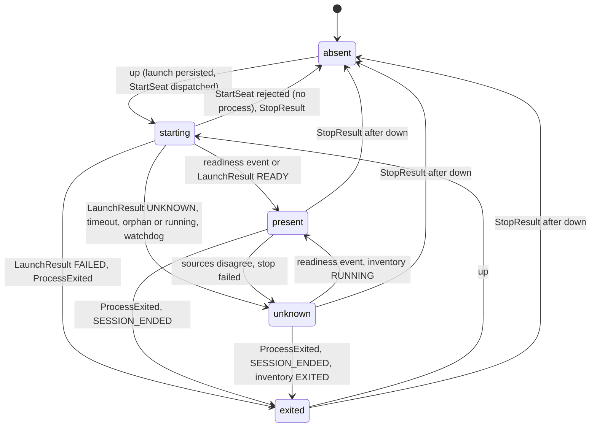
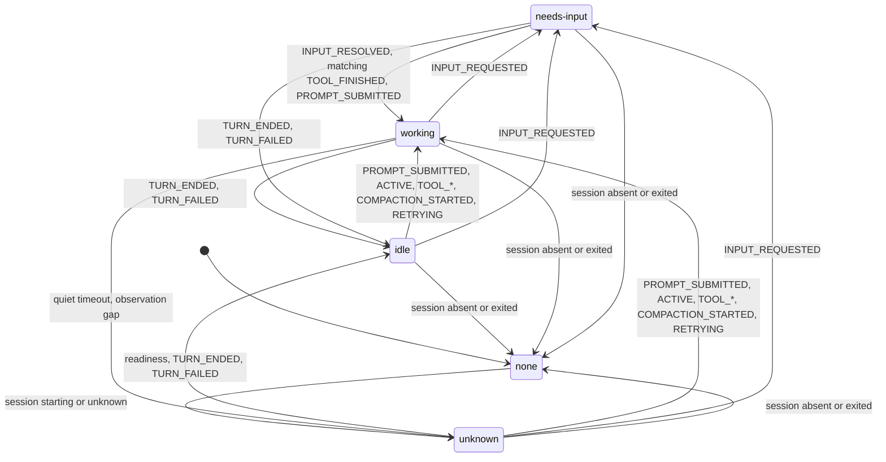
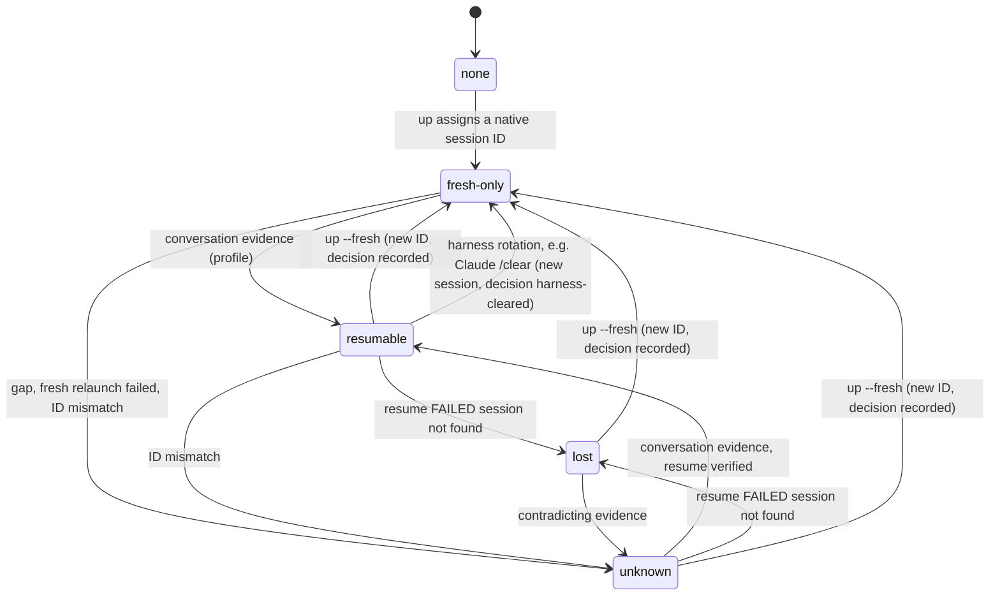
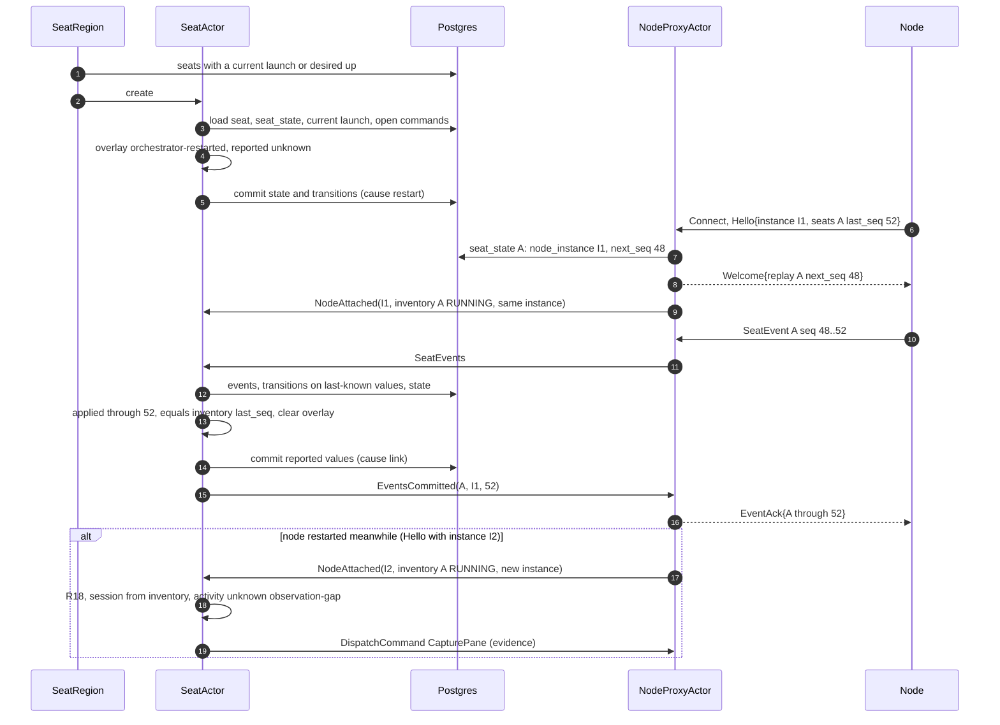

# 0006 — SeatActor: lifecycle and three-axis state

## Context

Issue [#13](https://github.com/aiakos-hq/aiakos/issues/13) asks for the `SeatActor`: the seat's
session, activity and resumability, merged from hook events, heartbeats and pane liveness, with
heartbeat timeout meaning `unknown` and a persisted session ID.

The plan defines the seat state model in four places, and this spec implements exactly that:

- [Plan §1](../plan.md#1-what-we-learned-from-openrig): "**Honest state**: three orthogonal axes
  (session / activity / resumability); `unknown` is a valid answer; no silent fresh-fallback on
  resume."
- [Plan §3](../plan.md#3-architecture): "**SeatActor** is the single place a seat's truth lives;
  merges hook events, heartbeats, sandbox events and pane liveness into the three state axes."
- [Plan §7](../plan.md#7-monitoring-incl-sandboxed-seats): "SeatActor merges them: hook events win
  (sequence numbers); heartbeat timeout ⇒ `unknown`; sandbox death ⇒ `exited`; disagreement ⇒
  health finding, never a guess."
- [Plan §4](../plan.md#4-technology-decisions) principles 2 and 4, and CLAUDE.md rules 3
  (honest state, no silent fallbacks), 4 (terminals are transport, the database is the record)
  and 6 (`tenant_id` on every table).

The plan and the issue name the axes and some values (session: present / exited / absent;
activity: working / idle / needs-input / unknown; resumability). This spec fixes the complete value
sets, the transitions and what `unknown` means on each axis.

Decisions this spec implements (not reopened here):
[ADR 0002](../adr/0002-dotnet-and-akka-for-live-entities.md) (Akka.NET for live entities only, the
database is the record, no Akka.Persistence),
[ADR 0003](../adr/0003-postgres-dbup-dapper.md) (Postgres, DbUp, Dapper, `tenant_id` from the
first migration), [ADR 0004](../adr/0004-orchestrator-node-split.md) (the node reports, the
orchestrator decides), [ADR 0005](../adr/0005-tmux-first-session-host.md) (capture is evidence,
never state) and [ADR 0006](../adr/0006-claude-code-first-harness.md) (Claude Code in M1, OpenCode
in M2 behind the same model).

Evidence from the spikes that shapes the state machine:

| Spike | What it forces into the SeatActor |
|---|---|
| [0001](../spikes/0001-claude-wsl-tmux-hooks.md) | The state mapping table (`SessionStart` → idle and readiness, `UserPromptSubmit`/tools → working, `Notification permission_prompt` → needs-input, `Stop` → idle, `SessionEnd` → exited). **Arrival order is not emission order** (each hook is a process), so ordering is by the relay's sequence number. `idle_prompt` never fired: **`Stop` is the only idle signal**. `permission_prompt` arrives ~6 s after `PreToolUse`, and **nothing signals "working again" after an approval until `PostToolUse`**. `SessionStart source=compact` is not a new session. Long tool calls are silent. |
| [0002](../spikes/0002-claude-session-resume.md) | The orchestrator owns the session ID. Resume outcome is verified / failed / unknown, **never a silent fresh start**; a fresh start after a failed resume is an explicit, recorded decision. **A session is resumable only after its first prompt** (F5); before that, relaunching with the same ID is a fresh start. A failed resume emits an **orphan `SessionEnd`** that must not change state. `~/.claude/sessions/<pid>.json` **goes stale** and is not a source of truth. |
| [0004](../spikes/0004-opencode-api.md) | OpenCode's `session.status` **stays `busy` while a permission is pending**, so needs-input comes from `permission.asked` and must survive later `busy` levels until `permission.replied`. Its SSE stream has no replay; after reconnects the node sends `RESYNC` events. |
| [0005](../spikes/0005-docker-seat.md) | **`StopFailure`** is the only signal for auth/API failures, after ~3 min of silence, so silence is not "working fine". **`docker restart` kills the harness with no `SessionEnd`**, so process exit is a separate signal. Exec'd harnesses **orphan** and hold the session ID. |

### Depends on wave 1 decisions

Specs 0001–0003 are accepted on main. If one of them changes, this spec changes with it.

- **Spec 0001 (solution skeleton, #9)**: the SeatActor lives in `Aiakos.Orchestrator`, hosted by
  Akka.Hosting with no remoting, clustering or persistence (R27); migrations are embedded
  `Migrations/NNNN_snake_case.sql` in `Aiakos.Data`, schema `aiakos`, forward-only (R30–R33), with
  the DbUp journal in `aiakos_meta` exempt from rule 6 (D4); `aiakos.tenant` and the default
  tenant UUID (D3, [ADR 0012](../adr/0012-tenant-keys.md)); `uuid` keys from
  `Guid.CreateVersion7()`, composite foreign keys that include `tenant_id`; Dapper repositories
  per aggregate taking `tenantId` first, SQL inline with explicit columns; tests on xUnit v3 +
  Microsoft.Testing.Platform with Testcontainers `postgres:18` (D5), and its risk that
  **Akka.TestKit may not support xUnit v3** (tracked here as RK1); `ActivitySource`/`Meter` named
  `Aiakos.Orchestrator`.
- **Spec 0002 (gRPC contract, #10)**: the `SeatEvent` envelope and its bodies (`CommandResult`,
  `HarnessEvent`, `SessionObserved`, `ProcessExited`, `ObservationGap`); the normalized
  `HarnessEventKind` values and the Claude/OpenCode mapping table; `seq` per
  `(node_instance_id, seat_id)` with the dedupe key `(tenant_id, node_instance_id, seat_id, seq)`
  and `EventAck` only after commit (R27–R30, [ADR 0019](../adr/0019-node-link-delivery-model.md));
  `source_seq` for emission order, stamped by the hook relay (R28, D3); an in-memory node buffer
  with no spool in M1 (D2); gap detection
  and `ObservationGap` reasons (R32, R33) and `origin = RESYNC`; `LaunchResult`
  READY / FAILED / UNKNOWN with reasons, `DeliveryResult` outcomes, at-most-once resend only to the
  same node instance (R18, R21, R22), with resume as a launch mode (D4); node liveness timeout
  (R10); `Hello.seats` inventory, with unknown seats on a node becoming findings and never being
  stopped automatically (R31, D9); command IDs persisted before sending (R13); the adapter split,
  where the node normalizes and the orchestrator interprets (D1,
  [ADR 0018](../adr/0018-harness-adapter-split.md)); the node decides readiness and resume
  verification in `LaunchResult`, and the SeatActor turns disagreements with the raw events into
  health findings (R21, D5); and the list of what #13 must do ("Assumptions for dependent
  specs").
- **Spec 0003 (rig file format, #14)**: seat identity is the address `<seat id>@<rig name>`, flat
  and rig-unique (R7, D1, [ADR 0014](../adr/0014-flat-seat-addresses.md)); human seats are recorded but never launched in M1 (R8); the loader's
  resolved seat parameter set is the launch input (R27) and contains **no session ID** (that is
  orchestrator-owned); `spec_hash` and `binding_hash` per rig instance (R26,
  [ADR 0017](../adr/0017-resolved-rig-and-hashes.md)), with table design left to the orchestrator
  specs; running seats are
  never hot-reloaded, and how a changed spec is applied is #15's decision.

Neighbouring work, in parallel:

| Topic | Owner |
|---|---|
| Claude Code event mapping, readiness and confirmation rules, the `IHarnessStateProfile` values for Claude | spec 0005, issue [#12](https://github.com/aiakos-hq/aiakos/issues/12) |
| tmux `ISessionHost`, pane liveness, the node's launch registry | spec 0004, issue [#11](https://github.com/aiakos-hq/aiakos/issues/11) |
| CLI `up/down/send/capture/ps`, output formatting, the API transport to the orchestrator, applying a changed spec | issue [#15](https://github.com/aiakos-hq/aiakos/issues/15) |
| `NodeProxyActor`, the gRPC service, node tokens | spec 0002 (issue #10) |

## Goals

- One `SeatActor` per agent seat is the only writer of that seat's state, and its state is always
  in the database: every conclusion is committed together with the evidence that caused it.
- Three orthogonal axes with fixed value sets, where `unknown` is an explicit value with a reason,
  entered by defined triggers and left only by defined evidence.
- `up`, `down`, `send` and `capture` with honest outcomes: resume is verified, failed or unknown;
  a fresh start after a failed resume is an explicit, recorded decision; input is delivered at
  most once.
- Out-of-order, duplicate and missing events never corrupt state. Duplicates are no-ops, late
  events cannot override newer evidence, and gaps lead to `unknown`, not to guesses.
- An orchestrator restart loses nothing: actors rebuild from Postgres and catch up from the node's
  replay.
- Health findings for disagreements, orphans, silence and prolonged `unknown`.
- A `ps` query the CLI can render without talking to actors.
- Every transition is visible as a log line, a metric and a span event.

## Non-goals / out of scope

- **Work queue, handoff, routing, work items, humans as active seats** (M3). The design leaves
  room for them (see [Extension points](#extension-points-for-m2m3)); nothing here implements them.
- **Automatic relaunch or reconciliation** of `desired = up` seats after an unexpected exit, and
  watchdog-driven refocus or handover (M7). M1 reports the exit as a finding (D7).
- **Answering permission prompts** through the orchestrator (`AnswerInput`, M2/M4). A human
  answers in the pane.
- **Chat delivery** and "deliver when idle" queuing (M4). M1 rejects a send that cannot be
  delivered now.
- **Sandbox lifecycle events** (Docker `die`/`exec_die`/OOM, M6). The state machine already maps
  `ProcessExited` from any source to `exited`, so M6 adds sources, not transitions.
- **Akka.Cluster, sharding across processes, Akka.Persistence** (M8, ADR 0002). M1 has one
  orchestrator process; see [Actor topology](#actor-topology).
- **Claude-specific parsing** (spec 0005), **tmux mechanics** (spec 0004), **wire format**
  (spec 0002), **CLI rendering** (#15), **dashboard** (M5).
- **Retention and pruning** of the event log (D17).
- **Fork** (`LAUNCH_MODE_FORK`): not needed in M1. The tables accept it; no command issues it.

## Requirements

### Actor model

R4–R7 are recorded in [ADR 0032](../adr/0032-seat-actor-sole-writer.md) (the SeatActor as sole
writer, evidence and conclusions in one transaction; D4).

- **R1** Each agent seat has exactly one `SeatActor` in the orchestrator process, addressed by
  `seat_id`. Human seats (spec 0003 R8) have no actor and are never launched.
- **R2** All messages for a seat go through a local `SeatRegion` actor that routes by `seat_id`
  (an `IMessageExtractor`-style envelope), so M8 can swap it for Akka.Cluster.Sharding without
  touching the SeatActor ([Actor topology](#actor-topology)).
- **R3** The state machine is a pure function `SeatStateMachine.Apply(state, input, profile, now)`
  that returns the next state, transitions, finding changes, event dispositions and effects. The
  actor only does I/O (database, commands, timers, replies) around it.
- **R4** The SeatActor is the **only writer** of `seat_state`, `seat_transition`, `seat_launch`,
  `seat_session`, `seat_command` outcomes and seat findings. Other components read these tables;
  the `up` API writes only `rig` and `seat` (desired configuration).
- **R5** Every input that changes anything is committed in **one transaction**: the new events (if
  any), the transitions, the new `seat_state` row (optimistic `version` check), finding changes and
  new command rows. Effects (sending commands, acks, replies) happen only after that commit.
- **R6** The SeatActor processes one input at a time. While a commit is in flight it stashes
  further messages; ordering per seat is therefore the mailbox order.
- **R7** A failed commit crashes the actor. The supervisor restarts it, the restart reloads state
  from Postgres, and the `NodeProxyActor` re-forwards every event it forwarded but has not seen
  committed ([Supervision](#supervision-and-failure)). No input is half-applied.

### State axes

R8–R20 are recorded in [ADR 0031](../adr/0031-three-axis-seat-state.md) (the three-axis model
with the reporting overlay; D1–D3, D9).

- **R8** The three axes and their only values are:
  - **session**: `absent`, `starting`, `present`, `exited`, `unknown`;
  - **activity**: `none`, `idle`, `working`, `needs-input`, `unknown`;
  - **resumability**: `none`, `fresh-only`, `resumable`, `lost`, `unknown`.
  Definitions are in [Axis definitions](#axis-definitions).
- **R9** Every axis value `unknown` carries a machine-readable **reason** from a closed list, and
  every axis carries the time it last changed (`since`).
- **R10** Axes are orthogonal but constrained: activity is `none` exactly when session is `absent`
  or `exited`, and `unknown` when session is `starting` or `unknown`. Resumability is independent
  of session and activity.
- **R11** Transitions follow the tables in [Transitions](#transitions) exactly. An input that the
  tables do not list for the current value causes no transition (it is still recorded as
  evidence).
- **R12** State is derived only from events of the **current launch**. Events carrying another
  `launch_id` are stored with disposition `stale-launch` and never change an axis; if they show a
  live harness (readiness, prompt, tool, input-requested kinds), they open an `orphan-harness`
  finding.
- **R13** Harness events are ordered by `source_seq` when present (spec 0002 R28). An event whose
  `source_seq` is lower than the highest `source_seq` already applied for the current launch is
  **late**: stored with disposition `late`, it may still establish monotonic facts (conversation
  evidence for resumability, usage samples), but it never changes session or activity.
- **R14** An event whose `(node_instance_id, seq)` is already stored is a duplicate: it changes
  nothing, and it counts as committed for the ack (spec 0002 R29).
- **R15** A `SESSION_ENDED` for a launch that has not produced a readiness event is an **orphan**
  (spike 0002): disposition `orphan`, no state change.
- **R16** When the node link for a seat is lost (node liveness timeout, stream closed,
  orchestrator restart), session and activity are **reported** as `unknown` with reason
  `node-link-lost` or `orchestrator-restarted`, unless session is `absent` or `exited`. The
  SeatActor keeps applying replayed events to its last-known values underneath.
- **R17** When the node reattaches with the **same** `node_instance_id` and replay has caught up
  with the node's `last_seq` for the seat, the reported values return to the last-known values.
  No evidence was lost, so no `unknown` remains.
- **R18** When the node reattaches with a **new** `node_instance_id`, or a sequence gap or an
  `ObservationGap` is seen, events were lost. Session is re-established from the node's inventory
  entry, activity becomes `unknown` (reason `observation-gap`) until an establishing event
  arrives, and a resumability of `fresh-only` becomes `unknown`. The SeatActor asks for a pane
  capture as evidence and never fabricates the missing events.
- **R19** If session is `present`, activity is `working`, and no event of the current launch has
  arrived for the profile's `quiet_timeout` (default 10 min), activity becomes `unknown` (reason
  `quiet-timeout`) and an `activity-stale` finding opens. `idle` and `needs-input` never time out.
- **R20** Disagreement between sources (for example `LaunchResult READY` and no readiness event,
  or a readiness event after `exited`) sets the affected axis to `unknown` (reason
  `sources-disagree`) and opens a finding. The SeatActor never picks a winner.

### Lifecycle commands

R21–R24 and the no-relaunch rule (D7) are recorded in
[ADR 0033](../adr/0033-no-unrecorded-relaunch.md): the orchestrator never relaunches a seat or
starts a fresh conversation without a recorded decision.

- **R21** `up` records `desired = up` and, if session is `absent` or `exited`, starts a launch in
  the mode chosen by resumability ([Launch mode decision](#launch-mode-decision)). It is a
  successful no-op when session is `starting` or `present`. It is rejected with
  `SEAT_STATE_UNKNOWN` when session is `unknown` (`down` first, or wait for the node) and with
  `NODE_NOT_CONNECTED` when the seat's node has no live stream. Commands decide on the
  **reported** values.
- **R22** Before `StartSeat` is dispatched, one transaction persists the `seat_session` (native
  session ID generated by the orchestrator through the harness profile, if new), the `seat_launch`
  (`launch_id`, mode, decision, spec and binding hashes, a hash of the per-launch seat token) and
  the `seat_command`. Session becomes `starting`.
- **R23** `up` never falls back to a fresh session. A resume that fails with
  `RESUME_SESSION_NOT_FOUND` sets resumability `lost` and the seat stays `exited`. A later `up` is
  rejected with `RESUME_LOST` until the caller passes the explicit `fresh` option.
- **R24** A fresh start that discards a conversation (`up --fresh` while resumability is
  `resumable`, `lost` or `unknown`) is recorded as decision `fresh-explicit` on the launch, with
  the caller identity from `CallerContext` (rule 2) and an optional note. The previous
  `seat_session` row is kept and marked abandoned.
- **R25** A launch outcome is recorded from `LaunchResult` as `ready` (fresh: ready; resume:
  **verified**), `failed`, `unknown`, or as `rejected` when the node rejected `StartSeat`. For a
  resume, `ready` means verified: the node confirmed `SessionStart` with the same native ID and
  source `resume` (spec 0002 R21).
- **R26** If no `LaunchResult` arrives within `ready_timeout + command timeout + 30 s`, session
  becomes `unknown` (reason `launch-result-missing`).
- **R27** `down` records `desired = down` and dispatches `StopSeat` for the current launch unless
  session is `absent`. Session becomes `absent` on a `StopResult` (`STOPPED`, `KILLED` or
  `NOT_RUNNING`) and `unknown` (reason `stop-failed`) if the stop command fails or times out.
  Stopping never changes resumability (spec 0002 R25).
- **R28** `capture` dispatches `CapturePane` in any state that has a launch and returns the text
  to the caller. A capture never changes an axis (ADR 0005); a capture whose `pane_dead` flag
  contradicts `present` opens a `sources-disagree` finding.

### Input delivery

- **R29** `send` is accepted only when the node link is live, session is `present`, activity is
  `idle`, and no delivery for the seat is in flight. With the explicit `force` option, activity
  `unknown` is also accepted, and the delivery row records that decision. `needs-input` and
  `working` are always rejected: text pasted into a permission dialog can select an option.
- **R30** A delivery is a `seat_command` of kind `deliver`, persisted with its lead and body
  before dispatch. Its outcome is `confirmed`, `submitted-unconfirmed`, `not-delivered`,
  `failed` or `unknown`.
- **R31** Delivery is **at most once**. The SeatActor never re-issues a delivery. Resending
  after a reconnect is the `NodeProxyActor`'s job and only to the same node instance (spec 0002
  R18); a delivery that was dispatched to a node instance that is gone becomes `unknown`.
- **R32** A `confirmed` delivery whose `turn_id` has no matching `PROMPT_SUBMITTED` event in the
  current launch after the next commit opens a `sources-disagree` finding (spec 0002 D5).
  Activity follows the harness events, not the delivery result.

### Persistence and restart

- **R33** A DbUp migration adds the tables in [Schema](#schema): `rig`, `seat`, `seat_state`,
  `seat_session`, `seat_launch`, `seat_command`, `seat_event`, `seat_transition`, `seat_finding`.
  Every table has `tenant_id uuid NOT NULL` with a foreign key to `aiakos.tenant` and composite
  foreign keys that include `tenant_id` (rule 6, spec 0001).
- **R34** `seat_event` has a unique key `(tenant_id, node_instance_id, seat_id, seq)` and inserts
  use `ON CONFLICT DO NOTHING` (spec 0002 R29). `seat_event` and `seat_transition` are
  append-only: no statement in the code base updates or deletes their rows.
- **R35** After an orchestrator restart, a SeatActor is started for every agent seat that has a
  current launch or `desired = up`. It loads its row from `seat_state`, marks live values
  `unknown` (reason `orchestrator-restarted`) as in R16, and recovers through R17 or R18 when the
  node reattaches. It does not replay the event log to rebuild state: `seat_state` is committed
  with the events, so it is already consistent.
- **R36** The `NodeProxyActor` builds `Welcome.replay` from `seat_state.node_instance_id` and
  `seat_state.next_seq` (the next `seq` the orchestrator expects), so replay starts after the last
  committed event.

### Health findings

- **R37** Findings live in `seat_finding` with a kind from the closed list in
  [Findings](#findings), a severity, evidence, occurrence count and open/resolved status. At most
  one finding per `(seat, kind)` is open; recurrences increment its count.
- **R38** Findings never change an axis by themselves. Findings that describe a condition
  (`activity-stale`, `state-unknown-prolonged`, `node-not-connected`) resolve automatically when
  the condition ends; findings that describe an incident (`turn-failed`, `sources-disagree`,
  `observation-gap`) stay open until acknowledged (M5 adds acknowledging; M1 lists them).
- **R39** Session `unknown` for longer than 5 min opens a `state-unknown-prolonged` finding.

### Queries

- **R40** `SeatQueries.ListAsync(tenantId, rigName?)` returns one row per seat (agent and human)
  with the columns in [Queries for `ps`](#queries-for-ps), read from Postgres only, in one
  round trip.
- **R41** `SeatQueries.GetDetailAsync(tenantId, address)` returns the axes with reasons and
  `since`, the current launch (mode, decision, outcome, reason, evidence), the last 20 transitions,
  open findings and the last 5 deliveries.
- **R42** `SeatQueries.GetLaunchAsync` and `GetCommandAsync` return one launch or command by ID,
  so the CLI can wait for an outcome by polling.

### Harness neutrality

- **R43** The SeatActor consumes only spec 0002's normalized inputs plus an
  `IHarnessStateProfile` per harness ([Harness profile](#harness-profile-what-the-adapter-must-provide)).
  It contains no harness name comparisons and never parses raw payloads.
- **R47** A readiness event that the profile classifies as a session rotation
  (`IsSessionRotation`, e.g. Claude `/clear`) adopts the harness's new native ID as a new
  `seat_session` with decision `harness-cleared` and resumability `fresh-only` (U8, D14). It is a
  recorded harness action, not a mismatch.

### Observability

- **R44** Every transition writes one structured log line at `Information`, a
  `aiakos.seat.transitions` counter increment and an event on the active span, with seat
  address, axis, from, to, reason and cause. Finding changes log at `Warning`.
- **R45** Processing an input is a span `seat.apply` that links to the trace context of the
  events it applies (spec 0002 R42); lifecycle commands are spans `seat.up`, `seat.down`,
  `seat.send`, `seat.capture`.
- **R46** Logs, spans and metrics never contain delivery bodies, raw payloads, seat tokens or
  other secrets. They may contain IDs, kinds, outcomes and reasons.

## Design

### Actor topology

```
ActorSystem "aiakos"
 └─ /user/seats            SeatRegion      routes SeatEnvelope(seat_id, message) to children;
    │                                       creates a child on first message or at startup (R35);
    │                                       supervisor of all SeatActors
    ├─ /user/seats/<seat_id>  SeatActor    one per agent seat
    └─ …
 └─ /user/nodes/<node>     NodeProxyActor  one per connected node (spec 0002); sends
                                           SeatEnvelope(...) to /user/seats
```

- **Why `SeatRegion` and not a `RigActor` parent (plan §3 diagram).** In M1 nothing needs live
  per-rig state: `up`/`down` on a rig is a loop over its seats in the API layer. A `RigActor` is
  added when rig-level live behaviour appears (routing, M3). See D10.
- **Envelope.** `SeatEnvelope(Guid TenantId, Guid SeatId, object Message)`. The region derives
  the child name from `SeatId`. This is the same shape as Akka.Cluster.Sharding's message
  extractor (entity ID `"{tenant}:{seat}"`, shard ID from a hash of the tenant), so M8 can put a
  `ShardRegion` behind `/user/seats` without changing SeatActor code. Because state is rebuilt from
  Postgres (R35), sharding needs neither Akka.Persistence nor remember-entities (D11). The ADR for
  this path is written when clustering is adopted (M8), not now.
- **Startup.** A hosted service registered after the migration step (spec 0001) starts the
  region, which loads the IDs of seats with a current launch or `desired = up` and creates their
  actors (R35). Other seats get an actor on their first message.
- **Passivation.** None in M1 (a handful of seats). Later: passivate seats with session `absent`
  and `desired = down` after 30 min idle.

### Actor protocol

| Message | From | Meaning |
|---|---|---|
| `SeatUp(Fresh, Note, Caller)` | API | R21–R24; replies `SeatCommandAccepted(launch_id, command_id)`, `SeatAlreadyUp(launch_id)` or `SeatCommandRejected(reason)` |
| `SeatDown(Caller)` | API | R27; replies accepted or no-op |
| `SeatSend(Lead, Body, ExpectConfirmation, Force, Caller)` | API | R29–R31; replies accepted (`command_id`) or rejected |
| `SeatCapture(HistoryLines, Caller)` | API | R28; replies with the `PaneCapture` when it arrives, or a timeout |
| `SeatEvents(NodeName, NodeInstanceId, IReadOnlyList<SeatEvent>)` | NodeProxy | a batch of events in `seq` order |
| `NodeAttached(NodeName, NodeInstanceId, SeatInventory?, IsNewInstance)` | NodeProxy | after `Hello`; `SeatInventory` is `null` when the node did not list the seat |
| `NodeLinkLost(NodeName, Reason)` | NodeProxy | liveness timeout or stream closed (spec 0002 R10) |
| `CommandDispatchFailed(CommandId, Reason)` | NodeProxy | the command could not be sent (no stream) |
| `EventsCommitted(SeatId, NodeInstanceId, ThroughSeq)` | SeatActor → NodeProxy | after commit; NodeProxy acks the node (spec 0002 R30) |
| `DispatchCommand(Command)` | SeatActor → NodeProxy | after commit (R5) |
| `SeatActorRestarted(SeatId)` | SeatActor → NodeProxy | in `PreStart` after a restart; NodeProxy re-forwards uncommitted events (R7) |
| timers `QuietTimeout`, `LaunchWatchdog`, `UnknownProlonged` | self | R19, R26, R39 |

The API layer (#15 decides the transport) resolves `CallerContext` (tenant, user) and the seat
address to `seat_id` before it sends; the SeatActor never takes identity from a message body
(rule 2).

### Axis definitions

**Session** — whether the harness process of the seat's current launch exists and is usable.

| Value | Meaning |
|---|---|
| `absent` | No harness is expected: never launched, or the last launch was stopped by `down` (or rejected by the node before starting). |
| `starting` | A launch was dispatched; its `LaunchResult` has not arrived and no readiness event has been seen. Input is not accepted. |
| `present` | The current launch's harness is running and has signalled readiness. |
| `exited` | The current launch's harness ended without a `down`: crash, `/exit`, a failed launch, a failed resume, a SIGKILL. Exit code and signal are kept when known. |
| `unknown` | Not established. Reasons: `node-link-lost`, `orchestrator-restarted`, `launch-unconfirmed` (`LaunchResult UNKNOWN` or `StartSeat` timed out), `launch-result-missing`, `stop-failed`, `orphan-or-running` (node found a live harness), `inventory-missing`, `sources-disagree`. |

**Activity** — what the harness is doing, meaningful only while there is a session.

| Value | Meaning |
|---|---|
| `none` | There is no harness (session `absent` or `exited`). Not a guess: nothing can be active. |
| `idle` | Ready for input: the last turn ended, or the session just became ready. |
| `working` | A turn is in progress. `activity_detail` refines it: `compacting`, `retrying`, `tool:<tool name>`. |
| `needs-input` | The harness waits for a human decision (permission, question). `pending_input_request` holds its ID when the harness gives one. |
| `unknown` | Reasons: `not-ready` (session `starting`), `session-unknown` (session `unknown`), `node-link-lost`, `orchestrator-restarted`, `observation-gap`, `quiet-timeout`, `sources-disagree`. |

**Resumability** — whether the seat's current conversation can be continued by a resume. It is a
property of the conversation (`seat_session`), so it survives stops, exits and link loss.

| Value | Meaning |
|---|---|
| `none` | The seat has no conversation yet (no native session ID assigned). |
| `fresh-only` | A native session ID is assigned, but the harness has not yet persisted a conversation (spike 0002 F5). A relaunch is a fresh start, reusing the ID if the profile allows. |
| `resumable` | The harness has persisted the conversation (profile evidence seen, or a resume was verified). |
| `lost` | A resume was attempted and the harness reported the conversation does not exist. Only an explicit fresh start moves on. |
| `unknown` | Reasons: `observation-gap` (the first prompt may have been missed), `fresh-relaunch-failed`, `session-id-mismatch`, `contradicting-evidence`. |

**Reported vs last-known values.** For session and activity, `seat_state` stores the reported
value (what `ps` shows) and the last-known value (the fact derived from events). They differ only
while an **overlay** is set: `node-link-lost` or `orchestrator-restarted` (R16). Transitions in the
tables apply to last-known values; the overlay decides what is reported. Resumability has no
overlay.

### Transitions

Notation: rows are inputs, columns are the current (last-known) value, cells are the next value.
`—` = no change. `n/a` = cannot occur for the current launch (recorded as evidence, no change).
`+F(kind)` = also open or bump a finding. Session changes also apply R10 to activity: entering
`absent`/`exited` sets activity `none`; entering `starting` sets `unknown/not-ready`; entering
`unknown` sets `unknown/session-unknown`; entering `present` through a readiness event sets `idle`
(A1), and through anything else (S5 without a readiness event, S15 inventory) sets
`unknown/sources-disagree` or `unknown/observation-gap` respectively, until an establishing event
arrives.

#### Session



The overlay (R16) is not drawn: it changes the reported value to `unknown` and back without a
transition of the last-known value.

| # | Input (current launch) | `absent` | `starting` | `present` | `exited` | `unknown` |
|---|---|---|---|---|---|---|
| S1 | `up` accepted | `starting` | — (no-op, returns launch) | — (no-op) | `starting` | rejected `SEAT_STATE_UNKNOWN` |
| S2 | `down` accepted (StopSeat dispatched) | — (desired only) | — | — | — (StopSeat sent to clean up the pane) | — |
| S3 | `StopResult` STOPPED / KILLED / NOT_RUNNING | n/a | `absent` | `absent` | `absent` | `absent` |
| S4 | `StopSeat` FAILED / TIMED_OUT | n/a | `unknown`/stop-failed | `unknown`/stop-failed | — | — |
| S5 | `LaunchResult READY` | n/a | `present` (no readiness event was seen: +F(sources-disagree), activity `unknown`) | — | `unknown`/sources-disagree +F(sources-disagree) | `present` |
| S6 | `LaunchResult FAILED` | n/a | `exited` | `unknown`/sources-disagree +F(sources-disagree) | — | `exited` |
| S7 | `LaunchResult UNKNOWN` | n/a | `unknown`/launch-unconfirmed +F(launch-unconfirmed) | `unknown`/sources-disagree +F(sources-disagree) | — | — |
| S8 | `StartSeat` REJECTED `SEAT_ALREADY_RUNNING` / `ORPHAN_HARNESS_DETECTED` | n/a | `unknown`/orphan-or-running +F(orphan-harness) | n/a | n/a | n/a |
| S9 | `StartSeat` REJECTED other reason, or FAILED | n/a | `absent` +F(launch-rejected) | n/a | n/a | n/a |
| S10 | `StartSeat` TIMED_OUT, or `LaunchWatchdog` fires | n/a | `unknown`/launch-unconfirmed or launch-result-missing | — | — | — |
| S11 | readiness event (profile) | n/a | `present` | — | `unknown`/sources-disagree +F(sources-disagree) | `present` |
| S12 | `SESSION_ENDED` after a readiness event in this launch | n/a | n/a (readiness moved it to `present`) | `exited` | — | `exited` |
| S13 | `SESSION_ENDED` without a readiness event (orphan, R15) | — | — | — | — | — |
| S14 | `ProcessExited` (any `ExitSource`; M6 adds container sources) | n/a | `exited` | `exited` | — (merge exit code) | `exited` |
| S15 | `NodeAttached`, new instance, inventory LAUNCHING / RUNNING / EXITED / UNKNOWN (same `launch_id`) | — | `starting` / `present` / `exited` / `unknown` | same mapping | same mapping | same mapping |
| S16 | `NodeAttached`, new instance, seat missing from inventory or other `launch_id` | — | `unknown`/inventory-missing +F(inventory-mismatch) | same | — | same |

`exited` while `desired = up` and not caused by a `down` opens `unexpected-exit` (D7).
`CapturePane` never appears in the table (R28).

#### Activity

Only evaluated while the last-known session is `starting`, `present` or `unknown`; otherwise it is
`none` (R10). Late events (R13) and stale-launch events (R12) are never inputs here.
(Amended 2026-10-04: while the session is `starting` or `unknown`, rows A2–A12 change nothing;
see Changes after acceptance.)



| # | Input (`HarnessEventKind`, current launch, not late) | `idle` | `working` | `needs-input` | `unknown` |
|---|---|---|---|---|---|
| A1 | readiness: `SESSION_STARTED` with a readiness source (profile) | `idle` | `idle` | `idle` | `idle` |
| A2 | `PROMPT_SUBMITTED` | `working` | — | `working` (a new prompt means no dialog is open) | `working` |
| A3 | `ACTIVE` (level; OpenCode `busy`) | `working` | — | — (**sticky**, spike 0004) | `working` |
| A4 | `TOOL_STARTED` | `working` detail `tool:<name>` | detail `tool:<name>` | — (sticky: a parallel tool does not answer the dialog) | `working` |
| A5 | `TOOL_FINISHED` | `working` | — (detail cleared) | `working` if it resolves the pending request (below), else — | `working` |
| A6 | `INPUT_REQUESTED` | `needs-input` | `needs-input` | — (request ID updated) | `needs-input` |
| A7 | `INPUT_RESOLVED` | — | — | `working` if it matches the pending request, else — | `working` |
| A8 | `COMPACTION_STARTED` | `working` detail `compacting`, remember `idle` | detail `compacting`, remember `working` | — | `working` detail `compacting`, remember `unknown` |
| A9 | `COMPACTED` | — | if detail is `compacting`: the remembered value (an `unknown` stays `unknown`/observation-gap); else — | — | — |
| A10 | `TURN_ENDED` | — | `idle` | `idle` (dialog closed, e.g. denial) | `idle` |
| A11 | `TURN_FAILED` | — +F(turn-failed) | `idle` +F(turn-failed) | `idle` +F(turn-failed) | `idle` +F(turn-failed) |
| A12 | `RETRYING` | `working` detail `retrying` | detail `retrying` | — | `working` detail `retrying` |
| A13 | `SESSION_ENDED` | handled by S12 / S13 | | | |
| A14 | `TELEMETRY`, `OTHER` | — (usage updated; quiet timer reset) | — | — | — |
| A15 | `QuietTimeout` (R19) | n/a | `unknown`/quiet-timeout +F(activity-stale) | n/a | n/a |
| A16 | `ObservationGap`, sequence gap, new node instance (R18) | `unknown`/observation-gap +F(observation-gap) | same | same | same |

**Resolving a pending input request (A5, A7).** `pending_input_request` stores the
`request_id` (OpenCode permission ID, or Claude's tool use ID if spec 0005 adopts
`PermissionRequest`) or `*` when the harness gives none (Claude `Notification permission_prompt`
has no ID, spike 0001). An `INPUT_RESOLVED` or `TOOL_FINISHED` resolves it if the IDs match
(`request_id` or `tool_use_id` attribute) or if the pending value is `*`. For Claude this is
exactly spike 0001's rule: `PostToolUse` after a permission prompt means input was given; nothing
earlier signals it. A5 with `*` can resolve early when parallel tools run; that is accepted in M1
and noted as a risk.

**Every** harness event of the current launch (including `TELEMETRY`, late ones and `RESYNC`
ones) updates `last_event_at` and resets the quiet timer.

**`RESYNC` events** (spec 0002 R33, OpenCode) are applied like live events. They are the reason a
gap on OpenCode seats heals by itself; Claude has no resync source, so a gap on an idle Claude
seat stays `unknown` until the next turn (D16).

#### Resumability



| # | Input | `none` | `fresh-only` | `resumable` | `lost` | `unknown` |
|---|---|---|---|---|---|---|
| U1 | new native session assigned (`up` from `none`, or any `up --fresh`) | `fresh-only` | `fresh-only` (new ID if fresh-explicit) | `fresh-only` (new session) | `fresh-only` (new session) | `fresh-only` (new session) |
| U2 | conversation evidence for the current native session (profile; applies even when late, R13) | n/a | `resumable` | — | `unknown`/contradicting-evidence +F(sources-disagree) | `resumable` |
| U3 | `LaunchResult READY` for mode RESUME (verified) | n/a | n/a | — | n/a | `resumable` |
| U4 | `LaunchResult FAILED` reason `RESUME_SESSION_NOT_FOUND` | n/a | n/a | `lost` +F(resume-lost) | — | `lost` |
| U5 | `LaunchResult FAILED` for a FRESH relaunch that reused the ID | n/a | `unknown`/fresh-relaunch-failed +F(launch-failed) | n/a | n/a | — |
| U6 | gap / new node instance (R18) | — | `unknown`/observation-gap | — | — | — |
| U7 | `SessionObserved.matches_expected = false`, or a readiness event with another native ID that is **not** a rotation (U8) | n/a | `unknown`/session-id-mismatch +F(session-id-mismatch) | same | same | +F only |
| U8 | session rotation (`profile.IsSessionRotation`; Claude `/clear`, D14): readiness event with a new valid native ID whose `previous_session_id` equals the current one | n/a | `fresh-only` (new `seat_session`, decision `harness-cleared`) | same | same | same |

**Rotation (U8).** Spec 0005's experiment showed that Claude's `/clear` emits
`SessionEnd{session_id: old, reason: clear}` (mapped to `OTHER`, so S12 does not fire) and then
`SessionStart{session_id: new, source: clear}` (mapped to `SESSION_STARTED` with attribute
`previous_session_id`). The SeatActor then, in one transaction: marks the old `seat_session`
abandoned (reason `harness-cleared`), inserts a new `seat_session` with the harness-chosen ID
(validated with `IsValidNativeSessionId`; an invalid ID is U7 instead), decision
`harness-cleared` and `previous_session_id`, points `current_session_id` at it, and sets
resumability `fresh-only`. Session stays `present`, activity follows A1 (`idle`). The launch keeps
its original `session_id`; later resumes use the new one. Rotation is applied even when the event
is late (R13), because every later event carries the new ID. Aiakos itself never sends `/clear`
in M1 (spec 0005).

Other `LaunchResult FAILED` reasons during a resume (`HARNESS_EXITED`, `SESSION_ID_MISMATCH`)
leave resumability unchanged apart from U7 and open `launch-failed`. `LaunchResult UNKNOWN` never
changes resumability: the conversation is probably fine, the launch is not.

#### Launch mode decision

`up` chooses the mode from resumability. This is the only place a launch mode is decided, and the
decision is stored on `seat_launch.decision`.

| Resumability | `up` | `up --fresh` |
|---|---|---|
| `none` | FRESH, new native ID — decision `new-session` | same |
| `fresh-only` | FRESH reusing the ID if `profile.FreshRelaunchReusesSessionId`, else a new ID — decision `no-conversation-yet` | FRESH, new ID — `fresh-explicit` |
| `resumable` | RESUME — decision `resume` | FRESH, new ID — `fresh-explicit`, old session abandoned |
| `lost` | **rejected** `RESUME_LOST` (hint: `--fresh`) | FRESH, new ID — `fresh-explicit`, old session abandoned |
| `unknown` | RESUME — decision `resume-unverified` (a missing conversation fails honestly with `RESUME_SESSION_NOT_FOUND`) | FRESH, new ID — `fresh-explicit`, old session abandoned |

`no-conversation-yet` is not a fallback: spike 0002 F5 shows there is nothing to resume, and the
adapter reports such a relaunch as fresh. If the assumption is wrong (a missed first prompt), the
harness refuses the reused ID (spike 0002 F2 "already in use") and U5 makes it `unknown`; the next
`up` then tries RESUME.

#### Delivery

| Input | `pending` | `sent` | final states |
|---|---|---|---|
| committed, dispatched | `sent` (with `node_instance_id`) | — | — |
| `CommandDispatchFailed` | `not-delivered` | n/a | — |
| `DeliveryResult CONFIRMED` / `SUBMITTED_UNCONFIRMED` / `NOT_DELIVERED` | n/a | `confirmed` / `submitted-unconfirmed` (+F(delivery-unconfirmed)) / `not-delivered` | — |
| `CommandResult` REJECTED / FAILED / TIMED_OUT (e.g. `SEAT_NOT_READY`, `SEAT_BUSY`, `SEAT_STOPPING`) | n/a | `failed` with reason | — |
| node reattached with a new instance | n/a | `unknown` | — |

A delivery outcome never sets activity; the `PROMPT_SUBMITTED` event does (R32).

### Event handling pipeline

For each `SeatEvents` batch, in order:

1. **Epoch.** If `node_instance_id` differs from `seat_state.node_instance_id`: when the state
   has none, adopt it; otherwise apply R18 first. Either way set `next_seq = 1` for the new
   instance. (Amended 2026-10-04: the condition "and the seat expected events from the previous
   instance" is dropped; see Changes after acceptance.)
2. **Dedupe.** `seq < next_seq` → duplicate (R14). Counted as committed.
3. **Gap.** `seq > next_seq` → sequence gap: apply A16/U6, open `observation-gap`, set
   `next_seq = seq`.
4. **Attribute.** `launch_id` ≠ current launch → disposition `stale-launch` (R12), except an
   `ObservationGapBody`, which applies R18 whatever its launch (observation loss belongs to the
   node, not to a launch). Orphan `SESSION_ENDED` → `orphan` (R15).
5. **Order.** Harness event with `source_seq > 0` and `source_seq <= last_source_seq` → `late`
   (R13); otherwise `applied` and `last_source_seq = source_seq`. `TELEMETRY`, `OTHER` and
   unspecified kinds are exempt: never late, and they never move `last_source_seq`, so a
   statusLine tick that overtakes a `Stop` hook cannot make the `Stop` late.
6. **Apply** the tables (session, then activity, then resumability) with the pure state machine.
7. **Commit** events, transitions, findings, state (`next_seq = last seq + 1`) in one
   transaction; then send `EventsCommitted` and any effects.

Non-harness bodies (`CommandResult`, `ProcessExited`, `SessionObserved`, `ObservationGap`) have no
`source_seq` and are applied in `seq` order. The node emits a launch's readiness event before its
`CommandResult` (spec 0002 sequence diagrams), so S5 after S11 is the normal path, not a
disagreement.

Why a stale guard and not a reorder buffer: every state-changing Claude kind maps to a fixed
target, so "the newest emitted event wins" gives the same final state as sorting (property-tested,
see Test plan), without timers. The history-dependent rules (A3/A4 stickiness, A9) only matter for
OpenCode's single ordered SSE stream. See D5.

### Supervision and failure

- `SeatRegion` supervises its children with `OneForOneStrategy(maxNrOfRetries: 10, withinTimeRange:
  1 min)`: any exception → **Restart**. After 10 restarts in a minute the child is stopped, an
  `actor-stopped` finding is written by the region (best effort) and an `Error` log names the seat;
  the next message recreates it.
- On restart the actor reloads everything from Postgres (as in R35, without the
  `orchestrator-restarted` overlay if the node link is still live) and sends
  `SeatActorRestarted` to the seat's `NodeProxyActor`. The NodeProxy keeps, per seat, the events it
  forwarded since the last `EventsCommitted` and re-forwards them; dedupe makes this safe. This is
  a requirement on the NodeProxy implementation (spec 0002's side), stated here because the two
  actors share the orchestrator process.
- If Postgres is down, commits fail, actors restart, events stay unacked in the node's buffer
  (spec 0002 R39), and `/health` is unhealthy (spec 0001 R29). Nothing is lost that the node still
  holds.
- Optimistic concurrency: every `seat_state` update is `WHERE seat_id = @id AND version = @v`. Zero
  rows means another writer exists (a bug, since the actor is the only writer): the actor throws,
  restarts and reloads.

### Harness profile (what the adapter must provide)

The orchestrator side of `IHarnessAdapter` (spec 0002 D1, [ADR 0018](../adr/0018-harness-adapter-split.md)) gives the SeatActor one immutable
profile per harness:

```csharp
namespace Aiakos.Orchestrator.Seats;

public interface IHarnessStateProfile
{
    string Harness { get; }                                   // "claude-code"
    string NewNativeSessionId();                              // Claude: lowercase UUIDv4
    bool IsValidNativeSessionId(string id);                   // Claude: canonical lowercase UUID only (spike 0002 F3)
    bool IsReadiness(HarnessEventKind kind, IReadOnlyDictionary<string, string> attributes);
    bool IsConversationEvidence(HarnessEventKind kind, IReadOnlyDictionary<string, string> attributes);
    bool IsSessionRotation(HarnessEventKind kind, IReadOnlyDictionary<string, string> attributes); // U8; proposed by spec 0005
    bool FreshRelaunchReusesSessionId { get; }                // Claude: true (spike 0002 F5)
    bool EmitsInputResolved { get; }                          // Claude: false; OpenCode: true
    TimeSpan ReadyTimeout { get; }                            // Claude: 15 s (spike 0002 F9)
    TimeSpan ConfirmTimeout { get; }                          // Claude: 5 s (spike 0001)
    TimeSpan QuietTimeout { get; }                            // default 10 min
}
```

Expected values for Claude Code, which **spec 0005 confirms or corrects**:

| Member | Claude Code (spec 0005) | OpenCode (M2, from spike 0004) |
|---|---|---|
| `IsReadiness` | `SESSION_STARTED` with `source` ∈ {`startup`, `resume`, `fork`, `clear`} | `SESSION_STARTED` |
| `IsConversationEvidence` | `PROMPT_SUBMITTED`, `TURN_ENDED`, `TURN_FAILED` for the event's own `native_session_id` (the transcript exists after the first prompt, spike 0002 F5 and spike 0005 F7; after `/clear` evidence counts for the new ID only) | `SESSION_STARTED` (the session is stored when created) |
| `IsSessionRotation` | `SESSION_STARTED` with `source = clear` and a `previous_session_id` attribute (spec 0005) | `false` (no rotation observed in spike 0004) |
| `FreshRelaunchReusesSessionId` | `true` | `false` |
| `EmitsInputResolved` | `false` (resolution inferred per A5) | `true` (`permission.replied`) |

Spec 0005 must also provide, through the node-side mapping (spec 0002's table):

1. `SessionStart source=compact` → `COMPACTED` (not a readiness event); `PreCompact` →
   `COMPACTION_STARTED`; `StopFailure` → `TURN_FAILED`; `Notification permission_prompt` (and
   `PermissionRequest`, if adopted) → `INPUT_REQUESTED`; `Stop` → `TURN_ENDED`.
2. Orphan `SessionEnd` events forwarded, not filtered (the SeatActor decides, R15).
3. Attributes `source`, `turn_id` (`prompt_id`), `tool_name`, `tool_use_id`, and `request_id`
   where the payload has one.
4. `source_seq` stamped by the hook relay, strictly increasing per seat **across launches**
   (a counter in the seat home), so R13 works after a relaunch.
5. The rotation mapping for `/clear` (answered by spec 0005, D14): `SessionEnd reason=clear` as
   `OTHER`, `SessionStart source=clear` as `SESSION_STARTED` with the new ID and
   `previous_session_id`, and no mismatching `SessionObserved` for it.

### Findings

| Kind | Severity | Opened by | Resolves |
|---|---|---|---|
| `sources-disagree` | warning | R20, R28, R32, S5–S7, S11, U2 | acknowledged |
| `launch-unconfirmed` | warning | S7, S10 | next `ready` launch |
| `launch-rejected` / `launch-failed` | error | S9, U5, failed resume with other reason | next `ready` launch |
| `resume-lost` | error | U4 | `up --fresh` |
| `orphan-harness` | error | S8, R12 | `down` with `StopResult` |
| `inventory-mismatch` | warning | S16 | node inventory matches again |
| `session-id-mismatch` | error | U7 | new session |
| `observation-gap` | warning | A16 | acknowledged |
| `activity-stale` | warning | R19 | next event of the launch |
| `turn-failed` | error | A11 (auth/API errors, spike 0005) | next `TURN_ENDED` |
| `delivery-unconfirmed` | warning | delivery `submitted-unconfirmed` | next `PROMPT_SUBMITTED` |
| `unexpected-exit` | warning | session `exited` while `desired = up`, no `down` | next `ready` launch or `down` |
| `state-unknown-prolonged` | warning | R39 | session leaves `unknown` |
| `node-not-connected` | warning | `up`/`send` while the seat's node has no stream | node attaches |
| `actor-stopped` | error | supervision limit | next successful commit |

Node-scoped findings that spec 0002 raises (events for unassigned seats R12, unknown seats on a
node R31 and D9) use the same table with `seat_id` null and `node_name` set.
The node link writes these node-scoped findings, not a SeatActor; ADR 0032 governs a seat's state.

### Schema

One migration, one logical change: the seat model. File name
`src/Aiakos.Data/Migrations/NNNN_seat_model.sql`, with the next free number when it merges
(provisionally `0002`). Conventions from spec 0001: schema `aiakos`, `uuid` keys from
`Guid.CreateVersion7()`, composite foreign keys with `tenant_id`, `timestamptz`, `text` with
`CHECK` for closed value sets.

```sql
-- Rig instance (spec 0003 R26). Minimal: #15 may add revision history.
CREATE TABLE aiakos.rig (
    tenant_id     uuid        NOT NULL REFERENCES aiakos.tenant (tenant_id),
    rig_id        uuid        PRIMARY KEY,
    name          text        NOT NULL CHECK (name ~ '^[a-z][a-z0-9-]{1,39}$'),
    spec_hash     text        NOT NULL,
    binding_hash  text        NOT NULL,
    tool_version  text        NOT NULL,
    resolved      jsonb       NOT NULL,            -- canonical resolved rig, file contents by hash
    created_at    timestamptz NOT NULL DEFAULT now(),
    updated_at    timestamptz NOT NULL DEFAULT now(),
    UNIQUE (tenant_id, rig_id),
    UNIQUE (tenant_id, name)
);

-- Desired configuration per seat. Written by the up API only.
CREATE TABLE aiakos.seat (
    tenant_id     uuid        NOT NULL REFERENCES aiakos.tenant (tenant_id),
    seat_id       uuid        PRIMARY KEY,
    rig_id        uuid        NOT NULL,
    member        text        NOT NULL,            -- seat id in rig.yaml
    address       text        NOT NULL,            -- member@rig
    kind          text        NOT NULL CHECK (kind IN ('agent', 'human')),
    harness       text,                            -- null for human seats
    node_name     text,                            -- from the binding; null for human seats (D13)
    desired       text        NOT NULL DEFAULT 'down' CHECK (desired IN ('up', 'down')),
    desired_at    timestamptz,
    desired_by    text,                            -- CallerContext user
    spec_hash     text        NOT NULL,
    binding_hash  text        NOT NULL,
    parameters    jsonb,                           -- resolved seat parameter set (spec 0003 R27); no secrets
    retired_at    timestamptz,                     -- removed from rig.yaml; rows are never deleted
    created_at    timestamptz NOT NULL DEFAULT now(),
    updated_at    timestamptz NOT NULL DEFAULT now(),
    UNIQUE (tenant_id, seat_id),
    UNIQUE (tenant_id, address),
    UNIQUE (tenant_id, rig_id, member),
    FOREIGN KEY (tenant_id, rig_id) REFERENCES aiakos.rig (tenant_id, rig_id),
    CHECK ((kind = 'agent') = (harness IS NOT NULL))
);

-- One row per native conversation of a seat.
CREATE TABLE aiakos.seat_session (
    tenant_id          uuid        NOT NULL REFERENCES aiakos.tenant (tenant_id),
    session_id         uuid        PRIMARY KEY,
    seat_id            uuid        NOT NULL,
    harness            text        NOT NULL,
    native_session_id  text        NOT NULL,       -- orchestrator-generated (spike 0002); harness-chosen on rotation (U8)
    decision           text        NOT NULL CHECK (decision IN ('new-session', 'fresh-explicit', 'harness-cleared')),
    previous_session_id uuid,                      -- set for 'harness-cleared' (U8)
    conversation_at    timestamptz,                -- first conversation evidence (U2/U3)
    lost_at            timestamptz,                -- U4
    abandoned_at       timestamptz,                -- replaced by an explicit fresh start (R24)
    abandoned_reason   text,
    created_at         timestamptz NOT NULL DEFAULT now(),
    UNIQUE (tenant_id, session_id),
    UNIQUE (tenant_id, harness, native_session_id),
    FOREIGN KEY (tenant_id, seat_id) REFERENCES aiakos.seat (tenant_id, seat_id),
    FOREIGN KEY (tenant_id, previous_session_id) REFERENCES aiakos.seat_session (tenant_id, session_id)
);

-- One row per launch attempt (StartSeat.launch_id).
CREATE TABLE aiakos.seat_launch (
    tenant_id            uuid        NOT NULL REFERENCES aiakos.tenant (tenant_id),
    launch_id            uuid        PRIMARY KEY,
    seat_id              uuid        NOT NULL,
    session_id           uuid        NOT NULL,
    mode                 text        NOT NULL CHECK (mode IN ('fresh', 'resume', 'fork')),
    decision             text        NOT NULL CHECK (decision IN
                           ('new-session', 'no-conversation-yet', 'resume', 'resume-unverified', 'fresh-explicit')),
    decided_by           text        NOT NULL,     -- CallerContext user
    decision_note        text,
    command_id           uuid        NOT NULL,     -- the StartSeat command
    node_name            text        NOT NULL,
    spec_hash            text        NOT NULL,
    binding_hash         text        NOT NULL,
    seat_token_hash      bytea       NOT NULL,     -- SHA-256 of the per-launch seat token (spec 0002 R45)
    outcome              text        CHECK (outcome IN ('ready', 'failed', 'unknown', 'rejected')),
    outcome_reason       text,                     -- LaunchResult.reason or Error.reason
    observed_session_id  text,
    exit_code            int,
    exit_signal          int,
    evidence             text,                     -- pane capture text for failed/unknown, ≤ 1 MiB
    requested_at         timestamptz NOT NULL DEFAULT now(),
    outcome_at           timestamptz,
    ended_at             timestamptz,              -- exited or stopped
    end_reason           text,                     -- 'stopped', 'killed', 'exited', 'session-ended'
    UNIQUE (tenant_id, launch_id),
    FOREIGN KEY (tenant_id, seat_id)    REFERENCES aiakos.seat (tenant_id, seat_id),
    FOREIGN KEY (tenant_id, session_id) REFERENCES aiakos.seat_session (tenant_id, session_id)
);

-- Every command sent to a node for a seat (spec 0002 R13: persisted before sending).
CREATE TABLE aiakos.seat_command (
    tenant_id         uuid        NOT NULL REFERENCES aiakos.tenant (tenant_id),
    command_id        uuid        PRIMARY KEY,
    seat_id           uuid        NOT NULL,
    launch_id         uuid,
    kind              text        NOT NULL CHECK (kind IN ('start', 'deliver', 'keys', 'capture', 'stop')),
    status            text        NOT NULL CHECK (status IN
                        ('pending', 'sent', 'completed', 'rejected', 'failed', 'timed-out', 'unknown')),
    outcome           text,       -- deliver: confirmed | submitted-unconfirmed | not-delivered | failed | unknown
                                  -- stop: stopped | killed | not-running
    error_reason      text,
    node_instance_id  uuid,       -- instance it was first sent to (at-most-once rule, spec 0002 R18)
    attempts          int         NOT NULL DEFAULT 0,
    payload           jsonb       NOT NULL,        -- lead/body/expect_confirmation, keys, history_lines, grace; never secrets
    forced            boolean     NOT NULL DEFAULT false,  -- send --force (R29)
    turn_id           text,
    result            jsonb,      -- e.g. capture text
    requested_by      text        NOT NULL,
    traceparent       text,
    created_at        timestamptz NOT NULL DEFAULT now(),
    sent_at           timestamptz,
    completed_at      timestamptz,
    UNIQUE (tenant_id, command_id),
    FOREIGN KEY (tenant_id, seat_id)   REFERENCES aiakos.seat (tenant_id, seat_id),
    FOREIGN KEY (tenant_id, launch_id) REFERENCES aiakos.seat_launch (tenant_id, launch_id)
);
CREATE INDEX seat_command_open ON aiakos.seat_command (tenant_id, seat_id)
    WHERE status IN ('pending', 'sent');

-- Append-only evidence: every SeatEvent received (spec 0002 R26), exactly once.
CREATE TABLE aiakos.seat_event (
    tenant_id          uuid        NOT NULL REFERENCES aiakos.tenant (tenant_id),
    event_id           uuid        PRIMARY KEY,
    seat_id            uuid        NOT NULL,
    node_instance_id   uuid        NOT NULL,
    seq                bigint      NOT NULL CHECK (seq > 0),
    source_seq         bigint,                     -- null = absent (0 on the wire)
    launch_id          uuid,                       -- null = not attributable; no FK (stale or foreign launches are kept)
    body_type          text        NOT NULL CHECK (body_type IN
                         ('command-result', 'harness', 'session-observed', 'process-exited', 'gap', 'unknown')),
    kind               text,                       -- HarnessEventKind, lower-kebab, e.g. 'input-requested'
    native_name        text,
    origin             text        CHECK (origin IN ('live', 'resync')),
    native_session_id  text,
    attributes         jsonb,
    usage              jsonb,
    body               jsonb,                      -- non-harness bodies, decoded
    raw                bytea,                      -- HarnessEvent.raw (≤ 256 KiB) or the undecoded envelope for 'unknown'
    raw_content_type   text,
    raw_truncated      boolean     NOT NULL DEFAULT false,
    raw_size           int,
    disposition        text        NOT NULL CHECK (disposition IN
                         ('applied', 'late', 'stale-launch', 'orphan', 'evidence')),
    observed_at        timestamptz,                -- node clock; never used for ordering
    received_at        timestamptz NOT NULL DEFAULT now(),
    traceparent        text,
    UNIQUE (tenant_id, node_instance_id, seat_id, seq),
    FOREIGN KEY (tenant_id, seat_id) REFERENCES aiakos.seat (tenant_id, seat_id)
);
CREATE INDEX seat_event_by_seat ON aiakos.seat_event (tenant_id, seat_id, received_at);
CREATE INDEX seat_event_by_turn ON aiakos.seat_event (tenant_id, seat_id, launch_id, (attributes ->> 'turn_id'));

-- Append-only conclusions: every axis change and why.
CREATE TABLE aiakos.seat_transition (
    tenant_id         uuid        NOT NULL REFERENCES aiakos.tenant (tenant_id),
    transition_id     uuid        PRIMARY KEY,
    seat_id           uuid        NOT NULL,
    axis              text        NOT NULL CHECK (axis IN ('session', 'activity', 'resumability')),
    reported          boolean     NOT NULL,        -- false = last-known value changed under an overlay
    from_value        text        NOT NULL,
    to_value          text        NOT NULL,
    reason            text,                        -- unknown reason, detail or rule id (e.g. 'S6')
    cause_type        text        NOT NULL CHECK (cause_type IN
                        ('event', 'command', 'timer', 'link', 'restart')),
    cause_event_id    uuid,
    cause_command_id  uuid,
    launch_id         uuid,
    at                timestamptz NOT NULL DEFAULT now(),
    FOREIGN KEY (tenant_id, seat_id) REFERENCES aiakos.seat (tenant_id, seat_id)
);
CREATE INDEX seat_transition_by_seat ON aiakos.seat_transition (tenant_id, seat_id, at DESC);

-- Current state; one row per agent seat; written only by its SeatActor.
CREATE TABLE aiakos.seat_state (
    tenant_id                 uuid        NOT NULL REFERENCES aiakos.tenant (tenant_id),
    seat_id                   uuid        PRIMARY KEY,
    version                   bigint      NOT NULL,              -- optimistic concurrency (R5)
    session                   text        NOT NULL CHECK (session IN ('absent', 'starting', 'present', 'exited', 'unknown')),
    session_reason            text,
    session_since             timestamptz NOT NULL,
    activity                  text        NOT NULL CHECK (activity IN ('none', 'idle', 'working', 'needs-input', 'unknown')),
    activity_detail           text,
    activity_reason           text,
    activity_since            timestamptz NOT NULL,
    resumability              text        NOT NULL CHECK (resumability IN ('none', 'fresh-only', 'resumable', 'lost', 'unknown')),
    resumability_reason       text,
    resumability_since        timestamptz NOT NULL,
    overlay                   text        CHECK (overlay IN ('node-link-lost', 'orchestrator-restarted')),
    known_session             text        NOT NULL,              -- last-known values under the overlay
    known_session_reason      text,
    known_activity            text        NOT NULL,
    known_activity_detail     text,
    known_activity_reason     text,
    current_launch_id         uuid,
    current_session_id        uuid,
    pending_input_request     text,                              -- request id or '*'
    pre_compaction_activity   text,
    readiness_seen            boolean     NOT NULL DEFAULT false, -- for the current launch (R15)
    node_instance_id          uuid,                              -- epoch of next_seq
    next_seq                  bigint      NOT NULL DEFAULT 1,
    last_source_seq           bigint      NOT NULL DEFAULT 0,
    catch_up_seq              bigint,                            -- inventory last_seq to reach before clearing the overlay (R17)
    last_event_at             timestamptz,
    usage                     jsonb,                             -- latest Usage (context %, model, cost)
    updated_at                timestamptz NOT NULL DEFAULT now(),
    UNIQUE (tenant_id, seat_id),
    FOREIGN KEY (tenant_id, seat_id)            REFERENCES aiakos.seat (tenant_id, seat_id),
    FOREIGN KEY (tenant_id, current_launch_id)  REFERENCES aiakos.seat_launch (tenant_id, launch_id),
    FOREIGN KEY (tenant_id, current_session_id) REFERENCES aiakos.seat_session (tenant_id, session_id),
    CHECK (session <> 'unknown' OR session_reason IS NOT NULL),
    CHECK (activity <> 'unknown' OR activity_reason IS NOT NULL),
    CHECK (resumability <> 'unknown' OR resumability_reason IS NOT NULL),
    CHECK ((session IN ('absent', 'exited')) = (activity = 'none'))                -- R10
);

CREATE TABLE aiakos.seat_finding (
    tenant_id        uuid        NOT NULL REFERENCES aiakos.tenant (tenant_id),
    finding_id       uuid        PRIMARY KEY,
    seat_id          uuid,                        -- null for node-scoped findings
    node_name        text,
    kind             text        NOT NULL,
    severity         text        NOT NULL CHECK (severity IN ('info', 'warning', 'error')),
    status           text        NOT NULL CHECK (status IN ('open', 'resolved')),
    summary          text        NOT NULL,        -- no secrets, no payload bodies
    evidence         jsonb,                       -- event ids, command ids, capture excerpt reference
    launch_id        uuid,
    occurrences      int         NOT NULL DEFAULT 1,
    first_seen_at    timestamptz NOT NULL DEFAULT now(),
    last_seen_at     timestamptz NOT NULL DEFAULT now(),
    resolved_at      timestamptz,
    resolved_reason  text,
    FOREIGN KEY (tenant_id, seat_id) REFERENCES aiakos.seat (tenant_id, seat_id),
    CHECK (seat_id IS NOT NULL OR node_name IS NOT NULL)
);
CREATE UNIQUE INDEX seat_finding_one_open ON aiakos.seat_finding (tenant_id, seat_id, kind)
    WHERE status = 'open' AND seat_id IS NOT NULL;
```

Notes:

- `seat_state` is created by the `up` API together with the `seat` row for agent seats
  (`absent`/`none`/`none`, `version` 0); after that only the SeatActor writes it.
- Enum-like values in the database are lower-kebab strings; the C# side maps them to enums with
  an explicit table (no `ToString()` of enum names), so a rename in code cannot change stored data.
- The delivery body is stored in `seat_command.payload` because the database is the record
  (rule 4); it is never logged (R46).

### Restart and rebuild



### Queries for `ps`

`SeatQueries.ListAsync(tenantId, rigName?)` returns `SeatStatusRow` records:

| Column | Source |
|---|---|
| `address`, `rig`, `member`, `kind`, `harness`, `node` | `seat`, `rig` |
| `desired` | `seat.desired` |
| `session`, `session_reason`, `session_since` | `seat_state` |
| `activity`, `activity_detail`, `activity_reason`, `activity_since` | `seat_state` |
| `resumability`, `resumability_reason` | `seat_state` |
| `native_session_id` | `seat_session` via `current_session_id` |
| `launch_id`, `launch_outcome`, `launch_decision` | `seat_launch` via `current_launch_id` |
| `spec_drift` | `seat_launch.spec_hash <> seat.spec_hash` (a running seat is never hot-reloaded, spec 0003) |
| `pending_op` | oldest `seat_command` in `pending`/`sent` (`start`, `stop`, `deliver`) |
| `last_delivery_outcome` | latest `deliver` command |
| `context_used_percent`, `model` | `seat_state.usage` (null = unknown, never 0) |
| `last_event_at` | `seat_state` |
| `open_findings`, `worst_severity` | `seat_finding` open rows |

```sql
SELECT s.address, r.name AS rig, s.member, s.kind, s.harness, s.node_name AS node, s.desired,
       st.session, st.session_reason, st.session_since,
       st.activity, st.activity_detail, st.activity_reason, st.activity_since,
       st.resumability, st.resumability_reason,
       ss.native_session_id, l.launch_id, l.outcome AS launch_outcome, l.decision AS launch_decision,
       (l.spec_hash IS DISTINCT FROM s.spec_hash) AS spec_drift,
       op.kind AS pending_op, dl.outcome AS last_delivery_outcome,
       (st.usage ->> 'context_used_percent')::int AS context_used_percent, st.usage ->> 'model_id' AS model,
       st.last_event_at, f.open_findings, f.worst_severity
FROM aiakos.seat s
JOIN aiakos.rig r              ON r.tenant_id = s.tenant_id AND r.rig_id = s.rig_id
LEFT JOIN aiakos.seat_state st ON st.tenant_id = s.tenant_id AND st.seat_id = s.seat_id
LEFT JOIN aiakos.seat_session ss ON ss.tenant_id = s.tenant_id AND ss.session_id = st.current_session_id
LEFT JOIN aiakos.seat_launch l ON l.tenant_id = s.tenant_id AND l.launch_id = st.current_launch_id
LEFT JOIN LATERAL (SELECT c.kind FROM aiakos.seat_command c
                   WHERE c.tenant_id = s.tenant_id AND c.seat_id = s.seat_id AND c.status IN ('pending', 'sent')
                   ORDER BY c.created_at LIMIT 1) op ON true
LEFT JOIN LATERAL (SELECT c.outcome FROM aiakos.seat_command c
                   WHERE c.tenant_id = s.tenant_id AND c.seat_id = s.seat_id AND c.kind = 'deliver'
                   ORDER BY c.created_at DESC LIMIT 1) dl ON true
LEFT JOIN LATERAL (SELECT count(*) AS open_findings,
                          max(CASE severity WHEN 'error' THEN 3 WHEN 'warning' THEN 2 ELSE 1 END) AS worst_severity
                   FROM aiakos.seat_finding x
                   WHERE x.tenant_id = s.tenant_id AND x.seat_id = s.seat_id AND x.status = 'open') f ON true
WHERE s.tenant_id = @TenantId AND s.retired_at IS NULL AND (@Rig IS NULL OR r.name = @Rig)
ORDER BY r.name, s.member;
```

Suggested rendering for #15 (not normative): `SEAT  NODE  DESIRED  SESSION  ACTIVITY  RESUME  CTX
FINDINGS`, with `unknown` printed as `unknown (reason)`, human seats as `human` in SESSION, and
`spec_drift` as a `*` after the seat.

### Observability

| Signal | Name | Attributes |
|---|---|---|
| Span | `seat.apply` (per input), `seat.up`, `seat.down`, `seat.send`, `seat.capture` | `aiakos.seat.address`, `aiakos.seat.launch_id`, `aiakos.command.id`; links to event trace contexts (R45) |
| Span event | `seat.transition` | axis, from, to, reason, cause |
| Counter | `aiakos.seat.transitions` | axis, from, to, cause_type |
| Counter | `aiakos.seat.events` | body_type, kind, disposition (`applied`, `late`, `stale-launch`, `orphan`, `duplicate`) |
| Counter | `aiakos.seat.launches` | mode, decision, outcome |
| Counter | `aiakos.seat.deliveries` | outcome, forced |
| Counter | `aiakos.seat.gaps` | reason (`sequence`, `node-restarted`, `observation-gap`) |
| Histogram | `aiakos.seat.apply.duration` (ms) | input type |
| Observable gauge | `aiakos.seat.state` | axis, value (count of seats) |
| Observable gauge | `aiakos.seat.findings.open` | kind, severity |
| Log (Information) | `Seat {SeatAddress} {Axis} {From} -> {To} ({Reason}) cause {CauseType} launch {LaunchId}` | structured |
| Log (Warning) | `Seat {SeatAddress} finding {Kind} opened/bumped/resolved` | structured |

The seat address is a telemetry attribute only in M1 (a handful of seats). With many seats it
moves to exemplars or logs to keep metric cardinality bounded.

### Extension points for M2/M3

- **Queue and handoff (M3)** sit above the SeatActor: a queue actor asks for `send` when a seat
  is `present`/`idle`, and reads the delivery outcome. The SeatActor needs no queue knowledge; the
  `seat_command` row can gain a nullable `work_item_id` later.
- **Humans as seats (M3)**: `seat.kind = 'human'` already exists; a human seat gets its own actor
  type when it has live behaviour.
- **`AnswerInput` (M2/M4)** is a new command kind; `INPUT_RESOLVED` already clears needs-input.
- **OpenCode (M2)** adds a profile, not transitions.
- **Sandbox sources (M6)** add `ExitSource` values mapped by S14.

## Acceptance criteria

- [ ] **AC1** `dotnet test --filter "FullyQualifiedName~Seats"` passes, including every row of the
  transition tables (one test per row id S1–S16, A1–A16, U1–U8, plus the delivery table).
- [ ] **AC2** The property tests pass with at least 1 000 generated cases each: for any
  permutation of a Claude-shaped event stream, the final axes equal those of the `source_seq`
  sorted stream; any duplication of events leaves state and row counts equal to the stream
  without duplicates; any removed run of `seq` numbers yields `activity = unknown/observation-gap`
  until the next establishing event, never a value that no remaining event supports.
- [ ] **AC3** On a fresh database, the migration creates the nine tables; the rule-6 guard test
  (spec 0001 R33) passes; `\d aiakos.seat_event` shows the unique key
  `(tenant_id, node_instance_id, seat_id, seq)`.
- [ ] **AC4** `git grep -nE "(UPDATE|DELETE)[^;]*seat_(event|transition)" -- src` finds nothing
  (R34).
- [ ] **AC5** Restart test (Testcontainers): drive a seat to `present`/`working` with events
  through `seq` 20, stop the actor system, start a new one, reattach the fake node with the same
  instance and replay `seq` 18–25; the seat reports `unknown`/`orchestrator-restarted` until
  `seq` 25 is applied and then the values derived from all 25 events; `seat_event` holds exactly
  25 rows for the seat.
- [ ] **AC6** Same test with a new node instance: the seat's session comes from the inventory,
  activity is `unknown`/`observation-gap`, an `observation-gap` finding is open and a
  `CapturePane` command was dispatched.
- [ ] **AC7** A resume that ends in `LaunchResult FAILED RESUME_SESSION_NOT_FOUND` leaves session
  `exited`, resumability `lost`, a `resume-lost` finding, and no second `StartSeat` in
  `seat_command`; `up` without `--fresh` is rejected with `RESUME_LOST`; `up --fresh` creates a
  new `seat_session`, a launch with decision `fresh-explicit` and `decided_by` set.
- [ ] **AC8** Crash test: a `SeatActor` whose commit throws once is restarted; the batch is
  re-forwarded by the NodeProxy and committed exactly once; the node receives one `EventAck` for
  it.
- [ ] **AC9** `send` is rejected for `needs-input`, `working` and (without `force`) `unknown`
  with the documented reasons; with `force` on `unknown` the command row has `forced = true`.
  After a node restart, a delivery in `sent` becomes `unknown` and is not re-sent.
- [ ] **AC10** A `SeatQueries.ListAsync` test returns agent and human seats with all columns of
  [Queries for `ps`](#queries-for-ps), filters by rig, and never shows another tenant's rows.
- [ ] **AC11** In the Aspire dashboard (manual demo, with #11/#12/#15): `up` a Claude seat,
  `send` a message, and see `seat.up`, `seat.send` and `seat.apply` spans in one trace with
  `seat.transition` events `absent→starting→present`, `idle→working→idle`; the orchestrator log
  shows one line per transition.
- [ ] **AC12** Manual demo on the maintainer's machine: `up`; `ps` shows
  `present / idle / fresh-only`; `send`; `ps` shows `working`, then `idle / resumable`; `down`;
  `ps` shows `absent / none / resumable`; `up` → launch decision `resume`, outcome `ready`;
  a permission prompt shows `needs-input` until approved in the pane; `wsl --shutdown` while up
  shows `unknown (node-link-lost)` within 20 s.
- [ ] **AC13** Rotation (U8, D14): a golden script with spec 0005's `/clear` sequence
  (`SessionEnd reason=clear`, then `SessionStart source=clear` with a new ID and
  `previous_session_id`) leaves session `present`, activity `idle`, resumability `fresh-only`,
  a new `seat_session` with decision `harness-cleared`, the old one abandoned, and no
  `session-id-mismatch` finding; the next `up` after a `down` resumes the new ID once a prompt was
  seen.
- [ ] **AC14** Before the first actor test is written, the Akka.TestKit/xUnit v3 check (RK1) is
  done and its result is recorded in the implementation PR description.

## Test plan

**Pure state machine (unit; `Aiakos.Orchestrator.Tests`, plain xUnit v3).** Most coverage lives
here because `SeatStateMachine.Apply` has no Akka dependency (R3):

- One test per table row (AC1), named by row id, asserting next values, reasons, findings and
  effects.
- R10 invariants checked after every `Apply` in every test (a shared assertion).
- Launch mode decision table, including `--fresh` on every resumability value.
- Claude traces from the spikes as golden scripts: spike 0001's permission timeline
  (`UserPromptSubmit`, `PreToolUse`, `Notification` +6 s, `PostToolUse`, `Stop`, `PreCompact`,
  `SessionStart compact`), spike 0002's kill-and-resume and failed-resume (orphan `SessionEnd`,
  exit 1), spike 0005's `StopFailure` after silence and `docker restart` without `SessionEnd`
  (`ProcessExited`), and spec 0005's `/clear` rotation and Escape denial (no hook; the seat stays
  `needs-input` until the next prompt). OpenCode's spike 0004 permission timeline (`busy`
  re-emitted while pending) as an M2 golden script against a test profile.

**Property tests (CsCheck; D15).** Generators build valid Claude-shaped turn sequences (turns,
tool calls with optional permission prompts, compactions, statusLine ticks), assign `seq` and
`source_seq`, then perturb them:

- *Out of order*: permute arrival order within the stream (harness events only, since `seq` is
  transport order); final axes equal the sorted result; no intermediate state has activity `none`
  while session is `present` (R10).
- *Duplicates*: repeat random events and replays of whole ranges; state, transition count and
  stored event count equal the stream without duplicates.
- *Gaps*: drop random `seq` ranges; activity becomes `unknown/observation-gap`, and afterwards
  only values justified by a remaining event appear; resumability `fresh-only` becomes `unknown`.
- *Epochs*: split the stream across two node instances; events of the old instance after the
  switch are handled per R18.
- *Model check*: a simple reference model (fold over the sorted, deduplicated stream) agrees with
  the actor's snapshot at the end of every generated run.

**Actor tests (Akka.TestKit).** A scripted fake NodeProxy (`TestProbe`) sends event batches and
link messages; an in-memory repository fake stands in for Postgres:

- Stashing during a commit; effects only after commit (R5, R6).
- Timers with `TestScheduler`: quiet timeout, launch watchdog, `state-unknown-prolonged`.
- Supervision: a failing repository call → restart → reload → `SeatActorRestarted` → re-forwarded
  batch applied once (AC8).
- `SeatRegion` routing and eager creation at startup (R35).
- TestKit and xUnit v3: use `Akka.TestKit.Xunit` if its current release supports xUnit v3; if
  not, derive from `Akka.TestKit.TestKitBase` with a small `ITestKitAssertions` adapter over
  xUnit v3's `Assert`; last resort, this one project stays on xUnit v2 (spec 0001 D5, RK1). Check
  before implementation starts.

**Persistence and restart tests (Testcontainers `postgres:18`, `Aiakos.Data.Tests` and
`Aiakos.Orchestrator.Tests`).**

- Migration applies on an empty database and after `0001_tenant.sql`; the rule-6 guard passes
  (AC3).
- Repository round trips for every table; another tenant's rows are invisible.
- `ON CONFLICT DO NOTHING` dedupe under concurrent inserts of the same `(node_instance_id, seq)`.
- Optimistic concurrency: a stale `version` update affects zero rows.
- Restart and new-instance scenarios AC5 and AC6 with a real actor system over real Postgres
  and a fake NodeProxy.
- `ps` query (AC10) with seats in every state.

**Integration (Linux CI, with #11/#12 when they land).** The fake harness script from spec 0002's
test plan (out-of-order hook posts, orphan `SessionEnd`, statusLine flood) runs end to end through
a real node and a real orchestrator; assertions on `seat_state` and `seat_transition`.

**Manual demo.** AC11 and AC12 on Windows with WSL (mirrored networking) and a logged-in Claude
Code.

## Risks and open questions

No questions remain open. The review on PR #29 accepted every recommendation; the outcomes are
folded into the requirements and design above.

### Decisions (resolved in review)

- **D1 — Is `starting` a session value?** The issue lists present / exited / absent.
  *Decision:* yes, `starting` is a session value (R8); there is no `stopping`, a stop shows as a
  pending command in `pending_op`. *Rationale:* between `StartSeat` and readiness the harness may
  sit on a dialog, input must be refused, and `ps` should say so. Part of
  [ADR 0031](../adr/0031-three-axis-seat-state.md).
- **D2 — `none` for activity without a session, or null?** *Decision:* the explicit value `none`
  (R8, R10, enforced by a check constraint). *Rationale:* `unknown` would claim ignorance where
  there is certainty, and null invites "treat as idle" bugs. Part of ADR 0031.
- **D3 — Resumability values.** *Decision:* `none`, `fresh-only`, `resumable`, `lost`, `unknown`
  (R8, [Resumability](#resumability)). *Rationale:* `fresh-only` encodes spike 0002 F5 honestly,
  and `lost` makes "never fall back" enforceable by a rejection instead of a convention. Part of
  ADR 0031.
- **D4 — Who writes events: NodeProxy or SeatActor?** *Decision:* the SeatActor, in the same
  transaction as the resulting state; the NodeProxy acks only after `EventsCommitted` (R4, R5,
  R7, R35). *Rationale:* evidence and conclusion can never disagree, and a restart needs no log
  replay; one transaction per batch per seat is cheap enough for M1 (RK3). Recorded in
  [ADR 0032](../adr/0032-seat-actor-sole-writer.md).
- **D5 — Stale guard or reorder window for out-of-order hooks?** *Decision:* the stale guard on
  `source_seq` (R13, [Event handling pipeline](#event-handling-pipeline)). *Rationale:* every
  state-changing Claude kind maps to a fixed target, so "newest emitted wins" gives the sorted
  result without timers or latency; the permutation property test proves it. Revisit if real
  traces show flapping (RK4).
- **D6 — Send only when idle?** *Decision:* yes in M1, plus `force` for `unknown` only (R29).
  Never into `needs-input` or `working`; queuing is M3/M4. *Rationale:* a paste can answer a
  permission dialog, and typeahead during a turn is untested; `force` covers idle Claude seats
  after a gap (D16).
- **D7 — Relaunch automatically when `desired = up` and the seat exited?** *Decision:* no in M1;
  `unexpected-exit` opens and a human runs `up` (S-table note, [Findings](#findings)).
  *Rationale:* automatic restarts belong to the M7 watchdogs and need a restart budget; together
  with R23/R24 this is "never change a seat's process or conversation without a recorded
  decision", recorded in [ADR 0033](../adr/0033-no-unrecorded-relaunch.md).
- **D8 — What does silence while `working` mean?** *Decision:* `unknown/quiet-timeout` after the
  profile's `QuietTimeout` (default 10 min), with an `activity-stale` finding; any event restores
  the state (R19, A15). *Rationale:* long tool calls are silent (spike 0001) and auth failures
  are silent for ~3 min (spike 0005), so silence is neither "working fine" nor a failure. The
  value is tuned from real traces (RK5).
- **D9 — Disagreement: unknown, or trust the node's `LaunchResult`?** *Decision:* the affected
  axis becomes `unknown/sources-disagree` and a finding opens (R20, S5–S7, S11). *Rationale:*
  plan §7 says "never a guess", and spec 0002 D5 makes disagreements findings; the node emits the
  readiness event before the result, so they should be rare (RK6). Part of ADR 0031.
- **D10 — A `RigActor` now (plan §3 diagram)?** *Decision:* not in M1; `SeatRegion` only
  ([Actor topology](#actor-topology)). *Rationale:* nothing needs live per-rig state yet;
  `RigActor` arrives with the first rig-level live behaviour (routing in M3), and the plan diagram
  is updated then. No ADR.
- **D11 — Sharding and persistence for later.** *Decision:* M1 uses a local `SeatRegion` with a
  sharding-shaped envelope (R2); M8 moves to Akka.Cluster.Sharding with entity ID
  `"{tenant}:{seat}"`, state from Postgres, no Akka.Persistence and no remember-entities.
  *Rationale:* the rebuild path (R35) already works from Postgres, so clustering is a hosting
  change, not a rewrite. **Its ADR is deferred until clustering is adopted** (it will refine
  ADR 0002).
- **D12 — Who owns the `rig` table?** *Decision:* this spec creates the minimal `rig` table the
  seats need ([Schema](#schema)); #15 adds revision history or blob storage in its own migration
  if `up` needs it. *Rationale:* spec 0003 leaves table design to the orchestrator specs, and the
  seat rows need a parent now.
- **D13 — Node reference.** *Decision:* `seat.node_name` is text from the binding; a foreign key
  is added when the node registry table exists (#10). *Rationale:* spec 0002 defines no node
  table, and a text reference is honest about that.
- **D14 — Claude `/clear`.** *Answered by spec 0005's experiment:* `/clear` rotates the session ID.
  It emits `SessionEnd{session_id: old, reason: clear}` and then
  `SessionStart{session_id: new, source: clear}`; Claude chooses the new ID and both transcripts
  exist. *Decision:* the profile member `IsSessionRotation` (proposed by spec 0005) identifies
  the rotation, and the SeatActor adopts the new ID as a new `seat_session` with decision
  `harness-cleared`, resumability `fresh-only`, and no `session-id-mismatch` finding (R47, U8).
  *Rationale:* the rotation is a known harness action, not a mismatch; recording it keeps the
  old conversation in history and makes the next resume use the right ID.
- **D15 — Property-testing library.** *Decision:* CsCheck ([Test plan](#test-plan)).
  *Rationale:* C#-first and framework-agnostic, so it has no xUnit version coupling (RK1).
- **D16 — Resync for idle Claude seats after a gap.** *Decision:* M1 has no Claude resync source;
  `send --force` (recorded on the delivery) plus `capture` as the human's evidence (R29,
  A16 note). Reading a validated `~/.claude/sessions/<pid>.json` as a `RESYNC` source may be
  evaluated later, not in M1. *Rationale:* Claude has no state query, and the sessions file goes
  stale (spike 0002 F4); a recorded human decision is honest (RK7).
- **D17 — Event log growth.** *Decision:* keep every event in M1; retention (dropping `raw` of
  `TELEMETRY` events older than N days) comes with the dashboard in M5 (Non-goals).
  *Rationale:* statusLine ticks are rate-limited to 1/s per seat (spec 0002 R39) and fire only
  around events, so M1 volume is small (RK8).

### Risks

Stable IDs; a central register links to them.

| ID | Risk | How and when it is checked | Owner |
|---|---|---|---|
| **RK1** | **Akka.TestKit may not support xUnit v3** (spec 0001 D5). Actor tests could not run in the xUnit v3 test project. | Before the first actor test (AC14): try `Akka.TestKit.Xunit` on xUnit v3; if unsupported, derive from `TestKitBase` with an `ITestKitAssertions` adapter; last resort, one xUnit v2 project. The state machine and property tests (D15) do not depend on it. Result recorded in the implementation PR. | #13 |
| **RK2** | **Parallel tool calls in Claude** can clear `needs-input` early, because the permission request carries no tool ID and resolves on any `TOOL_FINISHED` (A5, `*`). Spec 0005 found `PermissionRequest` also has no `tool_use_id`. | Golden script with two parallel tools and one permission prompt in the state machine tests; observed in the manual demo (AC12). If it happens in practice, spec 0005 correlates `PermissionRequest` with `PreToolUse` by tool name and input. | #12 |
| **RK3** | **One transaction per batch per seat** (D4) could become a bottleneck with many seats. | `aiakos.seat.apply.duration` histogram in the manual demo (AC11) and during stage B; batching up to 100 events per seat (spec 0002 R30) keeps M1 far below any limit. | #13 |
| **RK4** | **The stale guard (D5) could flap** if a harness needs history-dependent rules on an unordered source. | Permutation property test (AC2); `aiakos.seat.events{disposition=late}` counter reviewed in stage B. Switch to a reorder window only with evidence. | #13 |
| **RK5** | **Quiet timeout mis-tuned** (D8): too short gives false `unknown` during long tool calls, too long detects hung seats late. | `activity-stale` findings and their resolution times reviewed after the first week of stage B; the value is a profile setting. | #12 |
| **RK6** | **Disagreement as `unknown` (D9) could be noisy** if the node sends `LaunchResult` before the readiness event. | Integration test with a real node and the fake harness (spec 0002 ordering), asserting no `sources-disagree` on the normal path. | #10 |
| **RK7** | **Idle Claude seats stay `unknown` after a node restart** (D16) until someone uses `send --force`. | AC6 covers the state; the manual demo restarts the node once; friction is reviewed in stage B. | #12 |
| **RK8** | **Event log growth** (D17). | Rows per seat per day measured during stage B; retention lands with the dashboard (M5). | #13 |
| **RK9** | **NodeProxy re-forwarding after a SeatActor restart** (R7) lives on spec 0002's side. Without it, events stay unacked until the next reconnect. | AC8 (crash test with the real NodeProxy). | #10 |
| **RK10** | **Escape denial of a Claude permission emits no hook** (spec 0005), so the seat stays `needs-input` until the next prompt in the pane. Honest, but it blocks `send`. | Golden script in the state machine tests; noted in the manual demo. | #12 |
| **RK11** | **Vocabulary drift** between spec 0002's proto enums and the strings stored here. | A unit test maps every proto enum value (`HarnessEventKind`, outcomes, reasons) to its stored string exhaustively and fails on an unmapped value. | #13 |

## Changes after acceptance

- **2026-10-04 — brief 13-1 amendment** (findings F22–F25 of `docs/briefs/13-1/findings.md`;
  the pure state machine and its tests follow the brief, and this section records where the
  brief departs from the text above):
  - **Pipeline step 1 (epoch).** R18 is applied for every differing previously-known
    `node_instance_id`, not only when the seat expected events from the previous instance. A
    state with no instance adopts the new one without R18.
  - **Pipeline step 4 (attribute).** An `ObservationGapBody` applies R18 whatever its launch;
    every other body of another launch is `stale-launch`.
  - **Pipeline step 5 (order).** `TELEMETRY`, `OTHER` and unspecified harness kinds are exempt
    from the stale guard. *Rationale:* statusLine ticks are unordered against hooks (RK4).
  - **Rotation and a late event (U8, R13).** A late `SESSION_STARTED` with `source: clear` still
    rotates the native session ID, updates resumability and emits the adoption (the spec's
    "applied even when the event is late"), but it never applies A1 and never changes activity:
    a late event carries no evidence about the present moment. The sentence "activity follows A1
    (`idle`)" holds for an event that is not late.
  - **Session and activity (R10).** While the known session is `starting` or `unknown`, activity
    rows A2–A12 change nothing; only readiness leaves that state. This replaces "evaluated while
    the last-known session is `starting`, `present` or `unknown`" for those two states. The
    R10 reasons (`not-ready`, `session-unknown`) apply to known values only; reported values
    under an overlay keep the overlay's reason.

- **2026-10-01 — wave 3 amendment** (spec 0007 D15, accepted in review of PR #36):
  - **D12 answered.** Spec 0007 adds the append-only `rig_revision` table and
    `rig.current_revision_id` in its own migration, so every `spec_hash`/`binding_hash` a launch
    used is stored with its resolved files. The API layer that resolves addresses, builds
    `CallerContext` and sends `SeatEnvelope`s is spec 0007's local API
    ([ADR 0035](../adr/0035-local-api.md)).
