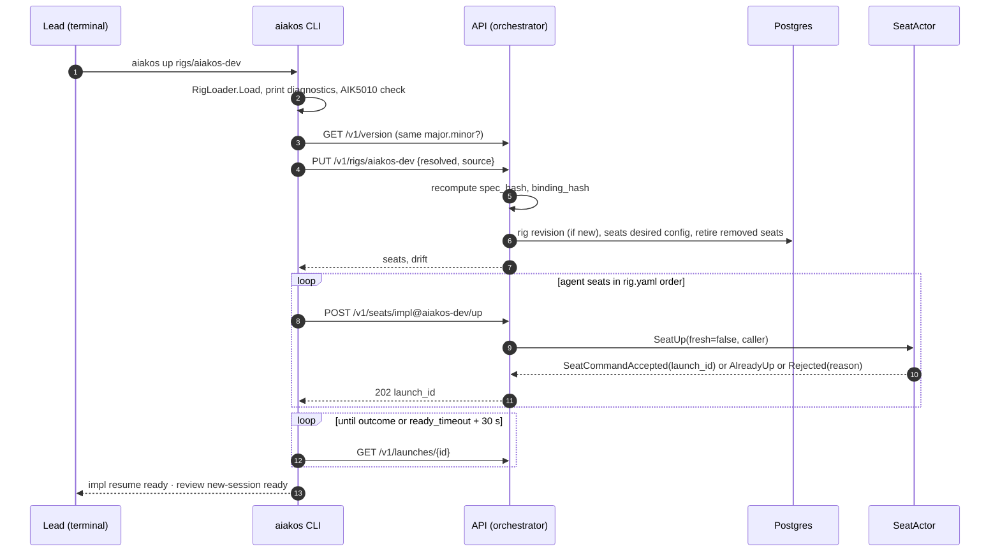
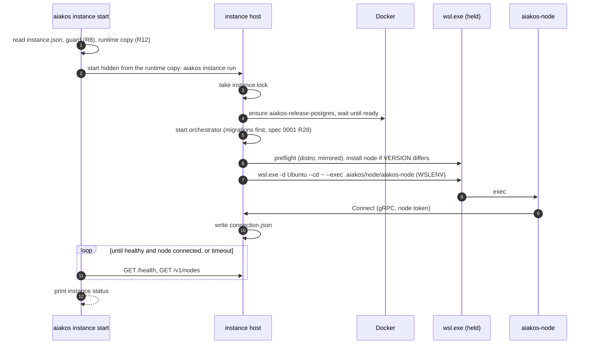

# 0007 — CLI and the released instance

## Context

Issue [#15](https://github.com/aiakos-hq/aiakos/issues/15) asks for the `aiakos` CLI:
`up/down/send/capture/ps`, built on System.CommandLine, instances isolated by home directory and
port, installable with `dotnet tool install -g aiakos`
([ADR 0008](../adr/0008-bootstrap-rule.md)). It is the last piece of M1 before the acceptance
test (#16, spec 0008): the `aiakos-dev` rig must run on a **released** Aiakos, never on the working
tree it is changing.

The CLI is more than a client. Every earlier M1 spec leaves the **released instance** to #15: the
dev stack is an Aspire AppHost that is never shipped (spec 0001), so the released tool has to start
Postgres, the orchestrator and the WSL node by itself, keep them running and let the team upgrade
deliberately. This spec therefore covers three things: the CLI commands, the local API they call,
and the process model of the released instance, including packaging and releases.

Decisions this spec implements (not reopened here):

- [ADR 0008](../adr/0008-bootstrap-rule.md): the team runs on the last release, installed as a
  pinned `dotnet tool` with its own home and port.
- [ADR 0004](../adr/0004-orchestrator-node-split.md): the orchestrator owns meaning and never
  touches terminals; the node owns the machine and dials out.
- [ADR 0012](../adr/0012-tenant-keys.md): slugs and addresses are resolved to UUIDs at the edge
  (CLI, API); only UUIDs travel inside.
- [ADR 0016](../adr/0016-secrets-as-node-file-references.md): secret values never reach the CLI,
  the orchestrator or the database.
- [ADR 0017](../adr/0017-resolved-rig-and-hashes.md): the resolved rig is self-contained and
  hashed; how a changed spec is applied to running seats is this spec's decision.
- [ADR 0031](../adr/0031-three-axis-seat-state.md), [ADR 0032](../adr/0032-seat-actor-sole-writer.md),
  [ADR 0033](../adr/0033-no-unrecorded-relaunch.md): the CLI shows the three axes honestly, never
  writes seat state, and never relaunches or starts fresh without a recorded, explicit request.
- Plan [§0.5](../plan.md#05-distribution-for-reference) (the CLI ships as a `dotnet tool`),
  [§4](../plan.md#4-technology-decisions) (System.CommandLine; REST API),
  [§10](../plan.md#10-roadmap-each-milestone-mvp-complete) (M1: CLI `up/down/send/capture/ps`,
  packaged so the team can run a pinned release), [§11](../plan.md#11-how-we-build-it--aiakos-builds-aiakos)
  (bootstrap stages and rule).
- CLAUDE.md rules 1 (bootstrap), 2 (identity from the environment or token), 3 (honest state, no
  silent fallbacks), 4 (the database is the record) and 7 (LF).

### What earlier specs leave to #15

| Source | Item | Here |
|---|---|---|
| Spec 0001 R48, D13 | Replace the placeholder `Aiakos.Cli` code under the same package ID and command | R1 |
| Spec 0001 Non-goals, D9, [side by side](0001-solution-skeleton.md#side-by-side-with-the-released-tool) | The released instance's process model, its own Postgres, no Aspire dev dashboard, final `InstanceDefaults` values | R6–R21 |
| Spec 0001 D8, [Telemetry](0001-solution-skeleton.md#telemetry) | File logging and the telemetry exporter of the released tool | R20, R21 |
| Spec 0001 Non-goals | Publishing to NuGet, release pipeline | R52–R55 |
| Spec 0003 R1, R23, D11 | `up`/`down` behaviour, printing diagnostics, the `--env` override, warning AIK5010 | R30–R33 |
| Spec 0003 [canonical form](0003-rig-file-format-v1.md#resolved-rig-and-canonical-form), ADR 0017 | Applying a changed `spec_hash` to a running rig | R36 |
| Spec 0004 Non-goals, RK5 | `aiakos attach`; keeping WSL running while no node process exists | R16, R50 |
| Spec 0005 RK3 | The `send` rejection message explains that denial by Escape emits no hook | R44 |
| Spec 0005 D11, RK5 | `up` says when guidance changes may not reach a resumed conversation | R40 |
| Spec 0006 R40–R42, D12 | Rendering `ps`, polling launches and commands, the API transport, rig revision history | R22–R28, R37, R48, R34 |
| Spec 0002 AC10 | One CLI `send` shows as one trace | R26 |

### Depends on wave 1 and wave 2 decisions

Specs 0001–0006 are accepted on `main`. If one of them changes, the parts listed here change
with it.

- **Spec 0001**: `InstanceDefaults` (released: instance `release`, WSL home `~/.aiakos`, port
  base 7180; dev: `dev`, `~/.aiakos-dev`, 5180) and the AppHost guard R18; the node's environment
  (`AIAKOS_ORCHESTRATOR_URL`, `AIAKOS_HOME`, `AIAKOS_NODE_ID`, `AIAKOS_NODE_TOKEN`,
  `AIAKOS_INSTANCE`), exit codes (2 configuration, 3 lock held) and SIGHUP stop; the node install
  steps (R20) and the WSL preflight (R26); the orchestrator's gRPC endpoint (h2c, loopback, port
  base) and its `/health`; `Directory.Build.props`, central package management and `IsPackable`
  on `Aiakos.Cli` only.
- **Spec 0002**: node tokens bind a node ID and tenant (R6, R44); `SendKeys` exists for humans
  (R23); the orchestrator of release N accepts nodes of the same major version at any minor up to
  its own (compatibility rule 6).
- **Spec 0003**: `RigLoader.Load(rigRoot, envPath)` and its diagnostics format (R23); the rig root
  and `rig.env.yaml` discovery (R1, D11); `spec_hash`, `binding_hash` and the canonical form
  (R26); running seats are never hot-reloaded.
- **Spec 0004**: the private tmux server `-L aiakos-<instance>`, the generated config
  `$AIAKOS_HOME/tmux/tmux.conf`, sessions named `<rig>_<seat>`, read-only attach by default (R6,
  R7, [attach](0004-tmux-session-host.md#server-socket-and-configuration)).
- **Spec 0005**: the lead line `[aiakos from <sender> #<d>]` built from `CallerContext` (R11), the
  `/compact` slash-command allowlist, `ready_timeout` 15 s and `confirm_timeout` 5 s (R10).
- **Spec 0006**: the `SeatUp`/`SeatDown`/`SeatSend`/`SeatCapture` messages and their rejection
  reasons; `SeatQueries.ListAsync`, `GetDetailAsync`, `GetLaunchAsync`, `GetCommandAsync`; the
  `rig` and `seat` tables written by the `up` API only (R4); the launch mode decision table.

## Goals

- `dotnet tool install -g aiakos --version <v>` installs everything the team needs on the Windows
  machine: the CLI, the orchestrator and the node binary for WSL.
- `aiakos instance start` brings up an isolated released instance (Postgres, orchestrator, node
  in WSL) that keeps running after the terminal closes, keeps WSL alive while it runs, and can be
  stopped and upgraded deliberately.
- `aiakos up <rig dir>` validates the rig files, prints every diagnostic, records the resolved rig
  and launches its agent seats, and reports each launch's honest outcome.
- `aiakos down`, `send`, `capture`, `ps` and `attach` cover the stage B loop: the lead drives
  seats from a Windows terminal and sees the three state axes as they are.
- The same CLI binary can target the dev stack (`--instance dev`) for testing before a release,
  without any setting that could point the released team at a development build.
- A tag on `main` produces a published, pinned, reproducible release.

## Non-goals / out of scope

- `aiakos spec validate`, `aiakos up --plan`, JSON Schema (M2). `up --dry-run` (R33) covers the M1
  need to check rig files without an instance.
- A `keys` command (spec 0002 `SendKeys`). The SeatActor has no message for it in M1 (spec 0006);
  a human who needs keys attaches with `--write` (R51). Added with the dashboard or chat
  approvals (M4/M5).
- Answering permission prompts through the API (M2/M4), queues and handoff (M3), chat (M4),
  dashboard and bundles (M5).
- Running the CLI inside WSL or inside a seat. Seats get their API through MCP in M2. The client
  code is OS-neutral, but the `instance` commands are Windows-only in M1.
- Running the released instance as a Windows service, starting it at logon, or on Linux
  (`aspire publish`, M6). Surviving a reboot is M7 (snapshot/restore); M1 makes it recoverable by
  hand (R39).
- Remote instances, TLS, several users per instance, tenant management (M6/M8).
- Automatic restarts or reconciliation of seats (ADR 0033).

## Requirements

### Package and command surface

- **R1** `src/Aiakos.Cli` keeps the package identity from spec 0001 R48 (`PackageId` `Aiakos`,
  `ToolCommandName` `aiakos`, `AssemblyName` `aiakos`, `RollForward` `Major`) and replaces the
  placeholder code. The version comes from the release tag (R53).
- **R2** The command tree is built with System.CommandLine 2.x and is exactly the one in
  [Command reference](#command-reference). `aiakos --version` prints the tool version.
  `aiakos --help` and every `<command> --help` describe arguments, defaults and exit codes.
- **R3** Global options: `--instance <name>` (environment `AIAKOS_INSTANCE`, default `release`)
  selects the instance; `--json` switches output to JSON where a command supports it; `-v` /
  `--verbose` adds request IDs and trace IDs to error output. No other global state exists.
- **R4** Exit codes are those in [Exit codes](#exit-codes). A command that asked for something and
  did not get it (launch not ready, delivery not confirmed, rejection) exits non-zero; `unknown` is
  never reported as success.
- **R5** Human output goes to stdout as plain text; progress and diagnostics go to stderr. Colour
  is used only when stdout is a terminal and `NO_COLOR` is unset. `--json` output is one JSON
  document on stdout, `snake_case`, with a top-level `"api": "v1"`; fields are only ever added
  within v1.

### Instances

- **R6** An **instance** is the tuple of spec 0001 R46 plus a Windows-side home: (name, Windows
  home, WSL home, port base, database). Values for `release` are the constants in
  `Aiakos.Core.InstanceDefaults`: Windows home `%USERPROFILE%\.aiakos`, WSL home `~/.aiakos`, port
  base 7180, database container `aiakos-release-postgres` with volume `aiakos-release-pgdata`.
- **R7** Another instance name `<n>` (for example a release candidate next to the pinned release)
  uses `%USERPROFILE%\.aiakos-<n>` and `~/.aiakos-<n>`; its port base must be given explicitly at
  `instance init` and must not overlap the ports of another initialized instance.
- **R8** The released tool refuses to initialize or start an instance whose name is `dev`, whose
  WSL home is `.aiakos-dev`, or whose port base is 5180 — the mirror of the AppHost guard (spec
  0001 R18). `--instance dev` is accepted only for client commands against a running dev stack
  (R29), never for `instance init|start|stop`.
- **R9** `aiakos instance init [--port-base N] [--distro D] [--node-id ID] [--database-url-file F]`
  writes `<windows home>\instance.json` ([Instance files](#instance-files)) and generates three
  secrets into `<windows home>\secrets\`: the node token, the API token and the Postgres password.
  Secret files are readable and writable only by the current user (explicit ACL, inheritance
  removed). No secret is printed, logged or passed on a command line. Running `init` again changes
  nothing unless `--force` is given; it never rotates secrets silently.
- **R10** Ports are derived from the port base as in [Ports](#ports). Every listener binds
  `127.0.0.1` only.

### Instance host

- **R11** `aiakos instance start` starts the **instance host**, a hidden, detached Windows process
  that keeps running after the terminal closes. It waits until the orchestrator is healthy and the
  node is connected (timeout 90 s, `--timeout`), then prints `instance status`. If the host already
  runs, it prints the status and exits 0.
- **R12** The instance host runs from a **versioned runtime copy**
  `<windows home>\runtime\<version>\` of the tool's files, made at `instance start` when missing
  or different (content hash). `dotnet tool update` can then replace the installed tool while the
  instance runs, and the running version is always explicit. The two most recent runtime copies
  are kept.
- **R13** The host takes an exclusive lock on `<windows home>\instance.lock` and writes its pid and
  version into it. A second host for the same instance exits with code 3 and names the holder,
  like the node's lock (spec 0001 R38).
- **R14** The host runs the orchestrator **in its own process**, through the same composition
  methods as `Aiakos.Orchestrator`'s own entry point (`AddAiakosOrchestrator`,
  `MapAiakosOrchestrator`), configured from `instance.json`. The gRPC endpoint is port base + 0
  (h2c, loopback), the API port base + 1 (R22).
- **R15** Database. In `container` mode (default) the host ensures a Docker container
  `aiakos-<instance>-postgres` (image `postgres:18`, volume `aiakos-<instance>-pgdata`, published
  on `127.0.0.1:<port base + 2>`, password from the secret file passed with `--env-file` from a
  user-only temporary file that is deleted right after, never on the command line), starts it if stopped, and waits until it
  accepts connections. In `external` mode it reads a connection string from the file named in
  `instance.json` (a secret file). If Docker is not reachable, `instance start` fails with a
  message naming Docker Desktop and starts nothing else.
- **R16** Node. Before the orchestrator accepts nodes, the host (a) runs the WSL preflight of spec
  0001 R26 (distro exists, mirrored networking), (b) installs the node from the package into
  `<wsl home>/node` with the steps of spec 0001 R20 when `<wsl home>/node/VERSION` differs from the
  tool version, and (c) starts it as a **child `wsl.exe` process that the host keeps attached**:
  `wsl.exe -d <distro> --cd ~ --exec <wsl home>/node/aiakos-node`, with the node's environment
  forwarded through `WSLENV` (spec 0001 R24). The attached child keeps WSL running for as long as
  the host runs (spec 0004 RK5).
- **R17** The host supervises the node: an unexpected exit is logged and the node restarted with
  exponential backoff (1 s doubling to 30 s, reset after 5 min up). Exit code 2 (configuration) or
  3 (lock held) is not retried: the host records it, `instance status` shows it, and the host keeps
  serving the API. The host never kills a node it did not start.
- **R18** `aiakos instance stop` asks the host to shut down through the API. It is refused while
  any agent seat has session `starting`, `present` or `unknown`, and the refusal lists them with
  `aiakos down --all` as the next step. `--keep-seats` stops anyway and says that the seats' tmux
  sessions keep running only while WSL stays up and are adopted by the next node. Shutdown order:
  stop accepting API calls, stop the node (end the `wsl.exe` child, which delivers SIGHUP; wait up
  to 10 s), stop the orchestrator, stop the Postgres container (`--keep-database` leaves it
  running), remove `connection.json`, release the lock.
- **R19** `aiakos instance status` prints: running or not; host pid, version and uptime; the CLI's
  version and whether it matches (R27); ports; database mode and health; each node's connection
  state and last error (for example exit code 3); seat counts by session value; log directory.
  Exit code 0 when running and healthy, 3 when not running, 1 when running but unhealthy.
- **R20** The host writes `<windows home>\connection.json` (`api_url`, `pid`, `version`,
  `started_at`, `otlp_endpoint` if any) when it is ready and deletes it on stop. The CLI finds a
  running instance only through this file and treats a file whose pid is not alive as "not
  running" (exit 3), never as a guess.
- **R21** Logs: the host writes rolling files `<windows home>\logs\host-<date>.log` and captures
  the node's stdout and stderr into `node-<date>.log`; files older than 14 days are deleted.
  Telemetry: OpenTelemetry is exported only when `instance.json` sets `telemetry.otlp_endpoint`, or
  when `telemetry.dashboard` is `true`, in which case the host runs the standalone Aspire dashboard
  container (`aiakos-<instance>-dashboard`, UI `127.0.0.1:<port base + 10000>`, OTLP gRPC
  `127.0.0.1:<port base + 14000>`) and points the orchestrator, the node and the CLI at it.

### Local API

- **R22** The orchestrator serves an HTTP/JSON API under `/v1` on `127.0.0.1:<port base + 1>`,
  HTTP/1.1, next to `/health` and `/alive`. It refuses to start if the API would bind a
  non-loopback address (as spec 0002 R43 does for the node link).
- **R23** Every `/v1` request carries `Authorization: Bearer <API token>`, the token from the
  instance's secret file. The token resolves to `CallerContext` (the default tenant and the
  operator name recorded at `instance init`, `user:<Windows user name>`). No request body carries
  a tenant, a user or a sender (rule 2). Missing or wrong token: 401 with no detail.
- **R24** The endpoints are those in [API](#api). Seat addresses (`<seat>@<rig>`) and rig names are
  resolved to UUIDs in the API layer (ADR 0012). Commands go to the `SeatRegion` (spec 0006);
  reads use `SeatQueries` and never ask an actor.
- **R25** Errors are `application/problem+json` with a stable `reason` (`UPPER_SNAKE_CASE`, the
  SeatActor's rejection reason passed through unchanged when there is one), a human `detail`, and
  `retryable`. Rejections of a command are 409; unknown seats or rigs 404; validation 400.
- **R26** The CLI starts one root activity per command (`cli.<command>`) and sends `traceparent` on
  every request; the API continues it, so one `aiakos send` is one trace from the CLI through the
  SeatActor and the node to the resulting `PROMPT_SUBMITTED` (spec 0002 AC10). The CLI exports its
  own span only when `connection.json` names an OTLP endpoint (flush bounded to 1 s).
- **R27** `GET /v1/version` returns the server's version. Commands that change anything (`up`,
  `down`, `send`, `instance stop`) require the CLI and the server to have the same major.minor
  version and refuse otherwise with exit code 4 and both versions; read commands (`ps`, `capture`,
  `instance status`) work across versions and print a warning.
- **R28** Request and response types live in `Aiakos.Api.Contracts` (records plus a
  source-generated `JsonSerializerContext`), shared by the orchestrator and the CLI.
- **R29** The dev AppHost exposes the same API on a fixed `http` endpoint (port base + 1, 5181),
  generates an API token parameter, and writes `%USERPROFILE%\.aiakos-dev\connection.json` and the
  token file on start, so `dotnet run --project src/Aiakos.Cli -- --instance dev ps` works. The
  released tool can *read* the dev instance but R8 keeps it from managing it.

### `up`

- **R30** `aiakos up [<rig dir>] [--env <file>] [--seat <id>]... [--fresh] [--note <text>]
  [--dry-run] [--no-wait]`. `<rig dir>` defaults to the current directory; `--env` defaults to
  `<rig dir>/rig.env.yaml` (spec 0003 R1).
- **R31** `up` runs `RigLoader.Load` in the CLI and prints every diagnostic in spec 0003's format
  (R23), relative to the current directory. Any error: exit 2, nothing is sent.
- **R32** When the rig root is inside a git work tree and the env file is tracked
  (`git ls-files --error-unmatch`), `up` prints warning AIK5010 (spec 0003). If `git` is missing, it
  prints an info line that the check was skipped.
- **R33** `--dry-run` loads, prints diagnostics and a summary (rig, `spec_hash`, `binding_hash`,
  and per seat: node, harness, model, checkout, workdir) and exits 0 on no errors. It never
  contacts an instance, so it works in CI (spec 0003 R32; spec 0008).
- **R34** Registration: `PUT /v1/rigs/{rig}` sends the resolved rig (canonical form plus file
  contents), the CLI version and the source (rig root path, git commit and whether the tree is
  dirty). The orchestrator recomputes `spec_hash` and `binding_hash` and rejects a mismatch
  (`HASH_MISMATCH`); stores a rig revision when the pair is new ([Schema](#schema)); upserts every
  seat's desired configuration (parameters, hashes); and retires seats that are gone from
  `rig.yaml`. A removed seat whose session is not `absent` or `exited` makes the whole call fail
  with `SEAT_REMOVED_WHILE_RUNNING` (nothing is written). A seat that returns is un-retired under
  the same address.
- **R35** After registration, `up` sends `SeatUp` for each selected agent seat (all agent seats, or
  those named by `--seat`) in `rig.yaml` order. Human seats are recorded and listed, never
  launched (spec 0003 R8).
- **R36** A running seat whose recorded launch has a different `spec_hash` or `binding_hash` is
  **not** restarted. `up` prints it as drifted with the next step (`aiakos down <seat>` then
  `aiakos up`), and `ps` marks it (R49). There is no automatic restart (ADR 0033; spec 0003).
- **R37** Unless `--no-wait`, `up` polls each launch (`GET /v1/launches/{id}`, spec 0006 R42) until
  it has an outcome or `ready_timeout + 30 s` passes, and prints per seat the decision (`new-session`,
  `resume`, …) and the outcome with its reason. Any outcome other than `ready`, and any
  rejection, makes the exit code 1.
- **R38** `--fresh` requires at least one `--seat` (a whole rig is never restarted fresh by
  accident) and is recorded as decision `fresh-explicit` with `--note` (spec 0006 R24).
- **R39** Rejections print the next step: `RESUME_LOST` → `--fresh --seat <seat>`;
  `SEAT_STATE_UNKNOWN` → `aiakos capture <seat>` to look, then `aiakos down <seat>` and `up` again
  (this is also the path after a reboot); `NODE_NOT_CONNECTED` → `aiakos instance status`.
- **R40** When a seat resumes (decision `resume` or `resume-unverified`) and its projection hash
  differs from the one its conversation started with, `up` prints: "guidance changes apply to fresh
  sessions or after `/compact`" (spec 0005 D11), until spec 0005 RK5 shows otherwise.

### `down`

- **R41** `aiakos down (<seat>... | --rig <rig> | --all) [--no-wait]` sends `SeatDown` for each
  agent seat, waits for the stop outcome, and prints it (`stopped`, `killed`, `not-running`). A
  stop that fails leaves the session `unknown` (spec 0006 R27): printed, exit 1. `down` never
  removes worktrees or seat homes.

### `send`

- **R42** `aiakos send <seat> (<text> | --file <path> | -) [--force] [--wait delivery|turn|none]
  [--timeout <s>]`. Exactly one body source; `-` reads stdin. A body that is a single slash command
  follows spec 0005 R11 (only `/compact` in M1).
- **R43** Before sending, the CLI checks the body with the shared validator of spec 0004 R16
  (UTF-8, at most 1 MiB, only LF and TAB as control characters, CRLF normalized) so the user gets
  the error locally; the node's check stays authoritative.
- **R44** Rejections are printed with the reason and a human explanation
  ([Rejection messages](#rejection-messages)). The `needs-input` message says that a permission
  denied with Escape emits no hook, so the seat stays `needs-input` until the next prompt in the
  pane (spec 0005 RK3). `--force` is accepted only for activity `unknown` (spec 0006 R29) and is
  recorded on the delivery.
- **R45** `--wait delivery` (default) polls the delivery command until it has a final outcome and
  prints it (`confirmed` with the turn ID, `submitted-unconfirmed`, `not-delivered`, `failed`,
  `unknown`). Only `confirmed` exits 0. `--wait turn` also waits until the seat's activity is
  `idle` again (or `needs-input`, or `unknown`, or the timeout, default 30 min) and prints the final
  activity. `--wait none` returns after acceptance.
- **R46** The CLI never prints, logs or puts into telemetry a delivery body (spec 0006 R46).

### `capture`

- **R47** `aiakos capture <seat> [--lines <n>]` (default 200, maximum 10 000) prints the pane text
  to stdout; `--json` adds `truncated` and `pane_dead`. A seat without a launch: exit 1 with a
  message. The capture is evidence; nothing in the CLI interprets its text (ADR 0005).

### `ps`

- **R48** `aiakos ps [--rig <rig>] [--wide] [--watch] [--json]` lists seats from
  `SeatQueries.ListAsync`; `aiakos ps <seat>` shows the detail of `GetDetailAsync` (axes with
  reasons and `since`, current launch, last transitions, open findings, last deliveries).
  `--watch` refreshes every 2 s until Ctrl+C.
- **R49** Rendering: `unknown` is always printed with its reason, `unknown (node-link-lost)`;
  human seats show `human` in SESSION; a drifted seat (R36) has `*` after its address; a context
  percentage that is `null` shows `?`, never `0`; findings show count and worst severity. A header
  line shows the instance, its version and each node's connection state.

### `attach`

- **R50** `aiakos attach <seat> [--write]` runs
  `wsl.exe -d <distro> --exec tmux -u -f <wsl home>/tmux/tmux.conf -L aiakos-<instance>
  attach-session -r -t =<rig>_<seat>` with the terminal inherited, and returns tmux's exit code.
  The socket, config path and session name come from one helper in `Aiakos.Core`, which the
  node's `GetAttachCommand` (spec 0004) also uses.
- **R51** `--write` drops `-r` and first prints a warning that typing in the pane collides with
  deliveries and is invisible to Aiakos until a hook reports it.

### Packaging and releases

- **R52** The package contains the CLI, the orchestrator and its dependencies (framework-dependent,
  `net10.0`, with the ASP.NET Core shared framework), and the node published self-contained for
  `linux-x64` under `tools/net10.0/any/node/linux-x64/`. It is built by the CI and release
  workflows on Linux.
- **R53** Versions are SemVer `0.<milestone>.<patch>` until 1.0: the M1 release is `0.1.0`, fixes
  are `0.1.1`, …; release candidates are `0.1.0-rc.<n>`. The version comes from the tag
  (`v0.1.0` → `0.1.0`); the project file carries only a development version.
- **R54** `.github/workflows/release.yml` runs on tags `v*` that point at a commit on `main`: it
  runs the CI build and tests, packs, and after approval in the GitHub environment `release`,
  pushes to nuget.org with trusted publishing (OIDC, no long-lived API key) and creates a GitHub
  Release with the `.nupkg` and its `.sha256`.
- **R55** CI packs the tool on every pull request, installs it into a temporary tool path and runs
  `aiakos --version` and `aiakos up --dry-run` on the `aiakos-dev` fixture of spec 0003, so a
  broken package fails the PR.

### Documentation

- **R56** The implementation PR adds `docs/cli.md` (installing, `instance` commands, the command
  reference, exit codes, upgrading), updates the "Commands" section of `CLAUDE.md` for the CLI, and
  updates plan §0.2 (the placeholder is replaced).

## Design

### Components

```text
src/
  Aiakos.Cli/               dotnet tool "aiakos": commands, rendering, API client,
                            instance host (instance run), node supervisor, packaging
  Aiakos.Api.Contracts/     NEW: API request/response records, JsonSerializerContext, routes
  Aiakos.Wsl/               NEW: WSL helpers without Aspire: wslpath conversion, WSLENV building,
                            the preflight of 0001 R26, the node install script of 0001 R20
  Aiakos.Hosting.Wsl/       (0001) now uses Aiakos.Wsl for the preflight and WSLENV
  Aiakos.Orchestrator/      (0001) + AddAiakosOrchestrator/MapAiakosOrchestrator, /v1 endpoints
  Aiakos.Spec/              (0003) the rig loader, used by the CLI
  Aiakos.Core/              (0001) + InstanceDefaults (final values), TmuxNames (R50),
                            the input validator of 0004 R16 (R43)
tests/
  Aiakos.Cli.Tests/         NEW: parsing, rendering goldens, client against a fake API,
                            instance config and guards, supervisor with a fake process runner
```

Project references added: `Aiakos.Cli` → `Aiakos.Orchestrator`, `Aiakos.Spec`,
`Aiakos.Api.Contracts`, `Aiakos.Wsl`, `Aiakos.Core`; `Aiakos.Orchestrator` →
`Aiakos.Api.Contracts`; `Aiakos.Hosting.Wsl` → `Aiakos.Wsl`. The node is not a project reference of
the CLI: the pack step publishes it for `linux-x64` and adds the output to the package
(`<None Pack="true" PackagePath="tools/net10.0/any/node/linux-x64/">`).

### Process model

```text
 Windows                                                            WSL (Ubuntu)
 ┌────────────────────────────────────────────────┐
 │ aiakos (CLI, short-lived)                      │
 │   reads connection.json, API token file        │
 └────────────┬───────────────────────────────────┘
              │ HTTP/1.1 127.0.0.1:7181, Bearer API token
 ┌────────────▼───────────────────────────────────┐
 │ instance host  (aiakos instance run, hidden)   │
 │   runs from %USERPROFILE%\.aiakos\runtime\<v>\  │
 │   ├─ orchestrator (in-process)                 │     ┌─────────────────────────────┐
 │   │    API :7181   gRPC h2c :7180 ◄────────────┼─────┤ aiakos-node (~/.aiakos/node)│
 │   │    Akka SeatRegion, Postgres client        │     │  hook ingest :7190          │
 │   ├─ node supervisor ── wsl.exe (held child) ──┼────►│  tmux -L aiakos-release     │
 │   └─ file logs, optional OTLP                  │     │   └─ seats: claude …        │
 └────────────┬───────────────────────────────────┘     └─────────────────────────────┘
              │ 127.0.0.1:7182
 ┌────────────▼──────────────┐
 │ Docker: aiakos-release-   │
 │ postgres (postgres:18)    │
 └───────────────────────────┘
```

The instance host is to the released instance what the AppHost is to the dev stack: it starts
the parts, wires their configuration and keeps the WSL node attached. Unlike the AppHost it is
shipped, and it hosts the orchestrator in-process instead of as a child project (Q1).

### Instance files

Windows side, `%USERPROFILE%\.aiakos\` for `release`:

```text
instance.json          configuration, written by `instance init`, editable
instance.lock          held by the running host (pid, version)
connection.json        written by the running host, deleted on stop (R20)
secrets\               user-only ACL (R9)
  api-token            Bearer token of the local API
  node-token           AIAKOS_NODE_TOKEN of the node
  postgres-password    container mode only
runtime\<version>\     runtime copies of the tool (R12)
logs\                  host-<date>.log, node-<date>.log (R21)
```

WSL side, `~/.aiakos/`: the node's `AIAKOS_HOME` as specs 0001, 0004 and 0005 define it (`node/`
with a `VERSION` file, `node.lock`, `tmux/`, `sessions/`).

`instance.json` for `release`:

```json
{
  "instance": "release",
  "port_base": 7180,
  "operator": "bsakel",
  "wsl": { "distro": "Ubuntu", "home": ".aiakos", "node_id": "wsl-local" },
  "database": { "mode": "container", "image": "postgres:18" },
  "telemetry": { "dashboard": false, "otlp_endpoint": null }
}
```

For `external`, `database` is `{ "mode": "external", "connection_string_file": "<path>" }`.

`connection.json`:

```json
{ "api_url": "http://127.0.0.1:7181", "pid": 12345, "version": "0.1.0",
  "started_at": "2026-10-20T08:15:00Z", "otlp_endpoint": null }
```

### Ports

| Offset | Release | Dev | Listener | Side |
|---|---|---|---|---|
| +0 | 7180 | 5180 | orchestrator gRPC (h2c, node link) | Windows |
| +1 | 7181 | 5181 | orchestrator HTTP: `/v1`, `/health`, `/alive` | Windows |
| +2 | 7182 | dynamic (Aspire) | Postgres (container mode) | Windows (Docker) |
| +10 | 7190 | 5190 | node hook ingest (spec 0005) | WSL |
| +10000 | 17180 | 15180 | dashboard UI (release: optional standalone) | Windows |
| +14000 | 21180 | 19180 | dashboard OTLP gRPC | Windows |

### Command reference

| Command | Purpose | JSON |
|---|---|---|
| `aiakos instance init` | Create `instance.json` and secrets (R9) | no |
| `aiakos instance start [--timeout s]` | Start the instance host (R11) | no |
| `aiakos instance stop [--keep-seats] [--keep-database]` | Stop it (R18) | no |
| `aiakos instance status` | Show the instance (R19) | yes |
| `aiakos instance run` | The host itself, foreground; used by `start`, useful for debugging | no |
| `aiakos up [<rig dir>] [--env f] [--seat id]… [--fresh] [--note t] [--dry-run] [--no-wait]` | Validate, record, launch (R30–R40) | yes |
| `aiakos down (<seat>… \| --rig r \| --all) [--no-wait]` | Stop seats (R41) | yes |
| `aiakos send <seat> (<text> \| --file f \| -) [--force] [--wait mode] [--timeout s]` | Deliver input (R42–R46) | yes |
| `aiakos capture <seat> [--lines n]` | Print the pane (R47) | yes |
| `aiakos ps [<seat>] [--rig r] [--wide] [--watch]` | Show seats (R48, R49) | yes |
| `aiakos attach <seat> [--write]` | Attach to the pane (R50, R51) | no |

`<seat>` is `<seat>@<rig>`, or `<seat>` alone when exactly one rig of the instance has a seat with
that ID; if several have, the CLI lists the addresses and exits 2 (no guessing).

### Exit codes

| Code | Meaning |
|---|---|
| 0 | Done as asked |
| 1 | The request was processed but the outcome is not what was asked: rejected, launch `failed`/`unknown`, delivery not `confirmed`, stop failed, instance unhealthy |
| 2 | Usage error, invalid input, rig diagnostics with errors, ambiguous seat |
| 3 | Instance not running or not reachable; instance lock held |
| 4 | CLI and instance versions not compatible for this command (R27) |
| 5 | Authentication failed (API token) |

### API

| Method and path | Body | Result |
|---|---|---|
| `GET /v1/version` | — | `{ version, api }` |
| `PUT /v1/rigs/{rig}` | `{ resolved, tool_version, source }` | `{ revision, spec_changed, binding_changed, seats: [{ address, kind, drifted, retired }] }` |
| `GET /v1/seats?rig=` | — | `SeatStatusRow[]` (spec 0006 R40) |
| `GET /v1/seats/{address}` | — | seat detail (spec 0006 R41) |
| `POST /v1/seats/{address}/up` | `{ fresh, note }` | 202 `{ launch_id, command_id }`, 200 `{ already_up, launch_id }`, 409 problem |
| `POST /v1/seats/{address}/down` | — | 202 `{ command_id }`, 200 `{ no_op }` |
| `POST /v1/seats/{address}/send` | `{ body, force }` | 202 `{ command_id }`, 409 problem |
| `POST /v1/seats/{address}/capture` | `{ history_lines }` | 200 `{ text, truncated, pane_dead }`, 504 on timeout |
| `GET /v1/launches/{id}` | — | launch (spec 0006 R42) |
| `GET /v1/commands/{id}` | — | command status and outcome, never the body |
| `GET /v1/nodes` | — | `[{ node, connected, since, node_instance_id, version, capabilities, last_error }]` |
| `POST /v1/admin/shutdown` | `{ keep_seats, keep_database }` | 202; instance host only (R18) |

The rig-level `up` and `down` are loops in the CLI over the per-seat endpoints, so each seat gets
its own outcome and exit status. The API is the application layer spec 0006 left to #15: it
resolves addresses, builds `CallerContext` and sends `SeatEnvelope`s; the M2 MCP server and the M5
dashboard call the same application services.

### `up` sequence



### `instance start` sequence



### Output examples

`aiakos ps`:

```text
instance release 0.1.0 · node wsl-local connected
SEAT                 NODE       DESIRED  SESSION   ACTIVITY                 RESUME      CTX  FINDINGS
lead@aiakos-dev      -          -        human     -                        -           -    -
impl@aiakos-dev*     wsl-local  up       present   working (tool:Bash)      resumable   41%  -
review@aiakos-dev    wsl-local  up       present   unknown (quiet-timeout)  resumable   ?    1 warning
```

`aiakos up rigs/aiakos-dev` after a guidance change:

```text
rig aiakos-dev · spec sha256:3f9a…1c (changed) · binding sha256:77b0…e2
impl@aiakos-dev    running with spec sha256:a41c…90 · drifted: run `aiakos down impl@aiakos-dev` then `aiakos up`
review@aiakos-dev  resume  ready (verified)
                   note: guidance changes apply to fresh sessions or after /compact
lead@aiakos-dev    human, not launched
```

### Rejection messages

| Reason (from the SeatActor or API) | Printed explanation and next step |
|---|---|
| `SEAT_WORKING` | The seat is working on a turn; input now could interleave. Wait (`--wait turn` on your last send) or look with `aiakos capture`. |
| `SEAT_NEEDS_INPUT` | The seat waits for a decision in its pane (permission or question). Answer it with `aiakos attach --write`. If it was already denied with Escape, Claude Code sent no event; type the next prompt in the pane. |
| `SEAT_ACTIVITY_UNKNOWN` | Activity is unknown (reason shown). Check with `aiakos capture`; if the seat is idle, `--force` sends anyway and records that decision. |
| `SEAT_NOT_PRESENT` | No running harness (session shown). Run `aiakos up`. |
| `DELIVERY_IN_FLIGHT` | A previous delivery has no outcome yet. |
| `SEAT_STATE_UNKNOWN` | Session is unknown (reason shown). `aiakos capture` to look, then `aiakos down` and `aiakos up`. |
| `RESUME_LOST` | The conversation does not exist any more. `aiakos up --fresh --seat <seat> --note "…"` starts a new one. |
| `NODE_NOT_CONNECTED` | The seat's node is not connected. `aiakos instance status`. |
| `SLASH_COMMAND_NOT_ALLOWED` | Only `/compact` can be sent in M1. |
| any other | The reason and detail as received (never hidden). |

The reason names are the SeatActor's and the adapter's; the implementation PR of #13 fixes the
final spelling and this table follows it (spec 0006 AC9).

### Schema

Migration `NNNN_rig_revision.sql` (next free number), one logical change (spec 0006 D12):

```sql
CREATE TABLE aiakos.rig_revision (
    tenant_id      uuid        NOT NULL REFERENCES aiakos.tenant (tenant_id),
    revision_id    uuid        PRIMARY KEY,
    rig_id         uuid        NOT NULL,
    revision       int         NOT NULL,              -- 1, 2, … per rig
    spec_hash      text        NOT NULL,
    binding_hash   text        NOT NULL,
    tool_version   text        NOT NULL,              -- the CLI that resolved it
    resolved       jsonb       NOT NULL,              -- canonical resolved rig with file contents
    source_path    text,                              -- rig root as given to `up`
    source_commit  text,                              -- git HEAD of the rig root, if any
    source_dirty   boolean,
    created_by     text        NOT NULL,              -- CallerContext user
    created_at     timestamptz NOT NULL DEFAULT now(),
    UNIQUE (tenant_id, revision_id),
    UNIQUE (tenant_id, rig_id, revision),
    UNIQUE (tenant_id, rig_id, spec_hash, binding_hash),
    FOREIGN KEY (tenant_id, rig_id) REFERENCES aiakos.rig (tenant_id, rig_id)
);
ALTER TABLE aiakos.rig ADD COLUMN current_revision_id uuid;
ALTER TABLE aiakos.rig ADD FOREIGN KEY (tenant_id, current_revision_id)
    REFERENCES aiakos.rig_revision (tenant_id, revision_id);
```

`rig_revision` is append-only. `seat_launch.spec_hash` and `binding_hash` then always point at a
stored revision, so the database can answer "which files was this seat launched with" (rule 4).

### Upgrading the released instance

1. `dotnet tool update -g aiakos --version 0.1.1` (works while the instance runs, R12).
2. `aiakos instance status` shows host 0.1.0, CLI 0.1.1; `up`/`down`/`send` refuse (R27) if the
   major.minor differs; a patch upgrade keeps working.
3. `aiakos down --all`, `aiakos instance stop`, `aiakos instance start` (new runtime copy; the node
   is reinstalled because its `VERSION` differs; migrations run at orchestrator start).
4. `aiakos up rigs/aiakos-dev`: seats resume (decision `resume`).

Downgrade is not supported once a newer version has migrated the database; the release notes say
when a release adds a migration.

### Release workflow

```yaml
name: release
on:
  push: { tags: ['v*'] }
permissions: { contents: read }
jobs:
  build:
    runs-on: ubuntu-latest
    steps:
      - uses: actions/checkout@v4
        with: { fetch-depth: 0 }
      - run: git merge-base --is-ancestor "$GITHUB_SHA" origin/main   # tag must be on main
      - uses: actions/setup-dotnet@v4
        with: { global-json-file: global.json }
      - run: dotnet build -c Release && dotnet test -c Release --no-build
      - run: dotnet pack src/Aiakos.Cli -c Release -p:Version=${GITHUB_REF_NAME#v} -o artifacts/packages
      - run: cd artifacts/packages && sha256sum *.nupkg > SHA256SUMS
      - uses: actions/upload-artifact@v4
        with: { name: package, path: artifacts/packages }
  publish:
    needs: build
    runs-on: ubuntu-latest
    environment: release                      # maintainer approval
    permissions: { contents: write, id-token: write }
    steps:
      - uses: actions/download-artifact@v4
        with: { name: package, path: artifacts/packages }
      - uses: NuGet/login@v1                   # trusted publishing (OIDC)
        id: login
        with: { user: <nuget.org account> }
      - run: dotnet nuget push artifacts/packages/*.nupkg --api-key ${{ steps.login.outputs.NUGET_API_KEY }} --source https://api.nuget.org/v3/index.json
      - run: gh release create "$GITHUB_REF_NAME" artifacts/packages/* --verify-tag --generate-notes
        env: { GH_TOKEN: '${{ github.token }}' }
```

The maintainer configures the trusted publishing policy on nuget.org and the `release`
environment once; neither is part of the PR.

### Proposed amendments to accepted specs

Applied after this spec is accepted, each recorded under "Changes after acceptance" of the target
spec (as wave 2 did in #34):

- **Spec 0001**: R14, the dev `http` endpoint has a fixed port (port base + 1) and the AppHost
  writes the dev `connection.json` and API token (R29); the layout gains `Aiakos.Api.Contracts`,
  `Aiakos.Wsl` and `Aiakos.Cli.Tests`, and `Aiakos.Cli`'s references (Components); the orchestrator
  exposes `AddAiakosOrchestrator`/`MapAiakosOrchestrator` (R14); D8 is answered by R21; the
  `InstanceDefaults` values of D9 become final with the Windows home and the database container
  name (R6).
- **Spec 0004**: `GetAttachCommand` uses the shared `TmuxNames` helper from `Aiakos.Core` (R50); the
  input validator of R16 moves to `Aiakos.Core` so the CLI can pre-check (R43).
- **Spec 0005**: R11's `<sender>` is the operator name from `CallerContext` in M1 (`bsakel`), not a
  seat address, until humans are mapped to seats in M3 (Q6).
- **Spec 0006**: D12 is answered by the `rig_revision` table (Schema).

## Acceptance criteria

- [ ] **AC1** `dotnet pack src/Aiakos.Cli -c Release -p:Version=0.1.0-rc.1` produces
  `Aiakos.0.1.0-rc.1.nupkg` that contains `tools/net10.0/any/node/linux-x64/aiakos-node`;
  installed into a temporary tool path, `aiakos --version` prints `0.1.0-rc.1` and `aiakos --help`
  lists exactly the commands of [Command reference](#command-reference) (CI, R55).
- [ ] **AC2** `aiakos up --dry-run` on spec 0003's `aiakos-dev` fixture exits 0 and prints both
  hashes and the two agent seats; with the typo `chekout` it prints `AIK2002` with the hint
  `did you mean 'checkout'?` and exits 2; neither run opens a network connection.
- [ ] **AC3** `aiakos instance init` creates `instance.json` and the three secret files;
  `icacls` shows only the current user on `secrets\`; a second `init` changes nothing (file hashes
  equal); `--instance dev`, `--port-base 5180` and a WSL home `.aiakos-dev` are refused with a
  message naming the value.
- [ ] **AC4** `aiakos instance start` exits 0 within 90 s and `instance status` shows the host,
  Postgres healthy and `wsl-local connected`. Closing the terminal leaves the host running. A
  second `instance start` exits 0 without starting anything; `aiakos instance run` by hand exits 3
  naming `instance.lock` and the pid.
- [ ] **AC5** With Docker Desktop stopped, `instance start` exits 3 with a message naming Docker
  Desktop, and no host process, node or `connection.json` remains.
- [ ] **AC6** On the maintainer's machine, `aiakos up rigs/aiakos-dev` (with the spec 0008 files)
  prints `new-session ready` for `impl` and `review` and `human, not launched` for `lead`;
  `aiakos ps` shows both agent seats `present / idle / fresh-only`.
- [ ] **AC7** `aiakos send impl "…" --wait turn` prints `confirmed` with a turn ID and returns when
  the seat is idle again; `ps` then shows `resumable`. The trace in the dashboard (with
  `telemetry.dashboard: true`) is rooted at `cli.send` and contains the API, `seat.send`, the
  node's delivery and `seat.apply` for `PROMPT_SUBMITTED` (spec 0002 AC10).
- [ ] **AC8** `send` to a `working` seat exits 1 with `SEAT_WORKING` and its explanation; to a
  seat in `needs-input` it exits 1 and the message mentions Escape (spec 0005 RK3). `--force` to a
  `working` seat is still rejected.
- [ ] **AC9** `aiakos down impl`, then `aiakos up`: decision `resume`, outcome `ready`. After
  editing the implementer's guidance, `up` prints `review` unchanged and `impl` as drifted with
  the next step and does not restart it; `ps` shows `impl@aiakos-dev*`; `down` then `up` resumes
  it and prints the guidance note (R40).
- [ ] **AC10** `aiakos capture impl --lines 50` prints the pane; `aiakos attach impl` attaches
  read-only (typing has no effect), and detaching returns to the Windows prompt with exit 0.
- [ ] **AC11** With seats up, `instance stop` exits 1 and lists them. After `aiakos down --all`,
  `instance stop` exits 0; afterwards no host process runs on Windows, `pgrep -f aiakos-node` in
  WSL prints nothing, the Postgres container is stopped and `connection.json` is gone.
- [ ] **AC12** Upgrade drill: with `0.1.0-rc.1` running, `dotnet tool update -g aiakos --version
  0.1.0-rc.2` succeeds; with a different minor (test build `0.2.0-test`) `aiakos up` exits 4 naming
  both versions while `ps` works with a warning; stop and start runs the new version and reinstalls
  the node (`~/.aiakos/node/VERSION`).
- [ ] **AC13** A request without the API token, or with a wrong one, gets 401; configuring the API
  on `0.0.0.0` makes the host refuse to start.
- [ ] **AC14** With the dev AppHost running, `dotnet run --project src/Aiakos.Cli -- --instance dev
  ps` shows the dev seats, and `-- --instance dev instance stop` is refused (R8).
- [ ] **AC15** Pushing the tag `v0.1.0-rc.1` on a `main` commit runs `release.yml`; after approval
  the package is on nuget.org and the GitHub Release has the `.nupkg` and `SHA256SUMS`. A tag on a
  commit not on `main` fails the first job.
- [ ] **AC16** `ps --json`, `up --json` and `send --json` match golden JSON documents; renaming a
  field fails the golden test.

## Test plan

**Unit (`Aiakos.Cli.Tests`, runs everywhere).**

- Parsing: every command and option of the reference; mutually exclusive body sources; `--fresh`
  without `--seat` rejected; seat resolution (`impl` unique, ambiguous, unknown).
- Rendering: golden text and JSON for `ps` (every axis value, `unknown` reasons, human seats,
  drift, `null` context, findings), `ps <seat>`, `up` (every decision and outcome, drift, the
  guidance note), `send` (every delivery outcome and rejection reason), `instance status`.
- Exit codes: a table-driven test from API responses to codes.
- Instance configuration: defaults per instance name, the guard of R8, port overlap detection,
  secrets never appear in any output or log (sentinel values), `init` idempotence.
- Node supervisor with a fake process runner: restart backoff, no restart on exit codes 2 and 3,
  shutdown order, the `WSLENV` it builds.
- Runtime copy: copied once per content hash; the two newest kept.

**API (`Aiakos.Orchestrator.Tests`, `WebApplicationFactory` + Testcontainers Postgres).**

- Authentication (R23, AC13); problem details with `reason` for 400/404/409.
- `PUT /v1/rigs`: hash recomputation and `HASH_MISMATCH`; revision stored once per hash pair;
  retire and un-retire; `SEAT_REMOVED_WHILE_RUNNING` writes nothing; drift reported.
- Seat endpoints against a SeatRegion with a scripted fake SeatActor: up/down/send/capture replies
  map to status codes; the caller in `CallerContext` comes from the token, never from the body.
- `traceparent` continuation (R26).

**Instance host integration (Linux CI where possible).** The host with `external` database
(Testcontainers) and a fake node process started through a fake `wsl.exe` runner: start, health,
`connection.json`, API shutdown, lock. Container mode is covered by the Windows manual demo.

**Package smoke test (CI, R55).** Pack, install into a temporary tool path, `--version`,
`--help`, `up --dry-run` on the fixture.

**Opt-in end-to-end (Windows + WSL, `AIAKOS_E2E_WSL=1`).** A throwaway instance
(`--instance e2e --port-base 9180`) runs `init`, `start`, `up` of a rig whose seat uses the fake
harness of spec 0002's test plan, `send`, `ps`, `down --all`, `stop`, and checks that no process
is left on either side.

**Manual demo (maintainer, Windows).** AC3–AC12 in order with a real Claude Code login, then the
upgrade drill; the result goes into the implementation PR.

## Risks and open questions

### Open questions (decide in review)

Each has a recommendation; the requirements above assume the recommendation.

- **Q1 — Where does the released orchestrator run?** (a) In-process in an instance host on Windows
  that also supervises the node; (b) as a separate child process of the host; (c) inside WSL next
  to the node. *Recommendation:* (a). One process to start, find, lock and stop; it holds the
  `wsl.exe` child that keeps WSL alive; the dev AppHost and the host use the same composition
  methods, so the two setups differ only in wiring. (b) adds a second supervision layer for no M1
  gain; (c) needs a Linux orchestrator build in the package and Docker inside WSL. *ADR candidate.*
- **Q2 — CLI ↔ orchestrator transport.** (a) HTTP/JSON on loopback with a bearer token file;
  (b) a second gRPC service `aiakos.api.v1`. *Recommendation:* (a). Plan §3 names a REST API, the
  M2 MCP server and the M5 dashboard reuse the same application services, polling fits spec 0006
  R42, and it can be tried with `curl`. *ADR candidate* (together with R23's token model).
- **Q3 — Does `up` start the instance when it is not running?** *Recommendation:* no; `up` exits
  3 with "run `aiakos instance start`". Starting Postgres and a WSL node is a big side effect for
  a command about seats, and explicit is honest (rule 3).
- **Q4 — Postgres for the released instance.** (a) a Docker container managed by the host;
  (b) a connection string the user provides; (c) Postgres installed in WSL. *Recommendation:* (a)
  by default with (b) as an option (R15). Docker Desktop is already a prerequisite; (c) adds a
  system package and a second data location.
- **Q5 — Run from a versioned runtime copy or from the tool directory?** *Recommendation:* the
  copy (R12). Windows locks a running tool's files, so without the copy `dotnet tool update`
  fails while the instance runs, and "which version is running" would depend on the last update.
- **Q6 — Who is `<sender>` in the lead line?** Spec 0005 R11 says the sender's address. In M1 the
  caller is the operator (the API token), not a seat. *Recommendation:* the operator name
  (`[aiakos from bsakel #1a2b3c4d]`) until M3 maps humans to seats; amend spec 0005 R11's wording.
  Choosing the rig's human seat implicitly would be a guess.
- **Q7 — `instance stop` with running seats.** *Recommendation:* refuse, with `--keep-seats` as
  the explicit override (R18). Stopping the host detaches `wsl.exe`, so WSL may idle out and kill
  the seats' tmux server; that should never happen by accident.
- **Q8 — Applying a changed spec to running seats.** (a) report drift and let the lead run `down`
  and `up`; (b) an `up --restart` that does both. *Recommendation:* (a) in M1 (R36): a restart
  interrupts a turn, and `down` + `up` already resumes the conversation. (b) can be added once
  stage B shows how often it is needed.
- **Q9 — A `keys` command in M1?** *Recommendation:* no (Non-goals). The SeatActor has no message
  for it, and `attach --write` covers the rare human need.
- **Q10 — File logging.** (a) Serilog's file sink in the instance host only; (b) a small custom
  `ILoggerProvider`. *Recommendation:* (a). It is the standard choice, rolling and retention are
  built in, and the node keeps logging to stdout (captured by the host, R21). This answers spec
  0001 D8.
- **Q11 — Releases.** *Recommendation:* tags `v*` on `main`, trusted publishing, a `release`
  environment with maintainer approval, and a GitHub Release with checksums (R54). *ADR
  candidate* (release and versioning policy, together with Q12 and Q13).
- **Q12 — Version numbers.** *Recommendation:* `0.<milestone>.<patch>` until 1.0 (R53), so the
  version says which milestone's acceptance it passed; `0.1.0` is cut when #9–#15 are merged and
  the manual demo passes, and #16's acceptance runs on it (fixes ship as `0.1.x`).
- **Q13 — CLI/instance version compatibility.** *Recommendation:* same major.minor for commands
  that change anything, any version for reads (R27). The CLI's rig loader must match the
  orchestrator's expectations of the resolved rig; a patch never changes them.
- **Q14 — `up --dry-run` in M1.** *Recommendation:* yes (R33). It is `RigLoader.Load` plus output,
  it gives spec 0008 a CI check that the rig files load with the pinned release (spec 0003 R32),
  and M2's `spec validate` can reuse it.
- **Q15 — Rig revision history.** *Recommendation:* yes, the `rig_revision` table (Schema). Without
  it, overwriting `rig.resolved` loses the files an older launch used, and the database stops being
  the record of what ran (rule 4).
- **Q16 — Recovery after a reboot.** After Windows restarts, seats that were up are
  `unknown (inventory-missing)`, and `up` is rejected (spec 0006 R21). *Recommendation:* the CLI
  prints the path (`capture`, `down`, `up`, R39) and does nothing automatically; an `up --recover`
  that chains them is revisited with M7's snapshot/restore.

**ADR candidates:** the released instance's process model (Q1, Q5); the local API and its token
(Q2, R23); the release and versioning policy (Q11–Q13).

### Risks

Stable IDs; [the register](../risks.md) indexes them.

| ID | Risk | How and when it is checked | Owner |
|---|---|---|---|
| **RK1** | **A `dotnet tool` with the ASP.NET Core shared framework and a ~70 MB node payload** may hit packaging or install limits (framework resolution for tools, package size, install time). | AC1 and the CI smoke test (R55); package size and install time recorded in the implementation PR. | #15 |
| **RK2** | **Holding a `wsl.exe` child may not keep WSL alive** through long runs, Windows sleep or WSL updates, and ending the child may not always deliver SIGHUP. Closes spec 0004 RK5 together with it. | AC4 and AC11; a manual overnight run with seats up; a sleep/resume check; the result recorded under "Changes after acceptance". | #15 |
| **RK3** | **The detached host may die with the terminal or at logoff** depending on how it is started (console attachment, job objects). | AC4 (close the terminal); logoff is out of scope and documented. | #15 |
| **RK4** | **Seats run as the same user and can read the Windows instance home through `/mnt/c`**, including the API token, and so could drive the released instance. | Spec 0008's deny rules (speed bump); fixed by sandboxing (M6). Same class as spec 0004 RK7. | #15, #16 (M1 mitigation), M6 |
| **RK5** | **Postgres data loss** through `docker volume prune`, a Docker Desktop reset or a WSL reinstall. | `instance status` shows the volume; `docs/cli.md` gives a `pg_dump` backup command; a backup command is an M5/M7 candidate. | #15 |
| **RK6** | **Dev and release compositions drift** (the AppHost wires the orchestrator one way, the host another). | Both call `AddAiakosOrchestrator`/`MapAiakosOrchestrator`; the opt-in E2E runs the host; the manual demo runs both. | #15 |
| **RK7** | **Reboot friction**: seats stay `unknown` after a restart until `down` and `up` (Q16). | Counted during stage B; revisited with M7. | #15 |
| **RK8** | **User-only ACLs on Windows** may be set wrongly (inheritance left on) and expose the tokens to other local users. | AC3 (`icacls`); a unit test on the ACL builder. | #15 |
| **RK9** | **Trusted publishing** may not be available for the account or may need a first push with an API key. | Checked when the policy is set up; fallback is a scoped, short-lived API key as an environment secret, recorded under "Changes after acceptance". | #15 |

## Changes after acceptance

*(none yet)*
